###### 一、前言

Electric Dreams项目的一个很重要的思想是把LevelInstance里面的Actor信息以点云的形式保存在PCGSettings，接下来通过PCGSettings将LevelInstance生成到PCG撒点的位置：
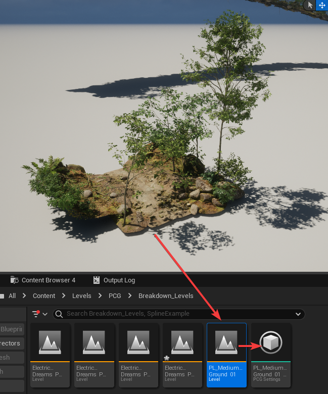
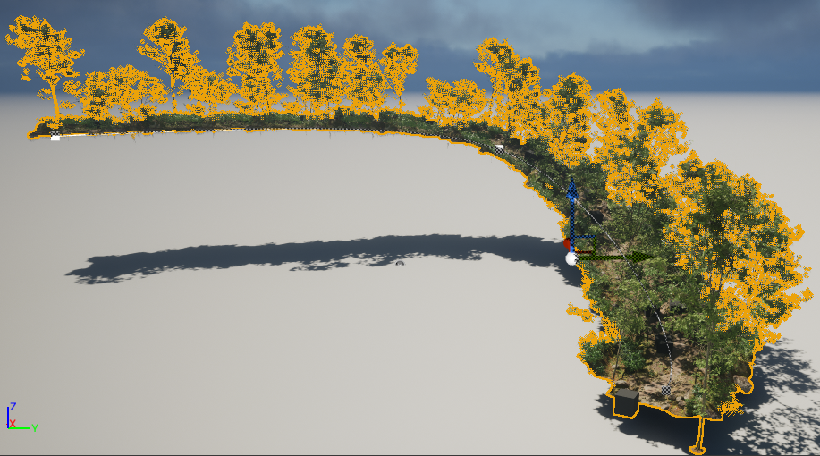

Electric Dreams的这个工作流程很大程度地提高了美术的可控性，但是有一个问题，那就是无法将PCGSettings暴露在外部作为参数修改。
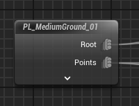

这样的话，我们如果想修改上面PCG生成的LevelInstance，就只能进到PCG蓝图里修改，这样会带来很多的不便。

本文简单介绍一下如何将PCGSettings暴露为蓝图参数：
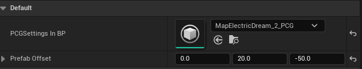

###### 二、实现

我们一共需要用到这4个蓝图：
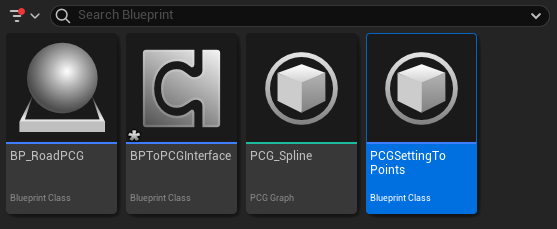
- 其中BP_RoadPCG是继承自Actor的一个蓝图
- PCG_Spline是一个PCG图表
- PCGSettingToPoints继承自PCGBlueprintElement，是一个自定义PCG节点
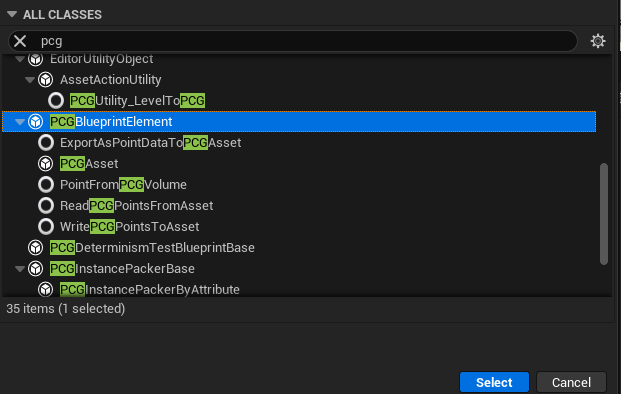
- BPToPCGInterface继承自ActorComponent，是一个自定义组件
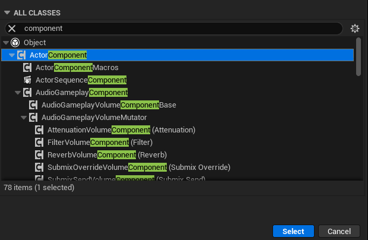

我们打开PCGSettingToPoints蓝图，重载它的ExecuteWithContext函数
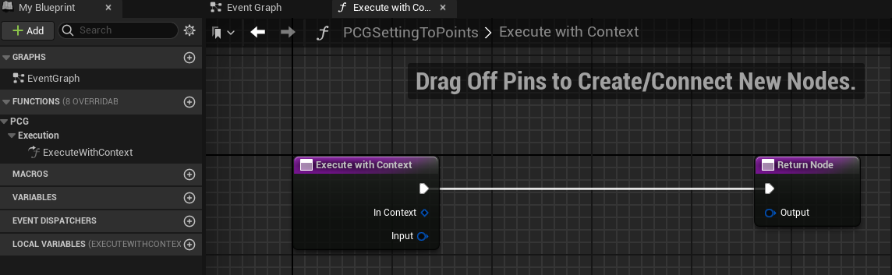

在左侧变量里创建一个PCGSettings变量，它的类型是PCGSettings Interface，我们可以把外面的PCGSettings赋给这个变量
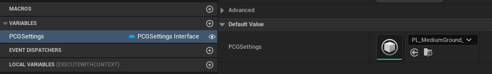

把变量拖入蓝图中，发现它并没有提供任何能拿到里面数据的函数
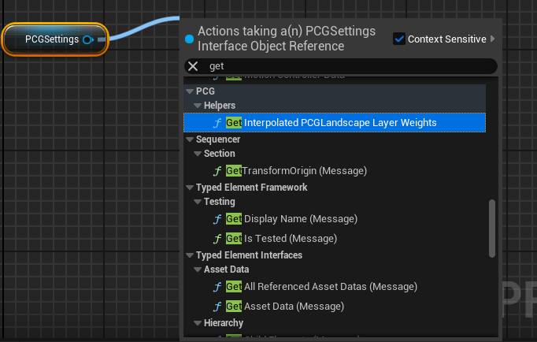

我们需要先将PCGSettings转化为PCGBlueprintSettings类型，然后拿到PCGBlueprintSettings里的Blueprint Element Instance，然后再转化为PCGAsset类
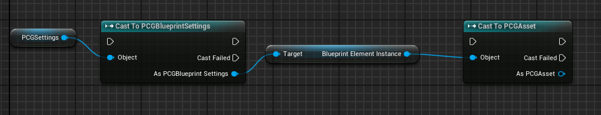

PCGAsset里有一个变量叫PCGData Collection，这个就是PCGSettings里的数据
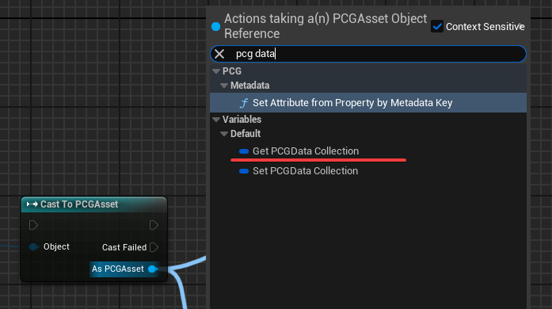

我们直接把上面的PCGData Collection数据输出看看：
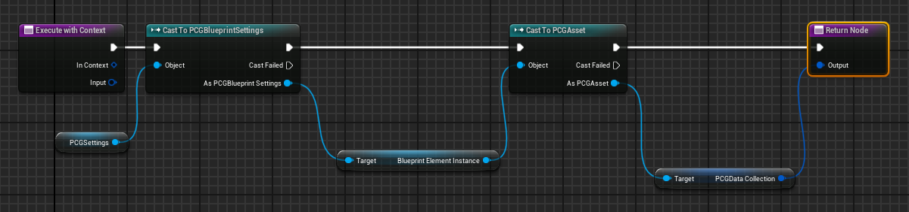

可以在PCG蓝图里看到，我们已经获取到数据了，输出的数据是一个数组，数组的第二个元素就是PCGSettings里的所有点云
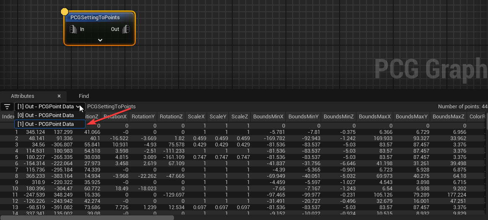

接下来在Class Defaults里设置好蓝图的输出针脚：
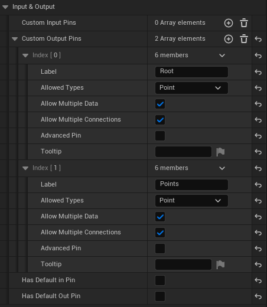

这样使用起来就跟PCGSettings拖入PCG蓝图产生的实例一毛一样了
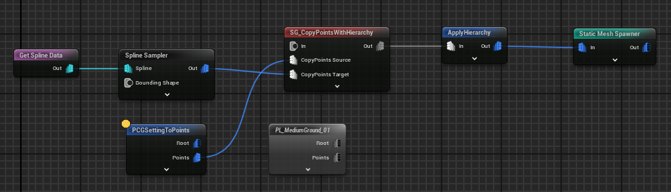
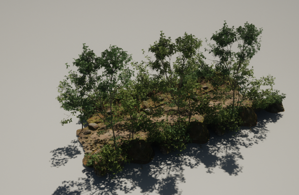

但是，目前为止我们只是把PCGSettings变成了在这里设置而已，并不能在蓝图里设置
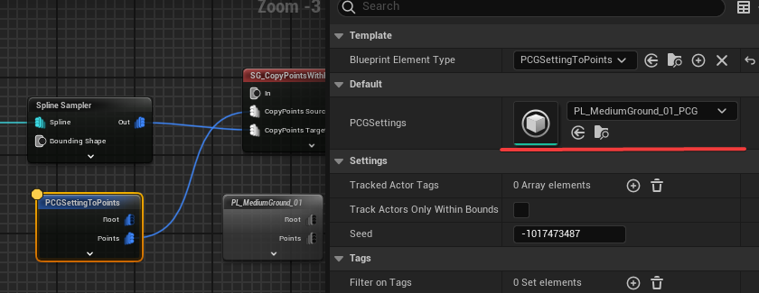

打开BP_RoadPCG蓝图，添加BPToPCGInterface作为蓝图的组件
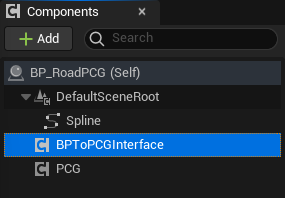

打开BPToPCGInterface，同样添加一个PCGSettings Interface的变量
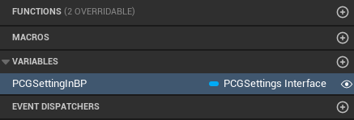

回到PCGSettingToPoints，通过Get Component by Class可以获取到蓝图上的BPToPCGInterface组件，这样就能访问BPToPCGInterface上的变量PCGSettingInBP：

接下来用PCGSettingInBP替换掉原本的PCGSettings就行了
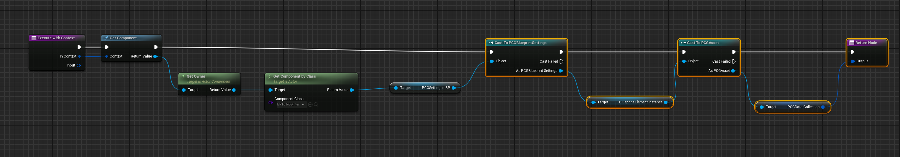

这样就能够通过设置BPToPCGInterface的PCGSettingInBP来替换不同的LevelInstance
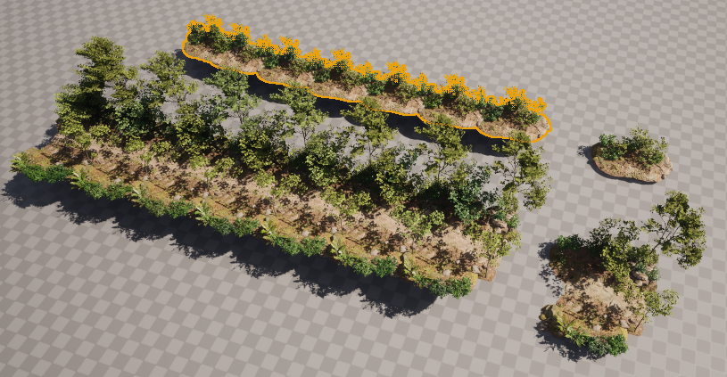

###### 三、参考

UE5.2: PCG - Mesh Sets As Variables：
https://www.youtube.com/watch?v=j4ris0z3KEE&t

