##### 一、前言

在动画或者卡通渲染存在一个很常见的效果，光源的边界染上一个饱和度较高的颜色，这个效果我们估计叫做半影着色：

	《吹响吧！上低音号》
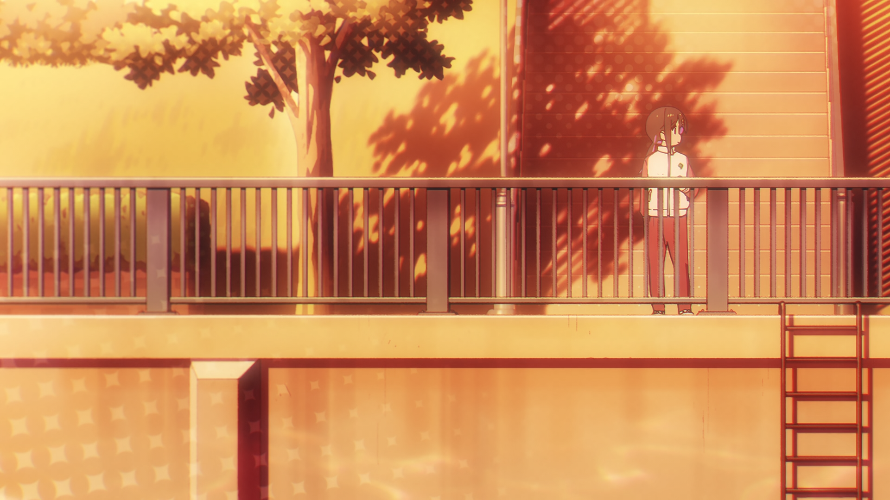
	《别当欧尼酱了》

	《绝区零》

在HDRP中也有类似的效果：

Unity里的实现非常简单，就是拿一个纯色来给半影染色：
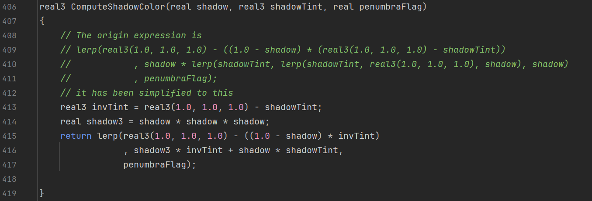

除了Unity的这种实现方式，还有一种常见的实现方法是用阴影来采样Ramp：
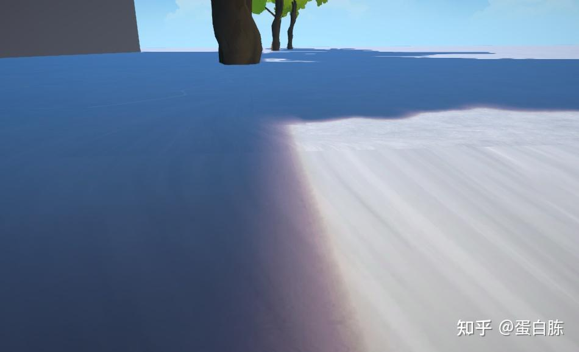
	https://zhuanlan.zhihu.com/p/588991753
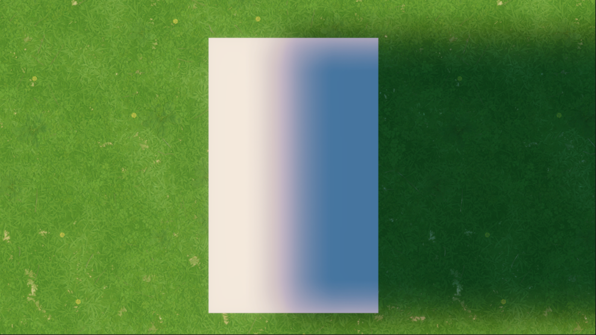
	https://zhuanlan.zhihu.com/p/688482736

##### 二、实现思路

###### 2.1 纯色法

首先在光源组件上添加新的参数：
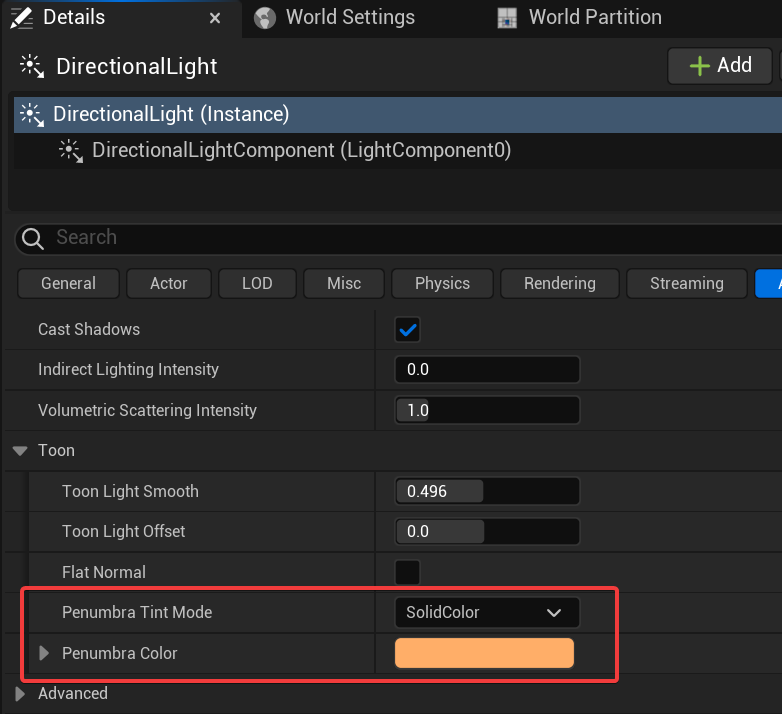

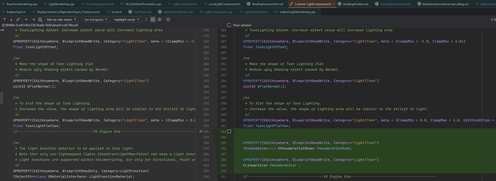
	LightComponent.h

接下来正常把这些参数传给shader就行，半影颜色的计算直接抄HDRP：
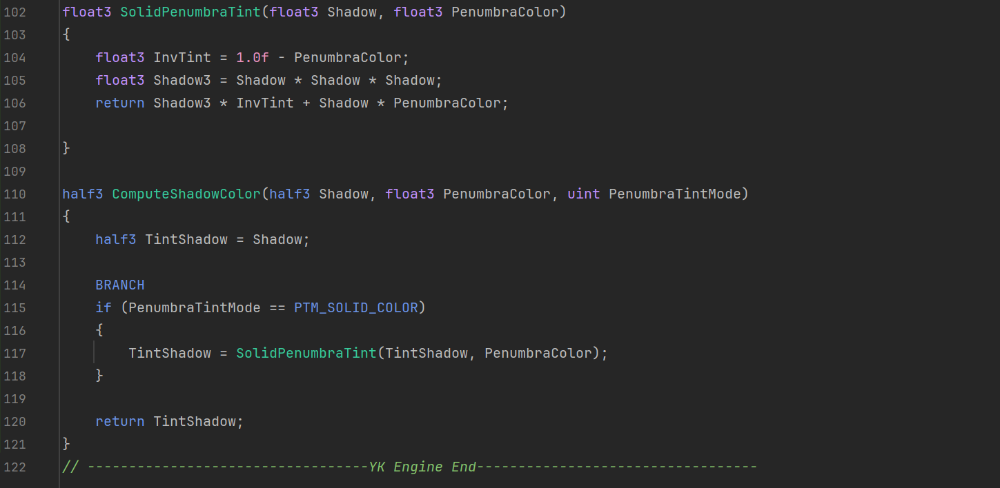
	ToonLightCommon.ush

在光照计算的时候调用ComputeShadowColor：

	DeferredLightingCommon.ush

接下来就能看到效果了：

效果还挺不错的，多光影也可以完美兼容：

不过，有一个尴尬的问题，上面的视频，可以发现主光的半影着色并没有影响Toon角色，这也正常，毕竟Toon角色的主光是在ToonLightPass里单独计算的。

按照正常的逻辑，我们应该把染过色的Shadow传给ToonLightPass，但是，这也的话得花3个通道来存储阴影，之前的ToonShadow已经满了，这样得新创建一张，有些浪费了。
所以我干脆还是把半影的参数传到ToonLightPass，然后在ToonLightPass自己去计算。

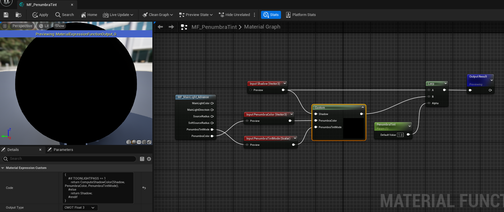

这样做还有个好处，如果觉得半影颜色在角色上有点太强了，很容易可以调节强度：

###### 2.2 Ramp法

同样的，在光源上添加新的参数：
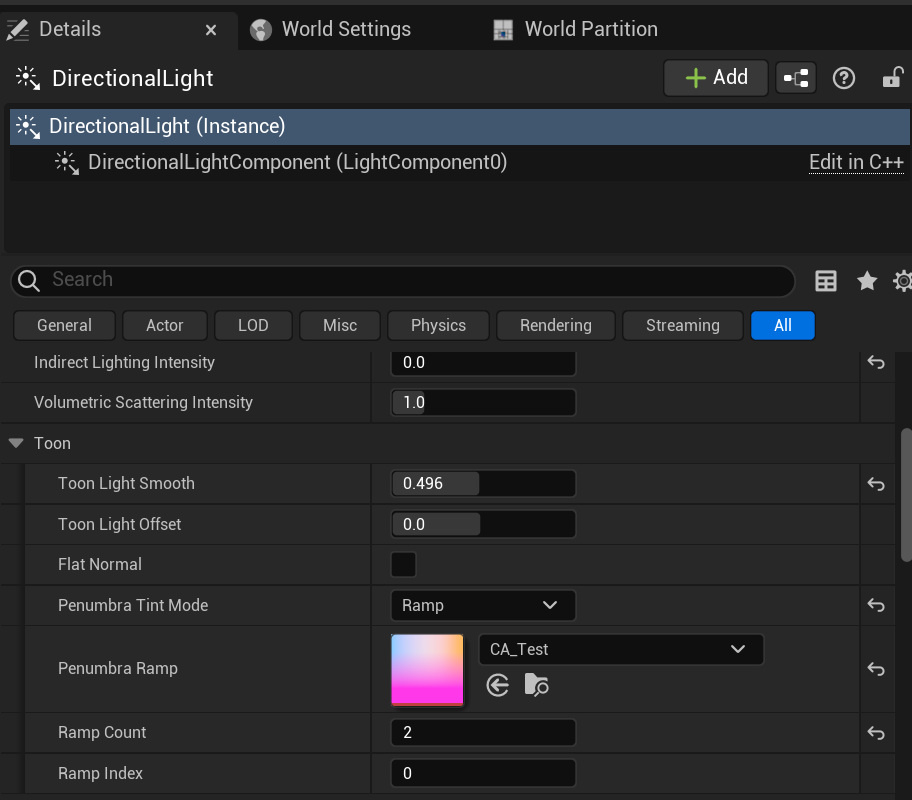

传参的时候跟以往的时候有些区别，如果把Ramp贴图放到FLightShaderParameters里的话会报错：
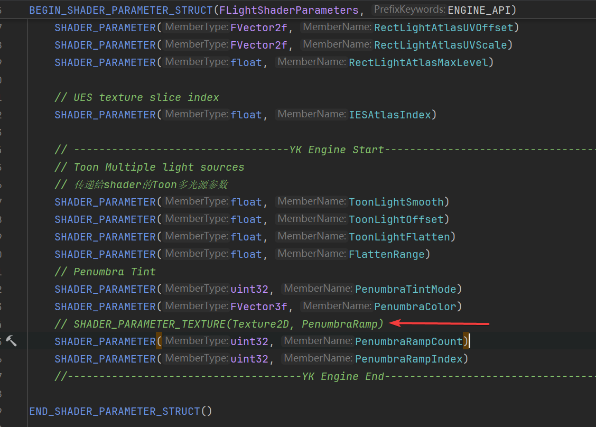
	SceneManagement.h

所以我把贴图放到FDeferredLightUniformStruct里，FToonLightUniformParameters也一样：
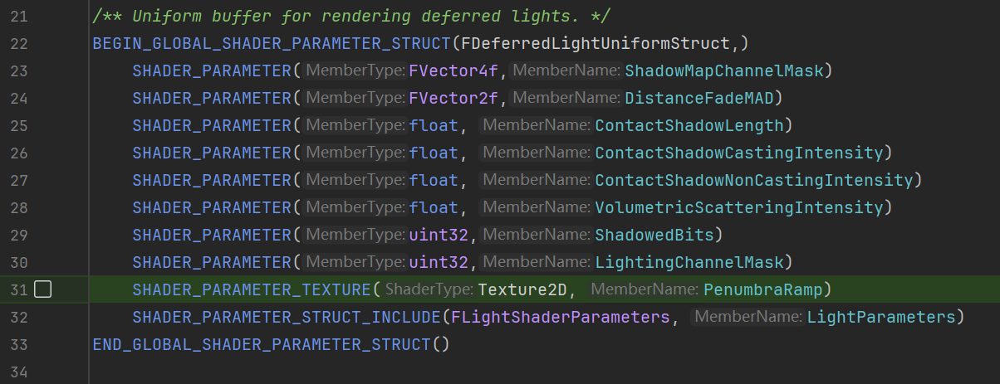
	LightRendering.h
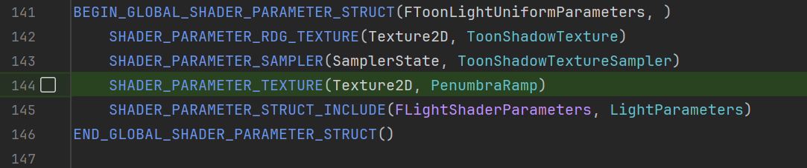
	ToonLightPassRendering.h

采样贴图的时候由于不同Pass里Buffer的名字不一样，所以在shader上添加宏来区分：
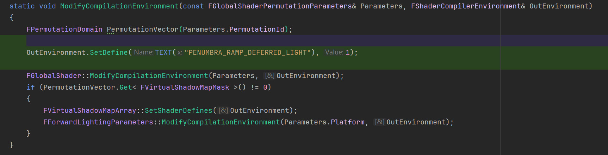
	LightRendering.cpp
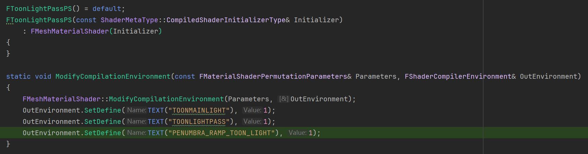
	ToonLightPassRendering.h
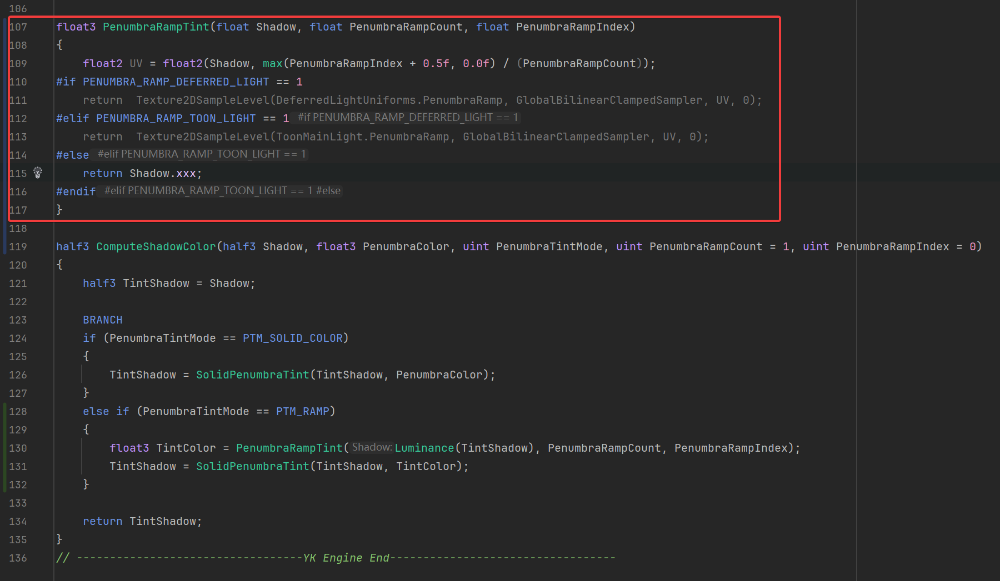
	ToonLightCommon.ush

在材质编辑器里也使用相同的函数来计算半影：
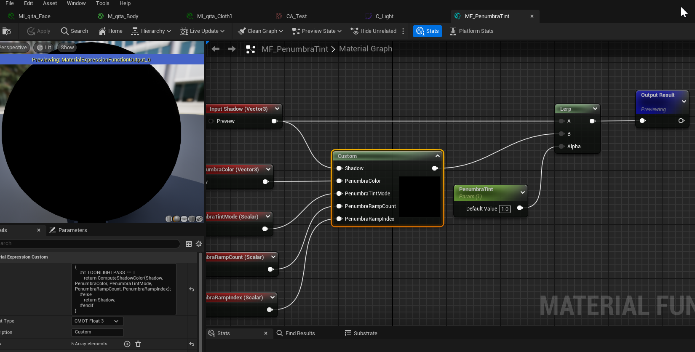

看看效果：

##### 三、参考和链接
###### 3.1 链接

本文的修改都上传github了，对应下图的提交记录：
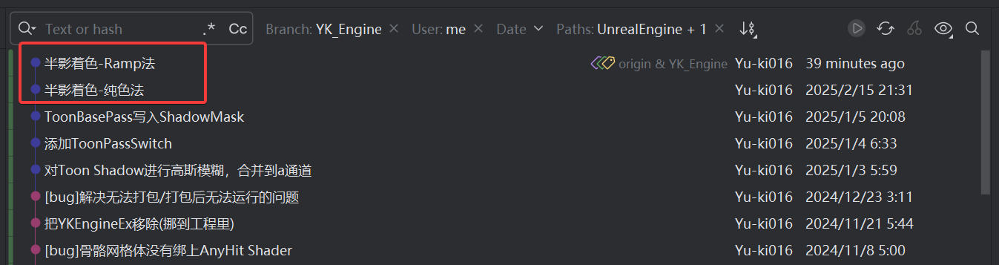
	https://github.com/Yu-ki016/UnrealEngine/tree/YK_Engine

示例工程：
https://github.com/Yu-ki016/YKEngineExampleProject

###### 3.2 参考

Unity URP 8Cascade+PCF/PCSS 阴影+Compute Shader屏幕空间shadowmap+阴影渐变：
https://zhuanlan.zhihu.com/p/588991753

图形引擎实战：8级风格化级联阴影：
https://zhuanlan.zhihu.com/p/688482736

