本文的修改都上传github了，对应下图的提交记录：
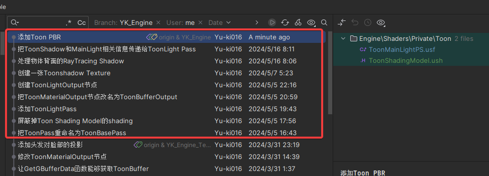
##### 一、前言
###### 1.1 延迟渲染实现卡渲的局限性

目前我的Toon着色就做了一个二分，其他的着色效果一点没加，相反，我改了很多投影相关的东西。这是因为，不先去掉角色脸上难看的自阴影实在没心情做别的东西，另一方面，我之前一直在为如何修改着色犹豫不决。

我的目标是写一个扩展性强，能够兼容市面上各种着色方式的引擎，然而，这和延迟渲染的思想似乎是背道而驰的：

众所周知，卡通渲染是各种trick的堆砌。
有些时候，卡通渲染的着色，只需要指定亮面和暗面的颜色即可；二游的渲染喜欢使用Ramp，可以做更丰富的颜色过渡；崩坏3的mmd使用2D的Ramp，能够让不同部位有不同的过渡效果，兴许也会有人想用。
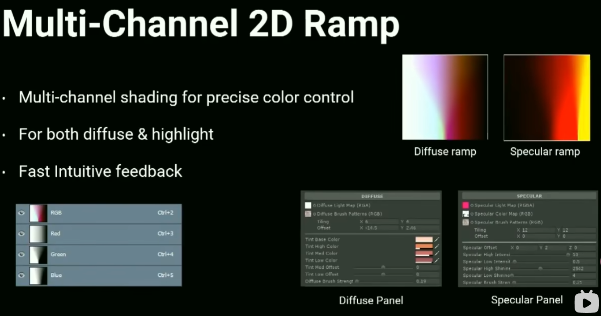
>https://www.bilibili.com/video/BV1XE411R7Ue

这些着色方式并无优劣之分，实现起来也并不困难，但是如果说要让延迟渲染同时支持这些做法，那就有点头痛了。如果还想再加上卡通渲染五花八门的小tricks：描边，SDF脸部光照，鼻尖高光，各种头发高光，各种边缘光...；GBuffer将会变得臃肿不堪。

市面上卡通渲染的方案各有不同，它们需要的渲染数据都会有或多或少的差异，使用一个有限的GBuffer，并不足以表达目前市面上或未来可能诞生的各种卡通渲染着色模型。


###### 1.2 我的做法

考虑到延迟渲染的局限性，我第一个想到的想法是让引擎使用者自行编写shading代码，其实就是让引擎使用者通过材质编辑器连连看的方式编辑Toon材质，想用什么着色方式就用什么方式，想加什么trick就加什么trick。

这时候你可能会问，这不就是使用公版引擎在自发光里做卡通渲染吗，这样的话多光源和投影都不支持了。

确实，我的做法和自发光里做卡渲差别很小，不同的是，我额外创建了一个ToonLight Pass，这个Pass在Light Pass后面执行，这样我们就有办法将光照相关的信息比如说shadow等传递给ToonLight Pass，因此我能够在材质编辑器里访问到投影等数据。
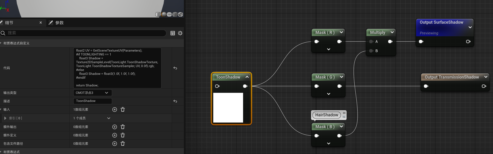
>在材质编辑器中通过CustomHLSL来获取投影
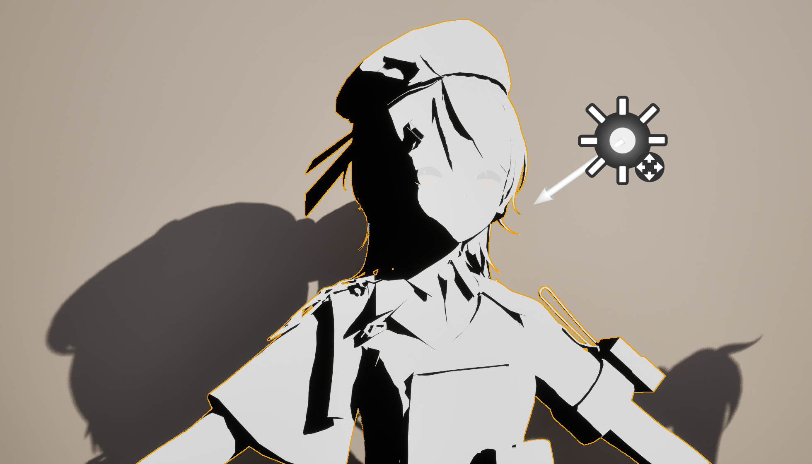

那这样相当于场景用延迟渲染，Toon用前向渲染吗？也不然，一方面，多光源的计算如果使用前向渲染的话消耗很大，确实是延迟渲染更合适；另一方面，多光源计算不会像主光计算那么八仙过海，不会有太多花样。所以Toon的多光源的计算依然是在Lights Pass中老老实实走延迟渲染。

所以说本文的主要思想是将主光的Shading任务交给材质编辑器，从而避免重要Shading代码写死的情况，从而提升了引擎的可扩展性，这部分属于前向渲染；而多光源等的计算仍然交给延迟渲染，这样能够更好地支持多光源特性。

##### 二、实现

###### 2.1 前期准备

先是是一些前期准备，我把之前的ToonPass重命名为ToonBasePass，这部分我就不在文章里写了，需要的话直接看git。
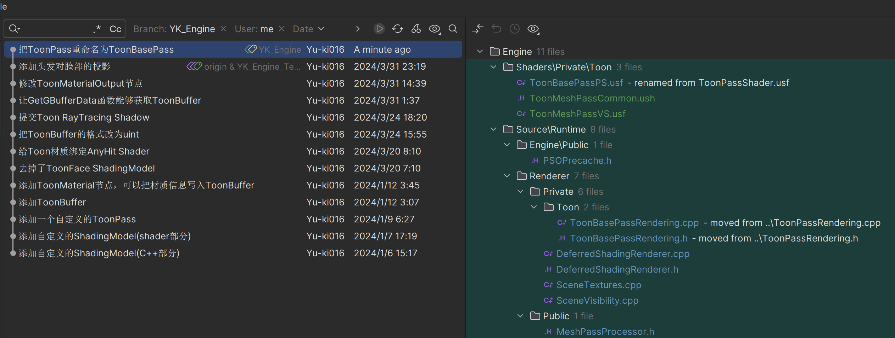

然后，为了我们做shading的时候不会受各种光照干扰，我把Toon材质的光照都去掉。
第一，把直接光照去掉：
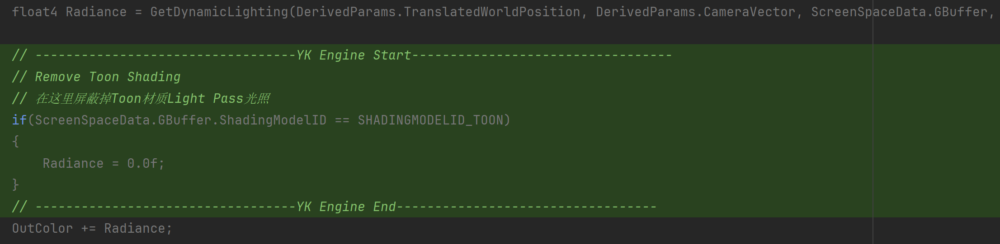
>DeferredLightPixelShaders.usf
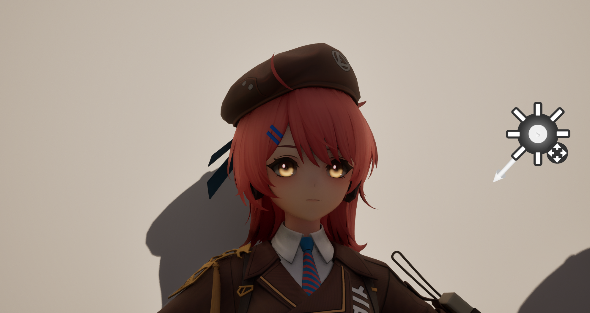
>消除了直接光照

接下来去掉环境光：

>DiffuseIndirectComposite.usf
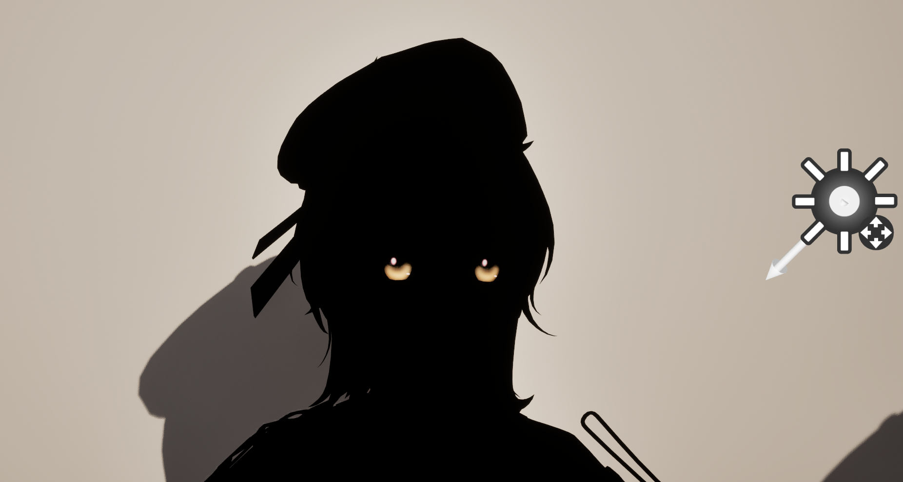
>消除了Lumen环境光

现在只去掉了Lumen产生的环境光，如果关掉Lumen，还是会有环境光
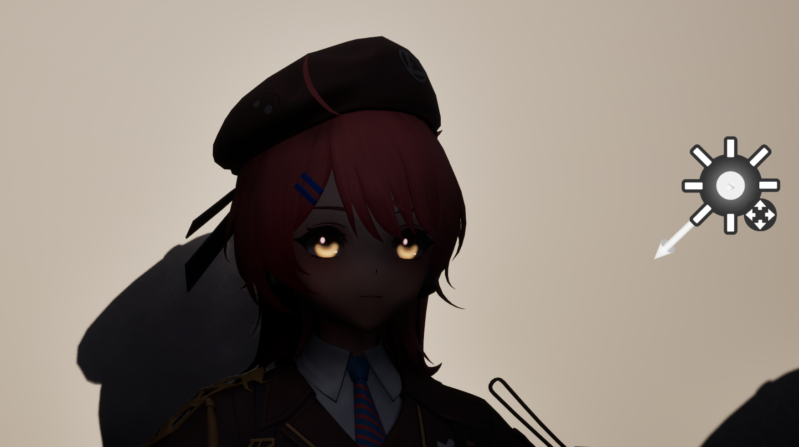

需要在ReflectionEnvironmentPixelShader.usf里去掉非Lumen的环境光

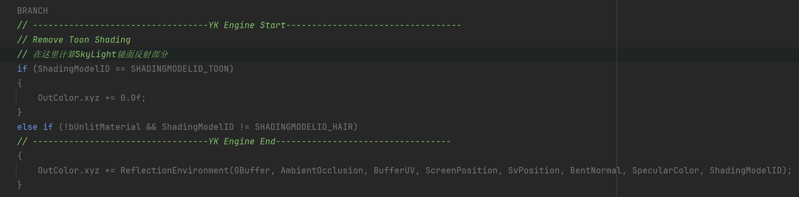

当混合模式为半透明的时候也会有光照，我也把它给去掉了：
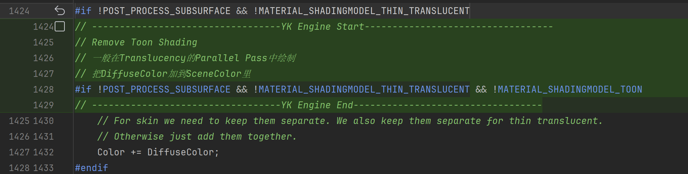
> BasePassPixelShader.usf
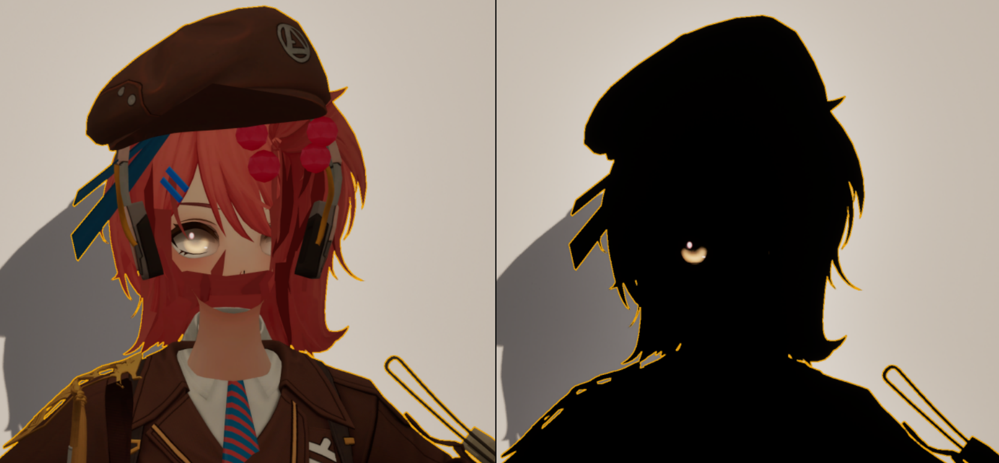
> BlendMode设置为半透明时Shading，有点排序问题也挺正常的

自发光也是在BasePassPixelShader.usf中计算，我就不把它去掉了


###### 2.2 创建ToonLightPass和ToonLightOutput节点

接下来创建一个ToonLightPass，如何创建一个MeshDraw Pass之前的文章已经写过了，就不再重复了， 细节还请看git。
https://zhuanlan.zhihu.com/p/677772284

主要就是在Lights Pass后面插入ToonLightPass：
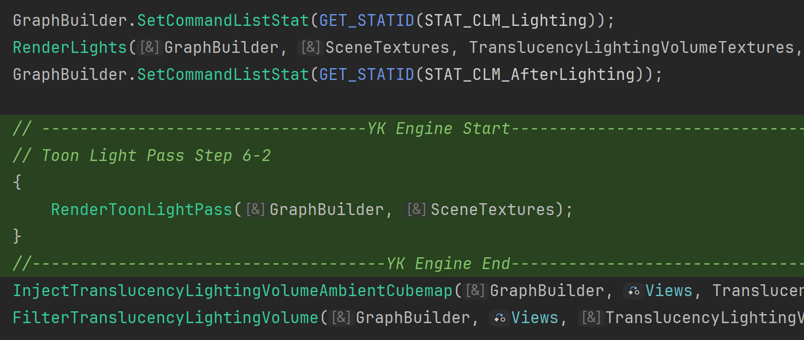
> DeferredShadingRenderer.cpp
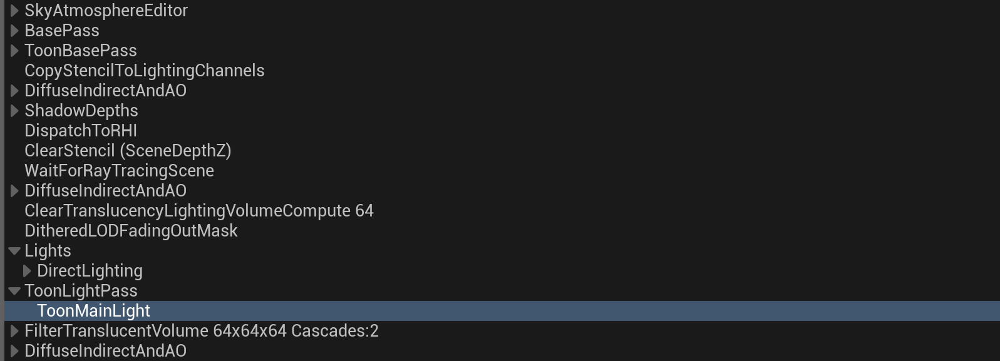

然后把ToonMaterialOutput节点改名为ToonBufferOutput：
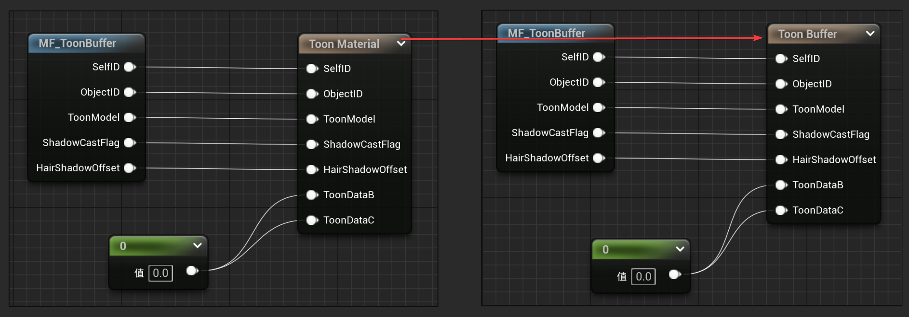

接下来添加一个ToonLightOutput节点，这个也是也是之前文章有的东西：
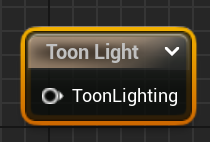

这样我们就可以在材质编辑器里计算光照了：
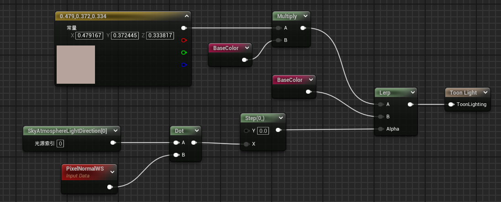
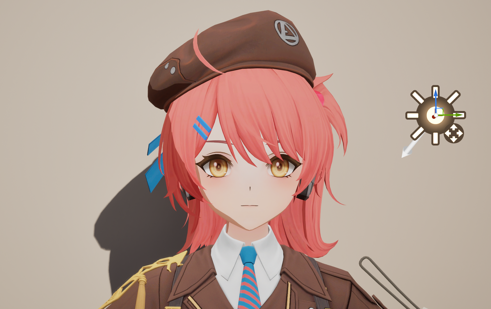

###### 2.3 传递光照信息给ToonLightPass

到目前位置，还是和使用公版引擎，在自发光里计算光照没什么区别
现在我们把Shadow等光照信息传递给ToonLight Pass。

首先创建一张ToonShadowTexture，用于保存MainLight的阴影，关于如何创建一张SceneTexture之前的文章也写过，这里也不细写了。
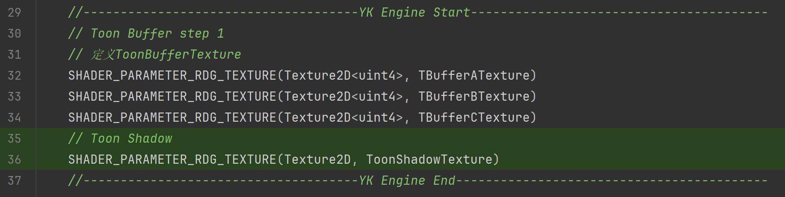
>SceneTexturesConfig.h

接下来给FDeferredLightPS多添加一个RenderTarget，用来在计算Main Light的时候顺便把阴影保存出来。
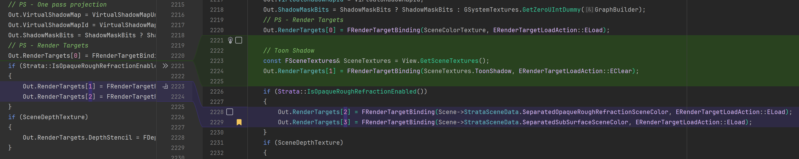
>LightRendering.cpp

修改DeferredLightPixelMain函数的输出
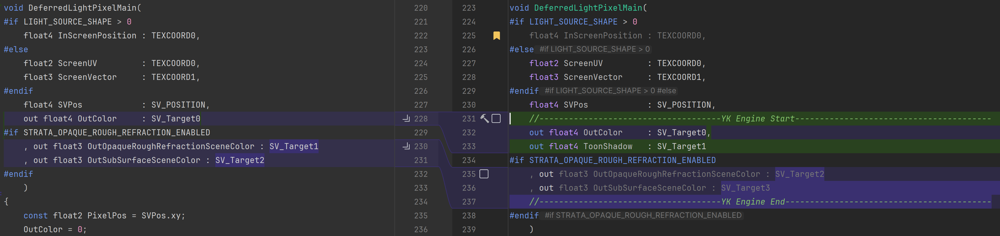
>DeferredLightPixelShaders.usf

输出ToonShadow，这里写得稍微复杂一点，其实直接输出LightAttenuation也没太大问题，不过DeferredLightingCommon.ush里是这么计算阴影的，就照着它计算了。
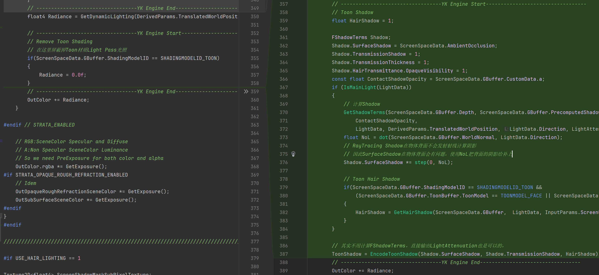
>DeferredLightPixelShaders.usf

完整代码：
```c
// Toon Shadow
float HairShadow = 1;

FShadowTerms Shadow;
Shadow.SurfaceShadow = ScreenSpaceData.AmbientOcclusion;
Shadow.TransmissionShadow = 1;
Shadow.TransmissionThickness = 1;
Shadow.HairTransmittance.OpaqueVisibility = 1;
const float ContactShadowOpacity = ScreenSpaceData.GBuffer.CustomData.a;

if (IsMainLight(LightData))
{
	// 计算Shadow
	GetShadowTerms(ScreenSpaceData.GBuffer.Depth, ScreenSpaceData.GBuffer.PrecomputedShadowFactors, ScreenSpaceData.GBuffer.ShadingModelID,
		ContactShadowOpacity,
		LightData, DerivedParams.TranslatedWorldPosition, LightData.Direction, LightAttenuation, Dither, Shadow);
	float NoL = dot(ScreenSpaceData.GBuffer.WorldNormal, LightData.Direction);
	// RayTracing Shadow在物体背面不会发射射线计算阴影
	// 因此SurfaceShadow在物体背面会有问题，使用NoL把背面的阴影给补上
	if (!ScreenSpaceData.GBuffer.ToonBuffer.ShadowCastFlag & SCF_DISABLEONSELF)
	{
		Shadow.SurfaceShadow *= step(0, NoL);
	}
	
	// Toon Hair Shadow
	if(ScreenSpaceData.GBuffer.ShadingModelID == SHADINGMODELID_TOON &&
		(ScreenSpaceData.GBuffer.ToonBuffer.ToonModel == TOONMODEL_FACE || ScreenSpaceData.GBuffer.ToonBuffer.ToonModel == TOONMODEL_EYE))
	{
		HairShadow = GetHairShadow(ScreenSpaceData.GBuffer,  LightData, InputParams.ScreenUV);
	}
}

ToonShadow = EncodeToonShadow(Shadow.SurfaceShadow, Shadow.TransmissionShadow, HairShadow);
```

注意这行代码：
```c
Shadow.SurfaceShadow *= step(0, NoL);
```
如果不加上的话，SurfaceShadow是这样的
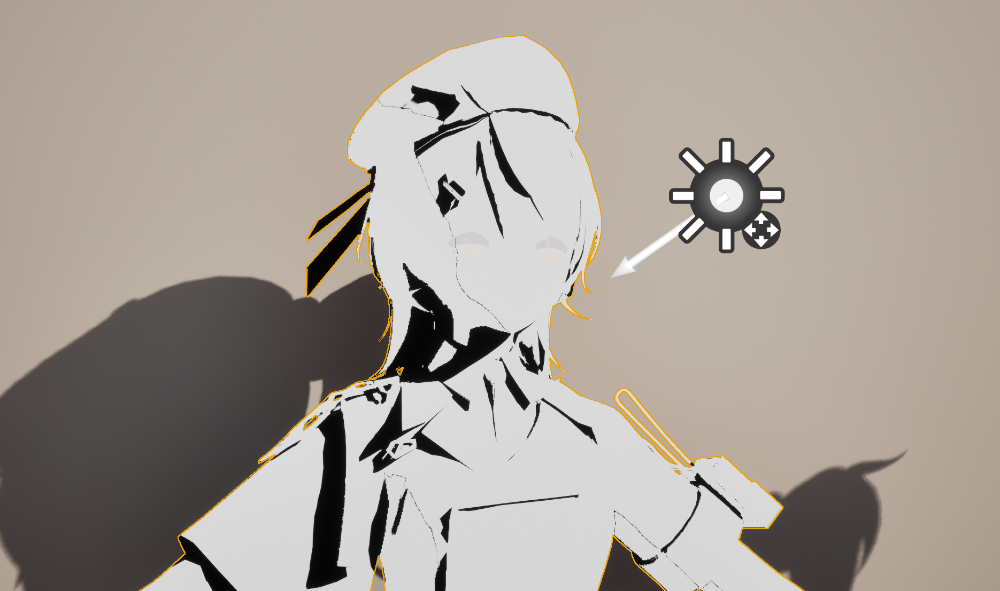
这是因为我们使用的是RayTracing Shadow，计算RayTracing Shadow的时候物体背面（也就是N dot L < 0）的像素是不会发射射线的，因此我们给SurfaceShadow乘上step(0, NoL)补上背面的阴影。
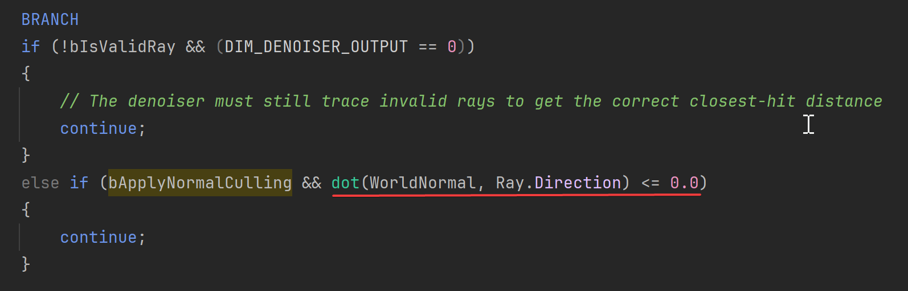
> RayTracingOcclusionRGS.usf

然后EncodeToonShadow函数我放在ToonBufferCommon.ush里，其实很简单，只是把代码封装起来，方面以后修改。
```c
float4 EncodeToonShadow(float SurfaceShadow, float TransmissionShadow, float HairShadow)
{
	float4 ToonShadow = 1.0f;

	ToonShadow.r = SurfaceShadow;
	ToonShadow.g = TransmissionShadow;
	ToonShadow.b = HairShadow;
	
	return ToonShadow;
}
```

这样我们就把MainLight的阴影给保存起来了，接下来把它传递给ToonLight Pass。

我创建了一个ToonLight UniformBuffer，需要传递给ToonLight Pass里的数据之后都往这里面丢。

这里用SHADER_PARAMETER_RDG_UNIFORM_BUFFER声明一个叫ToonLight的Buffer，引擎会生成一个"/Engine/Generated/UniformBuffers/ToonLight.ush"（并不会真的把这个文件生成出来），所有的Uniform Buffer都会include到/Engine/Generated/GeneratedUniformBuffers.ush里然后被Common.ush引用。
我们要使用ToonLight Buffer里的变量时，使用ToonLight.ToonShadowTexture即可

>ToonLightPassRendering.cpp

在GetToonLightPassParameters里把ToonShadowTexture填进Buffer里：
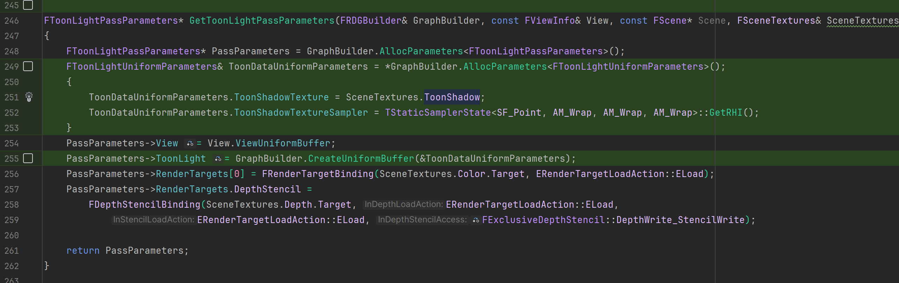
>ToonLightPassRendering.cpp

由于我们的shader里并没有用到ToonLight里面的任何东西，可能会在编译shader的时候被优化掉，导致我们之后使用Custom HLSL访问ToonLight时会报错找不到ToonLight，所以我们手动include ToonLight.ush。


这样我们就可以在ToonLight Pass里访问ToonShadowTexture了。
我目前是通过Custom HLSL来访问ToonShadowTexture的，以后可以写个新的材质节点来实现，这样用起来会更方便一点。


>成功在材质编辑器里获取投影

```c
float2 UV = GetSceneTextureUV(Parameters);
#if TOONLIGHTING == 1
	float3 Shadow = Texture2DSampleLevel(ToonLight.ToonShadowTexture, ToonLight.ToonShadowTextureSampler, UV, 0.0f).rgb;
#else
	float3 Shadow = float3(1.0f, 1.0f, 1.0f);
#endif

return Shadow;
```
上面的代码里的TOONLIGHTING这个宏是FToonLightPassPS用ModifyCompilationEnvironment添加的，避免FToonLightPassPS之外的shader访问ToonShadowTexture导致报错：
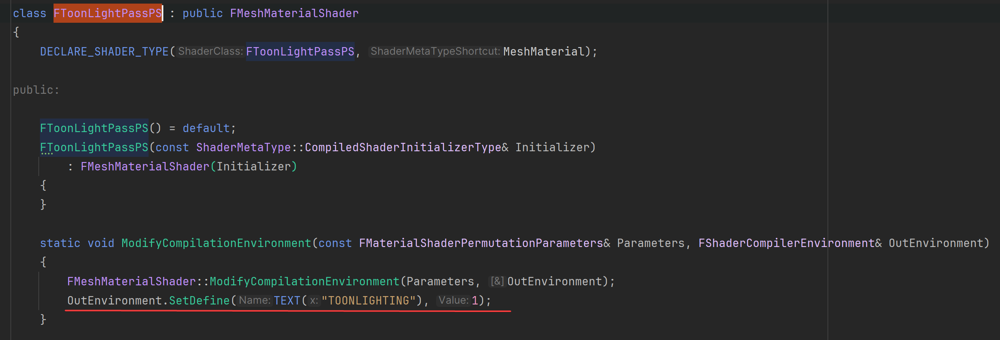
>ToonLightPassRendering.h

接下来我把MainLight的颜色和方向等数据也传递给ToonLight Pass，往ToonData UniformBuffer加入FLightShaderParameters
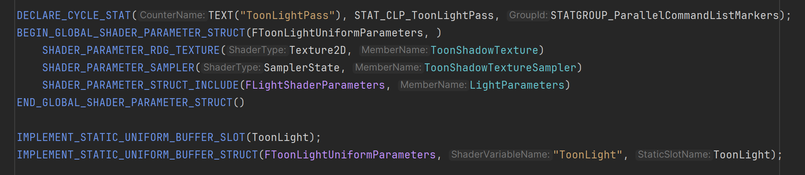
> ToonLightPassRendering.cpp

在GetToonLightPassParameters里将它赋值
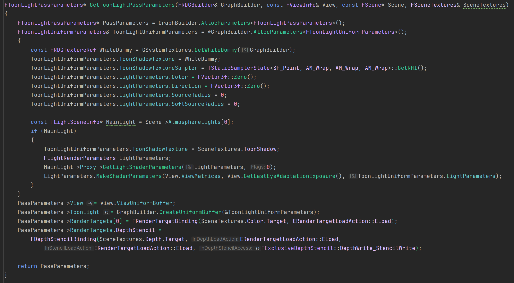
> ToonLightPassRendering.cpp

使用Custom HLSL来获取LightParameters里的数据：
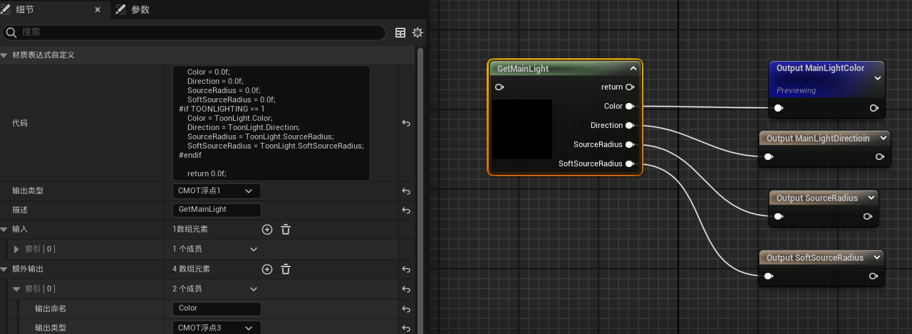
Custom HLSL里的代码：
```c
	Color = 0.0f;
	Direction = 0.0f;
	SourceRadius = 0.0f;
	SoftSourceRadius = 0.0f;
#if TOONLIGHTING == 1
	Color = ToonLight.Color;
	Direction = ToonLight.Direction;
	SourceRadius = ToonLight.SourceRadius;
	SoftSourceRadius = ToonLight.SoftSourceRadius;
#endif

	return 0.0f;
```
上面的SourceRadius和SoftSourceRadius其实就是平行光的Source Angle和Source Soft Angle，不过Source Angle和Source Soft Angle的取值范围是0到180，SourceRadius和SoftSourceRadius的取值范围是0到1.
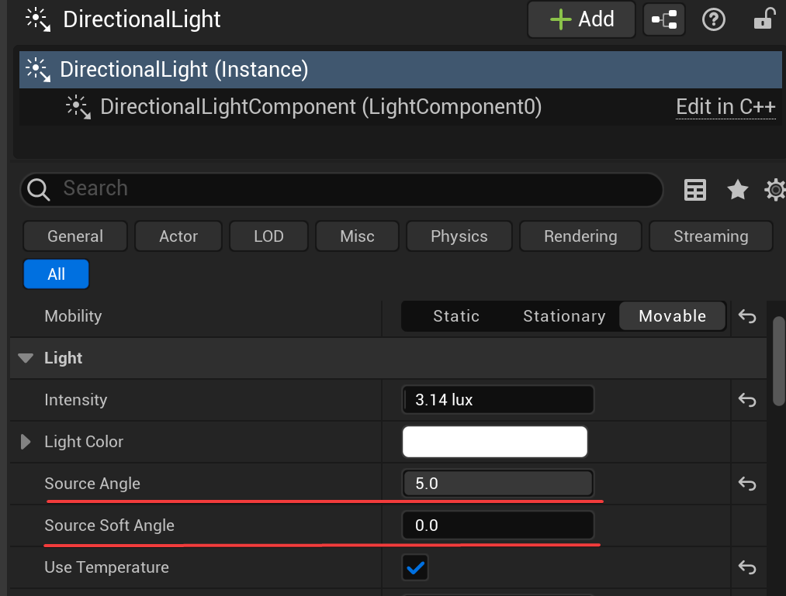


###### 2.4 在材质编辑器里做shading

接下来就是在材质编辑器里连连看做，这部分就是手艺活了，没什么好讲的，按照个人喜好来做就行了。
关于少前的shading我主要参考蛋白胨的文章：
https://zhuanlan.zhihu.com/p/663968812

由于Lumen环境光目前是被我注释掉的状态，所以目前的环境光其实就是基础色再乘上一个EnvironmentColor的状态。
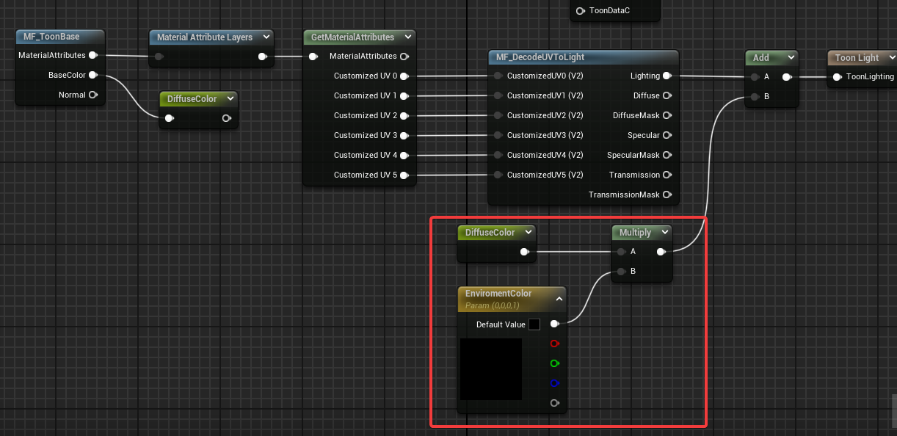

其他的渲染特性目前只做了：
- Ramp着色
- 脸部SDF光照，鼻尖高光
- 头发高光
- 服装PBR着色


上面的特性里也就PBR着色稍微值得讲一讲。
依然是在Custom HLSL中计算：
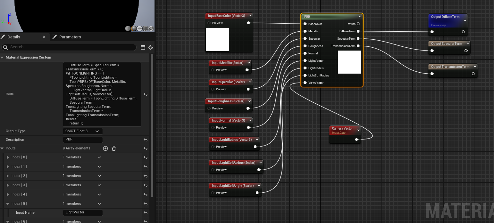

```c
	DiffuseTerm = SpecularTerm = TransmissionTerm = 0;
#if TOONLIGHTING == 1
	FToonLighting ToonLighting = 
	ToonPBRBxDF(BaseColor, Metallic, Specular, Roughness, Normal,
		LightVector, LightRadius, LightSoftRadius, ViewVector);
	DiffuseTerm = ToonLighting.DiffuseTerm;
	SpecularTerm = ToonLighting.SpecularTerm;
	TransmissionTerm = ToonLighting.TransmissionTerm;
#endif
	return 1;
```

用到的这个ToonPBRBxDF我写在一个新文件ToonShadingModel.ush里，主要就是参考Unreal的DefaultLitBxDF改的：
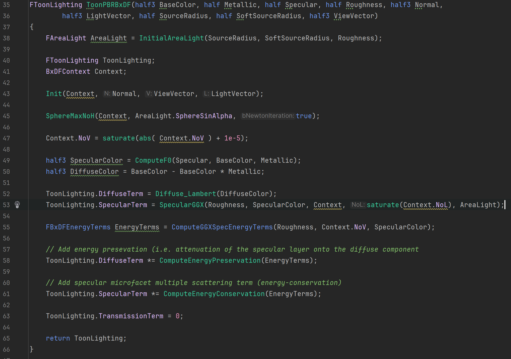

用到的结构体FToonLighting是这样的：
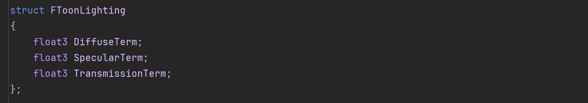

InitialAreaLight函数则是这样的，需要用的的SourceRadius和SoftSourceRadius已经在2.3中传递给材质编辑器了：
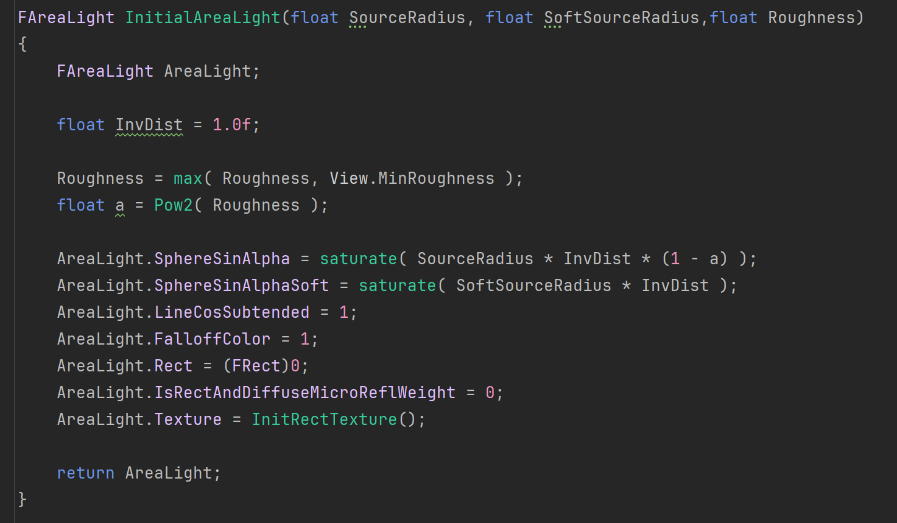

跟DefaultLitBxDF里不一样的地方是DefaultLitBxDF的Diffuse和Specular会乘上AreaLight.FalloffColor、Falloff 和NoL。
- 平行光的AreaLight.FalloffColor和Falloff永远等于1，所以没必要乘上
- NoL则是我想要在材质编辑器里改为乘上一个Ramp
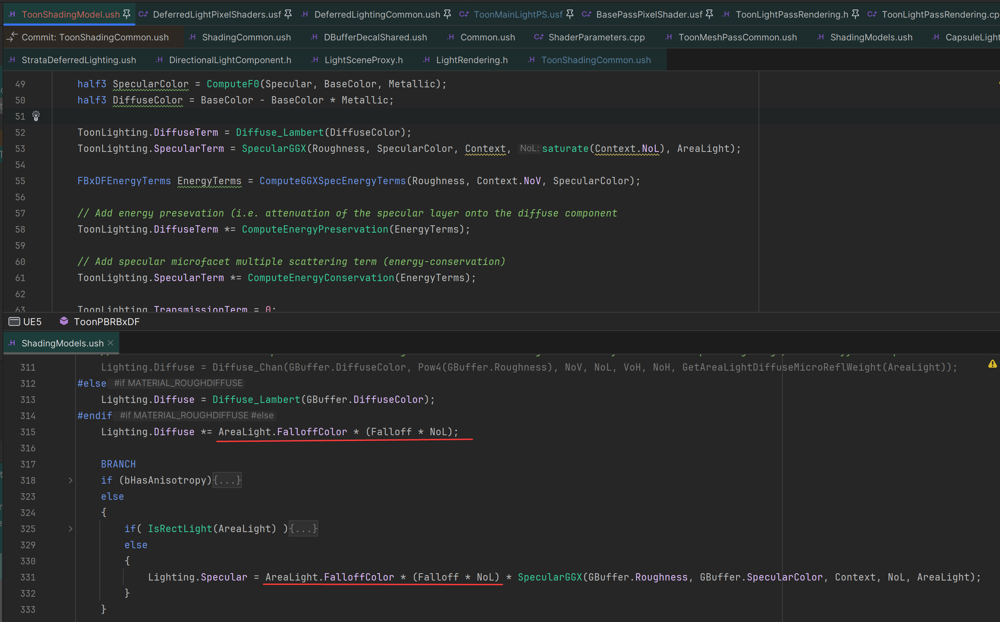
>上面是ToonPBRBxDF，下面是DefaultLitBxDF

在DiffuseTerm和SpecularTerm后面乘上Ramp和光源颜色:
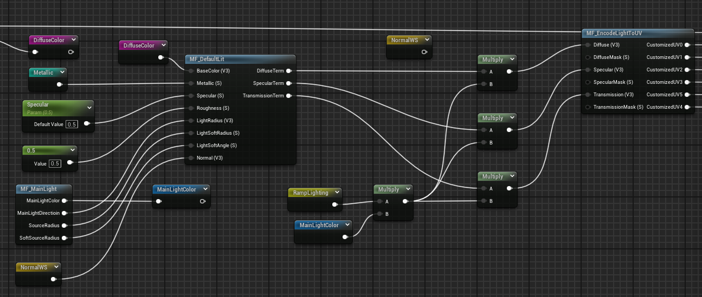


完整的ToonShadingModel.ush代码：
```c
// ----------------------------------YK Engine Start----------------------------------
// Toon Shading
#pragma once

#include "../ShadingModels.ush"

struct FToonLighting
{
	float3 DiffuseTerm;
	float3 SpecularTerm;
	float3 TransmissionTerm;
};

FAreaLight InitialAreaLight(float SourceRadius, float SoftSourceRadius,float Roughness)
{
	FAreaLight AreaLight;

	float InvDist = 1.0f;
	
	Roughness = max( Roughness, View.MinRoughness );
	float a = Pow2( Roughness );
	
	AreaLight.SphereSinAlpha = saturate( SourceRadius * InvDist * (1 - a) );
	AreaLight.SphereSinAlphaSoft = saturate( SoftSourceRadius * InvDist );
	AreaLight.LineCosSubtended = 1;
	AreaLight.FalloffColor = 1;
	AreaLight.Rect = (FRect)0;
	AreaLight.IsRectAndDiffuseMicroReflWeight = 0;
	AreaLight.Texture = InitRectTexture();

	return AreaLight;
}


FToonLighting ToonPBRBxDF(half3 BaseColor, half Metallic, half Specular, half Roughness, half3 Normal,
		half3 LightVector, half SourceRadius, half SoftSourceRadius, half3 ViewVector)
{
	FAreaLight AreaLight = InitialAreaLight(SourceRadius, SoftSourceRadius, Roughness);

	FToonLighting ToonLighting;
	BxDFContext Context;

	Init(Context, Normal, ViewVector, LightVector);

	SphereMaxNoH(Context, AreaLight.SphereSinAlpha, true);

	Context.NoV = saturate(abs( Context.NoV ) + 1e-5);

	half3 SpecularColor = ComputeF0(Specular, BaseColor, Metallic);
	half3 DiffuseColor = BaseColor - BaseColor * Metallic;
	
	ToonLighting.DiffuseTerm = Diffuse_Lambert(DiffuseColor);
	ToonLighting.SpecularTerm = SpecularGGX(Roughness, SpecularColor, Context, saturate(Context.NoL), AreaLight);

	FBxDFEnergyTerms EnergyTerms = ComputeGGXSpecEnergyTerms(Roughness, Context.NoV, SpecularColor);
	
	// Add energy presevation (i.e. attenuation of the specular layer onto the diffuse component
	ToonLighting.DiffuseTerm *= ComputeEnergyPreservation(EnergyTerms);
	
	// Add specular microfacet multiple scattering term (energy-conservation)
	ToonLighting.SpecularTerm *= ComputeEnergyConservation(EnergyTerms);

	ToonLighting.TransmissionTerm = 0;

	return ToonLighting;
}

// ----------------------------------YK Engine End----------------------------------
```

##### 三、结语

本文的主要思想是将Toon的主光计算使用前向渲染来实现，并且将这部分shading任务交给材质编辑器来设计，从而提高了引擎的可扩展性，让引擎使用者能够按照自己的意愿来设计主光渲染；对于多光源计算，在计划上仍然会交给延迟渲染来实现。

当然，这种设计也是有其局限性的，这种前向+延迟是渲染方式最大的一个假设就是主光之外的平行光或其他光源不需要过多的自定义设计，如果说有人想打好几个平行光，每个平行光都采样不同的Ramp，这种做法我的引擎就无能为力了，不过好在动画或者卡通渲染这种情况还是很少出现的。

目前本文只添加了主光，多光源和环境光我都还没做，还请等待我之后的文章。

另外，我家小孩真可爱吧。

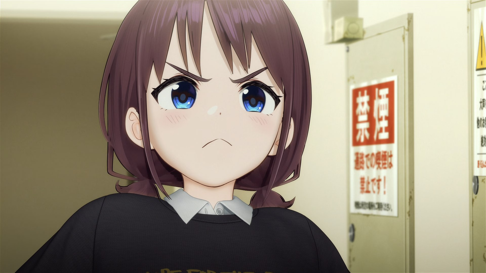
> 《Girls Band Gry》

##### 四、参考

少女前线2：追放 vepley角色渲染分析还原：
https://zhuanlan.zhihu.com/p/663968812

Unreal Engine 5.2 MeshPass拓展：
https://zhuanlan.zhihu.com/p/671423486


