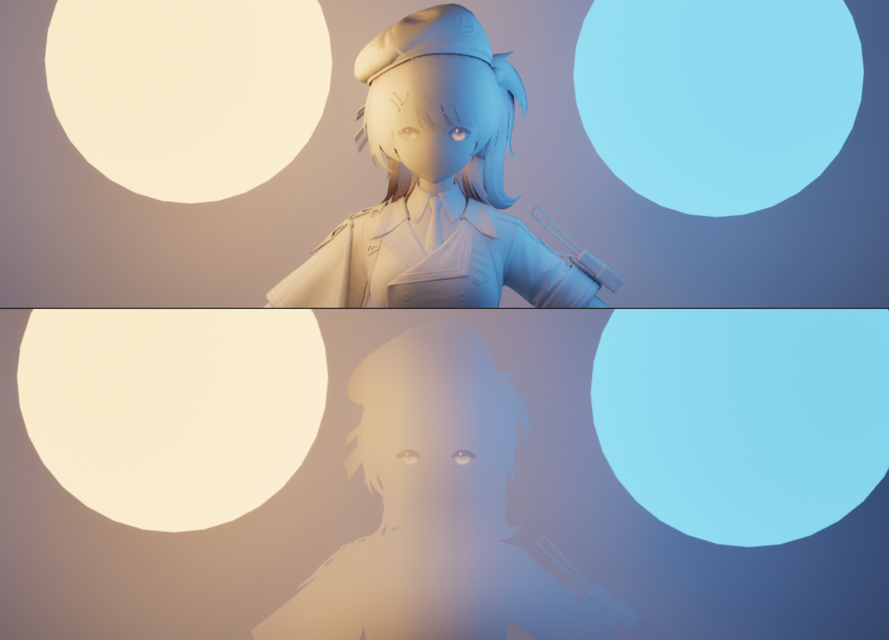
##### 一、前言

之前文章我们添加了直接光照，接下来开始添加环境光和GI。
这篇文章里提到的Lumen其实指的是Lumen的Diffuse，不包含对Specular的修改，目前对Specular没有什么idea。
###### 1.1 球谐与Lumen
如果是unity，很多人会使用球谐光照作为环境光，一般会把法线拍平来计算一个更扁平一点的球谐光照，或者是直接使用一阶球谐来作为环境光。

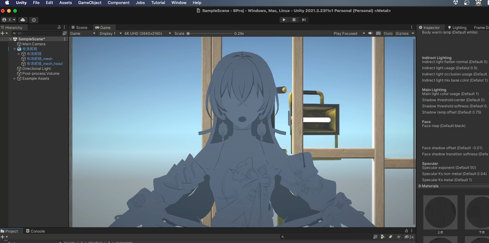
	https://www.bilibili.com/video/BV1CN411C7qx

养乐多大佬的视频里也提供了UE使用球谐的方法：
```c
float4 NormalVector = float4 (Normal,1.0f);
float3 Intermediate0,Intermediate1,Intermediate2;
Intermediate0.x = dot(View_SkyIrradianceEnvironmentMap[0],NormalVector);
Intermediate0.y = dot(View_SkyIrradianceEnvironmentMap[1],NormalVector);
Intermediate0.z = dot(View_SkyIrradianceEnvironmentMap[2],NormalVector);

float4 vB = NormalVector.xyzz * NormalVector.yzzx;
Intermediate1.x = dot(View_SkyIrradianceEnvironmentMap[3],NormalVector);
Intermediate1.y = dot(View_SkyIrradianceEnvironmentMap[4],NormalVector);
Intermediate1.z = dot(View_SkyIrradianceEnvironmentMap[5],NormalVector);

float4 Vc = NormalVector.x * NormalVector.x - NormalVector.y * NormalVector.y;
Intermediate2 = View_SkyIrradianceEnvironmentMap[6].xyz * Vc;

return max(0,Intermediate0+Intermediate1+Intermediate2); 
```

但毕竟UE都有Lumen了，还使用球谐的话有些浪费Lumen这一特性了。并且Lumen它毕竟还带有GI信息，带有GI的卡通渲染还是挺有意思的。
	球谐本身是可以带有GI的，不过UE没有像Unity那样的光照探针，UE的球谐只计算了天空的信息，并不带有GI。


###### 1.2 Lumen修改思路

我们可以观察一下Lumen的效果：
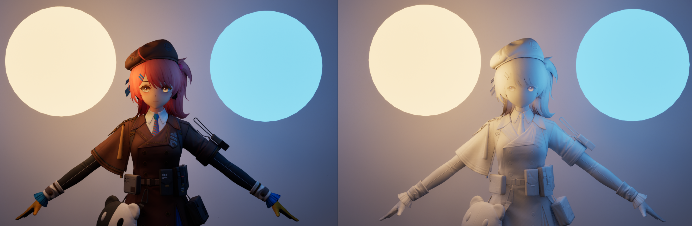

可以看到，黑暗环境下Lumen计算出来的间接光效果是挺扎实的，体积感很强。
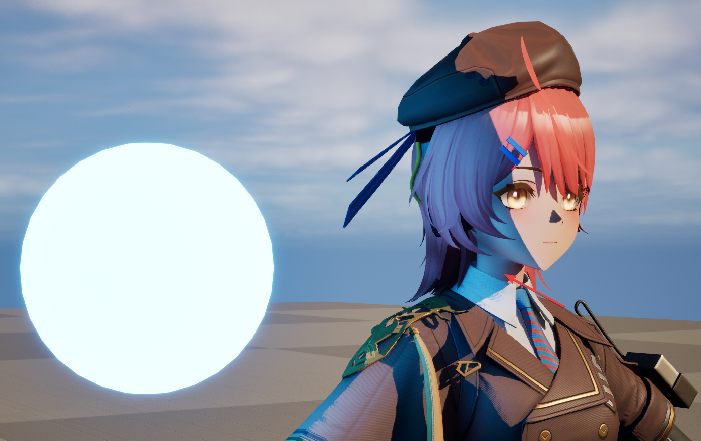
	为了突显Lumen的效果，上图把SkyLight给关掉了

但是在光照环境下，Lumens过强的体积感导致角色的暗部显得有些“塑料感”。

Lumen虽然拥有很强的体积感，丰富的GI信息，但是这对于卡通渲染来说，这些信息的“频率”太高了（毕竟卡通渲染本来就是对画面做减法），因此，我们需要对Lumen进行`降频`。

如果要做`降频`的话，相信大家第一个想到的算法就是blur，如果要进行大范围的blur需要进行大量的卷积运算，消耗还是挺高的。不过我们对GI的准确度其实并不没有太高的要求，我们可以暴力一点，多DownSample几次再blur。

这是对Lumen的进行了6次DownSample再用双线性插值采样的效果，其实已经很平滑了，基本已经是可以用的程度，不过稍微会可以看到像素之间的栅格：
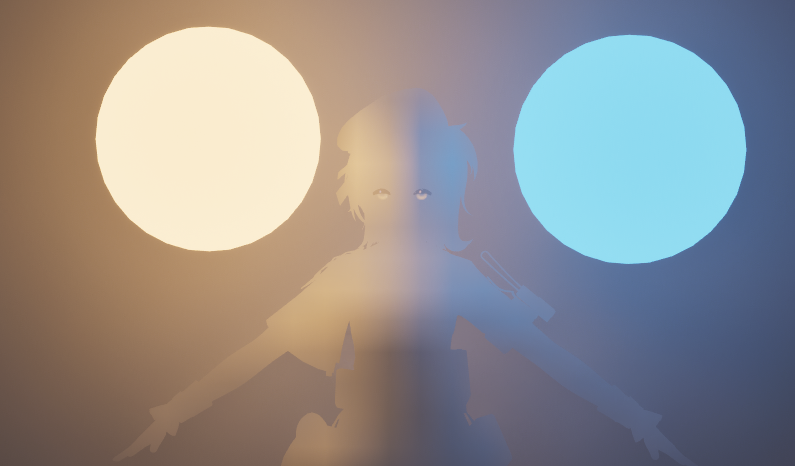
如果还想减轻一些瑕疵，可以在上面的基础上再做一次卷积：
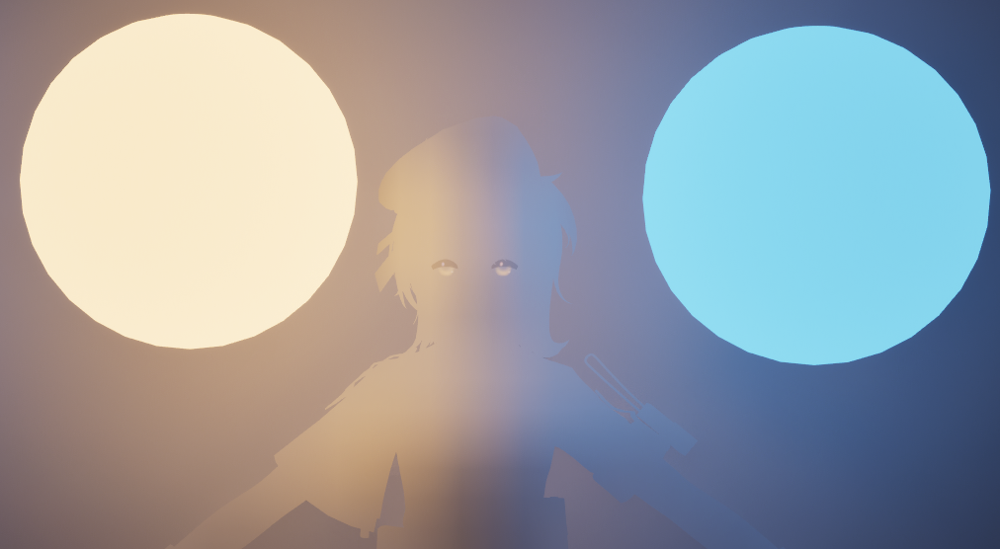

接下来我们拿这个结果和原本的Lumen进行Lerp一下就差不多了，核心代码如下：
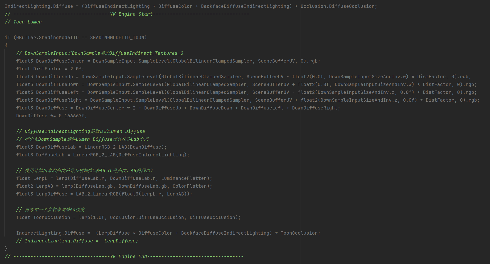

上面的代码里，Lerp之前把Lumen变换到Lab空间，然后分别插值L和ab让我们能够分别调整明度和颜色的插值比例


还有在光照环境下的Toon Lumen表现：
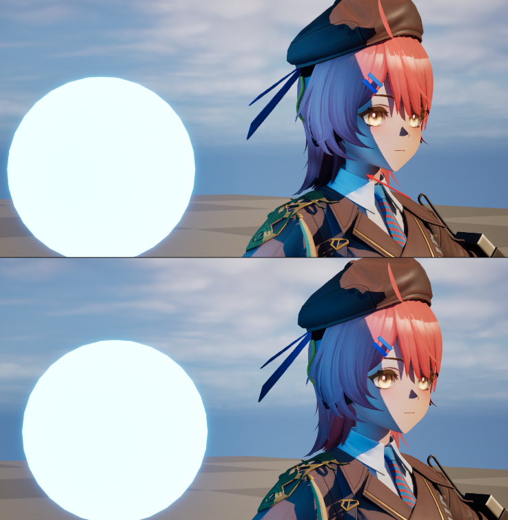
	上图的插值比例，明度0.75，颜色0.5


##### 二、代码实现

这篇文章的代码实现非常简单，需要改的东西不多。
###### 2.1 添加Post参数和DownSample

我们先给后处理盒子添加一些参数，用来调整Toon Lumen效果
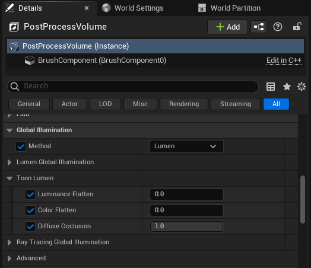

给FPostProcessSettings里添加一些新的属性：
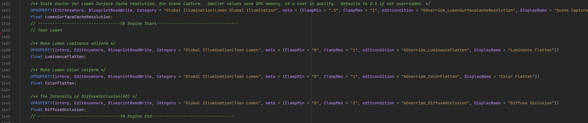
	Scene.h
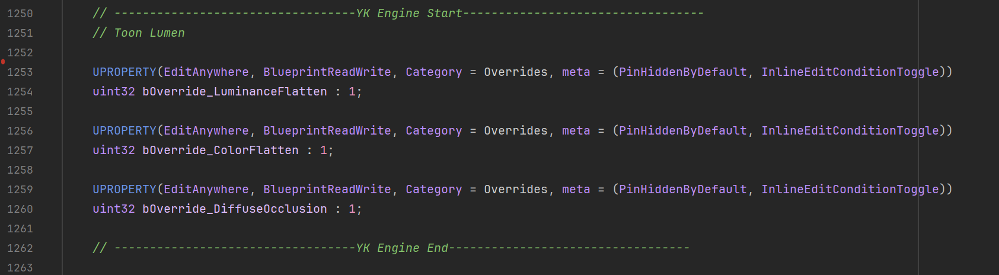
	Scene.h

上面的参数的默认值：
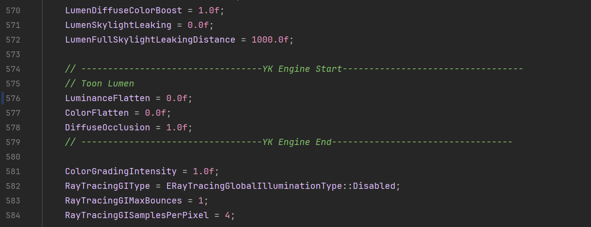
	Scene.cpp

这里应该是控制后处理盒子参数插值的地方，我们也给添加上：
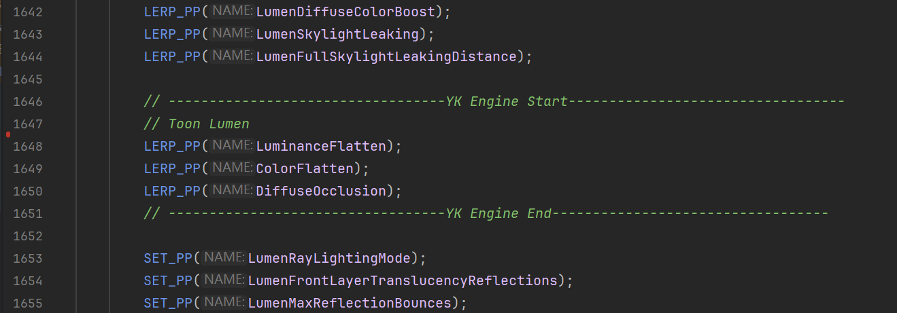
	SceneView.cpp

添加一个FLumenToonParameters，通过这个结构体我们把参数传递给shader：
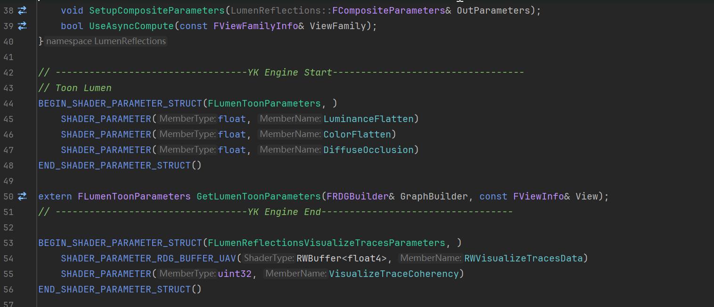
	LumenReflections.h
FLumenToonParameters的Get方法：
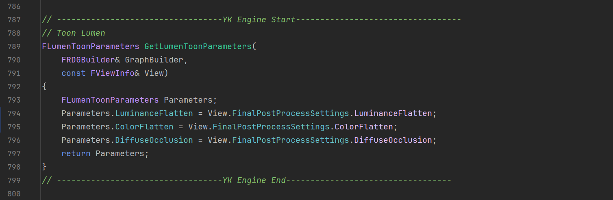
	LumenReflectionTracing.cpp

给FDiffuseIndirectCompositePS添加我们的参数，DownSampleInput是我们后面要传入的DownSample LumenDiffuse：
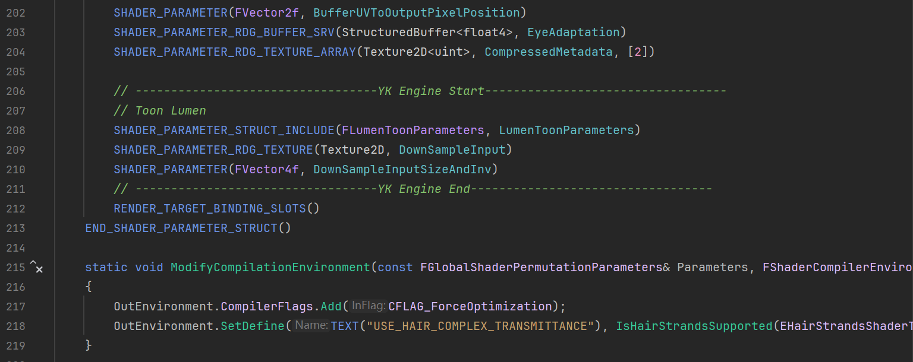
	IndirectLightRendering.cpp

接下来把Toon相关Lumen参数传递给shader，并且对Lumen Diffuse进行DownSample，这里用FSceneDownsampleChain来进行DownSample，UE计算Bloom的时候就是用这个东西来DownSample，我们直接拿来用，非常方便。
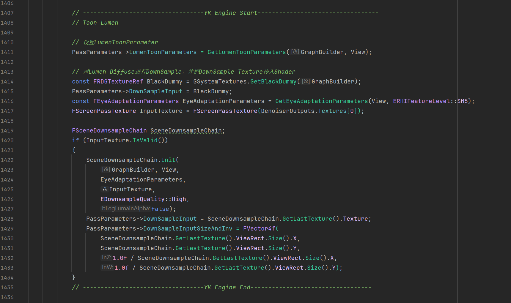
	IndirectLightRendering.cpp

在shader里添加参数的声明：
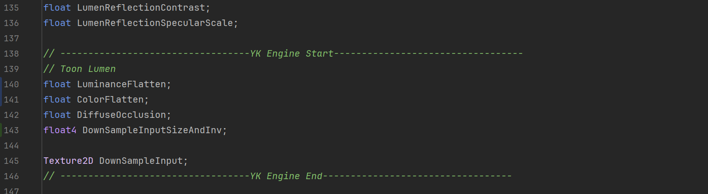
	DiffuseIndirectComposite.usf

###### 2.2 Toon Lumen计算

把之前关掉的Lumen效果开启回来：
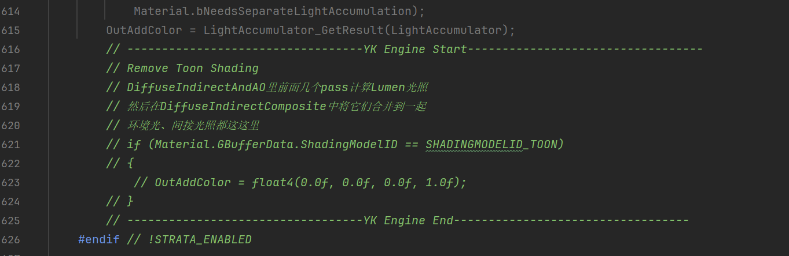
	DiffuseIndirectComposite.usf

Toon Lumen的计算就这么一点：

	DiffuseIndirectComposite.usf

##### 三、参考与链接

###### 3.1 链接

本文的修改都上传github了，对应下图的提交记录：
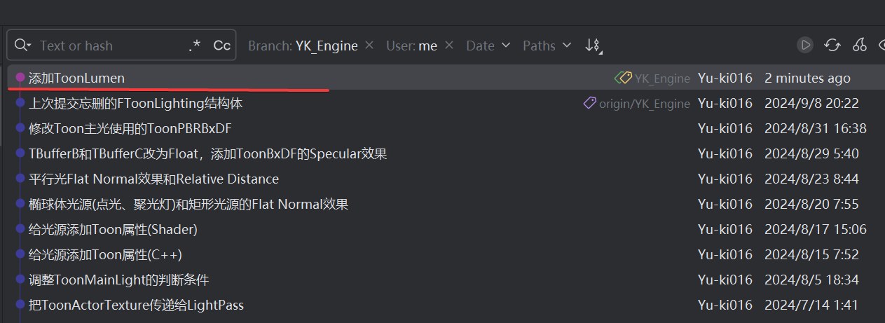
	https://github.com/Yu-ki016/UnrealEngine/tree/YK_Engine

###### 3.2 参考

【Unity/虚幻5/Blender】3种引擎 崩坏: 星穹铁道风格 卡通渲染 从球谐光照到眉毛透过刘海 完整流程：
https://www.bilibili.com/video/BV1CN411C7qx

虚幻5渲染编程(风格化渲染篇)[第八卷: Toon Lumen GI in UnrealEngine5]：
https://zhuanlan.zhihu.com/p/528608826

UE5【实践】3.卡通渲染改进-Shadow&Shading&Lumen：
https://zhuanlan.zhihu.com/p/573897188

虚幻5 Lumen光照下的ToonShading和AO修复：
https://zhuanlan.zhihu.com/p/612661259