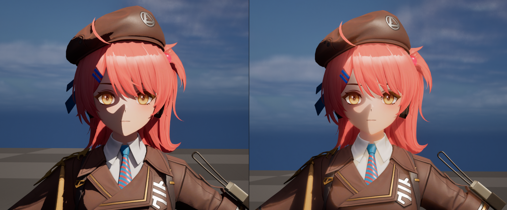
##### 一、前言

完美的分享里有一个效果称为暗部晕染，实现思路是给阴影做Blur，然后应该会把Blur结果用"变亮"之类的方法和SceneColor混合，或者乘上BaseColor之类的叠到SceneColor里。

	https://www.bilibili.com/video/BV1rW2LYvEox

这个效果挺有意思的，我打算抄一抄，不过我的实现上会和完美的分享有些区别。
分享里是在后处理阶段执行的，此时光照已经计算完成了，再叠上暗部晕染的话必然会导致亮部变得更亮。这个思路本身是没问题的，效果也很挺对味，但YKEngine毕竟多个了前向渲染的Pass，如果说我们把Blur后的阴影传递给前向渲染的Pass的话，我们能比在后处理做更灵活一点。

##### 二、实现思路

从这篇文章开始，我不会再像之前一样，每行代码都贴出来，每行都贴出来实在太麻烦了，工作量太大，不过一些关键的代码我还是会展示的。我会把文章的重心放在展示“我做了什么”、“为什么这么做”上，具体的实现还请移步github，github上也会又完整的代码，我也会尽量每次提交都只提交一小个功能，让你们看代码时更清晰一点。

###### 2.1 对ToonShadow进行Blur

我们可以参考Bloom来做Blur，这里我们Copy一下PostProcessBloomSetup里的AddGaussianBloomPasses，小改一下，用来封装一个做高斯模糊常用的函数，以后做各种后处理可能也会用到。
基本就改了一些变量名，然后把BloomQuality、BloomSize、BloomTint这些参数改成从外面传进来。
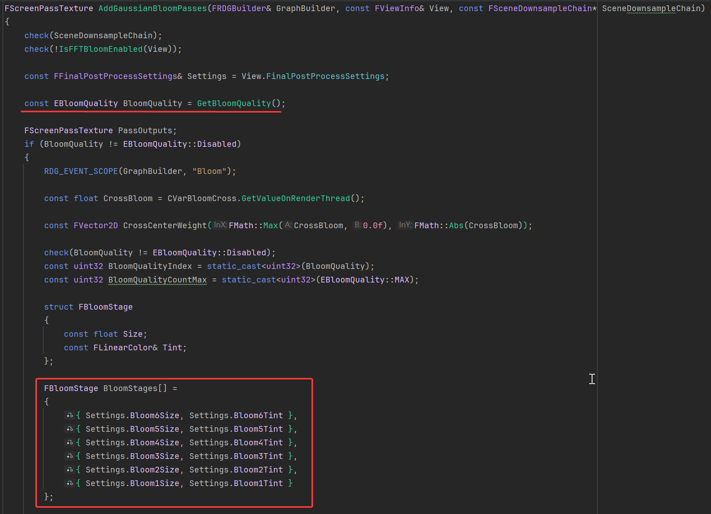
	PostProcessBloomSetup.cpp
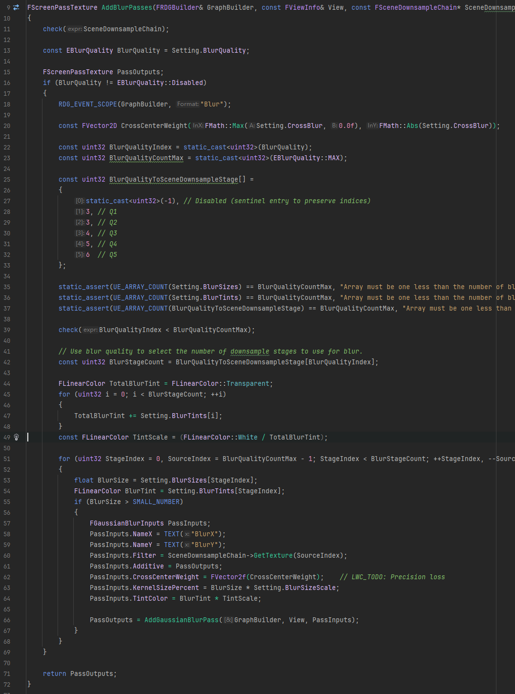
	GaussianBlurPassRendering.cpp

这些参数我本来是想直接用Bloom的默认值，自己调了一下感觉对最终效果影响还挺大的，所以还是暴露出来。

和Bloom不同的地方主要是这里，这个TintScale是我改成这样是为了保证最终的加起来的权重为1：
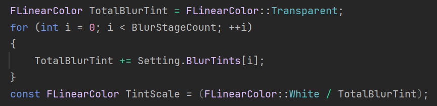
	GaussianBlurPassRendering.cpp

然后为了方便调参数，我把所有的参数都放到后处理里了：
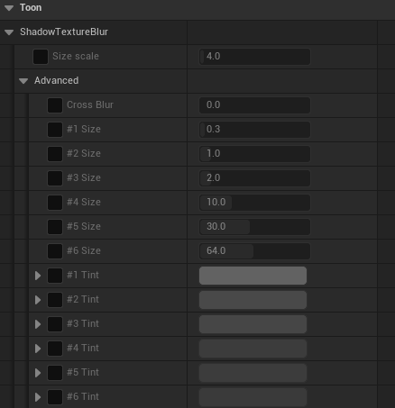

然后再封装一个AddTextureBlurPass，把DownSample也放进去，更方便调用：
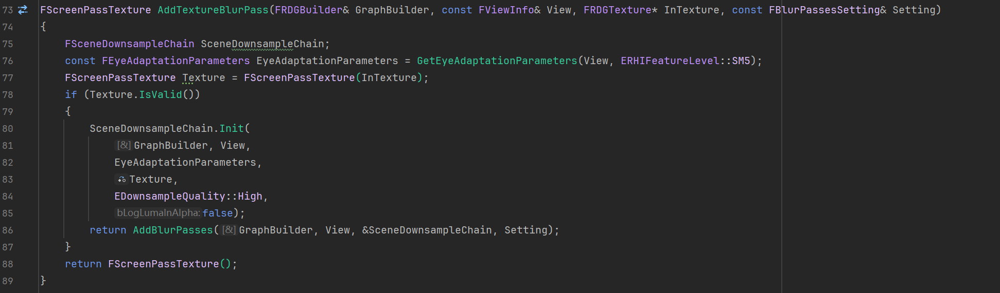
	GaussianBlurPassRendering.cpp

接下来新建ToonShadowBlur.h/.cpp，在这里我们对ToonShadow做高斯模糊，我们先直接对ToonShadow进行模糊看看效果。
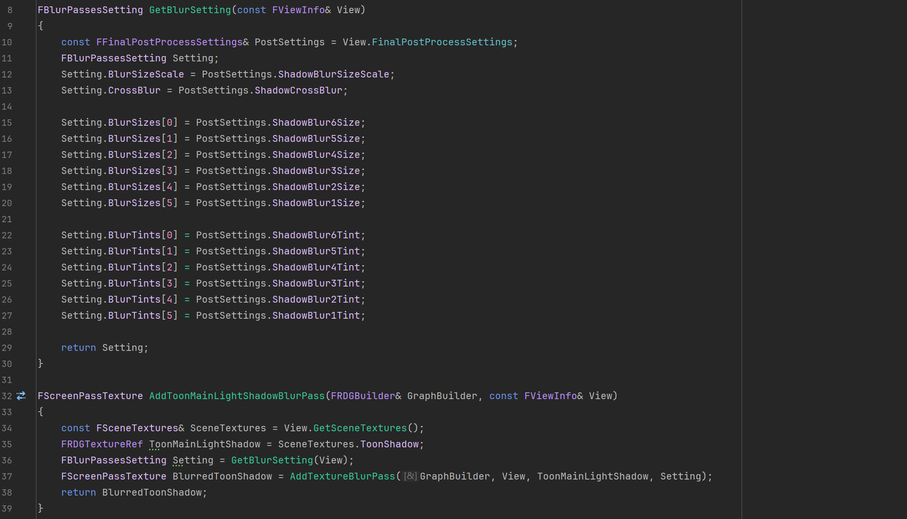
	ToonShadowBlur.cpp

我目前使用的是Bloom的默认参数来进行Blur，感觉效果也还ok。
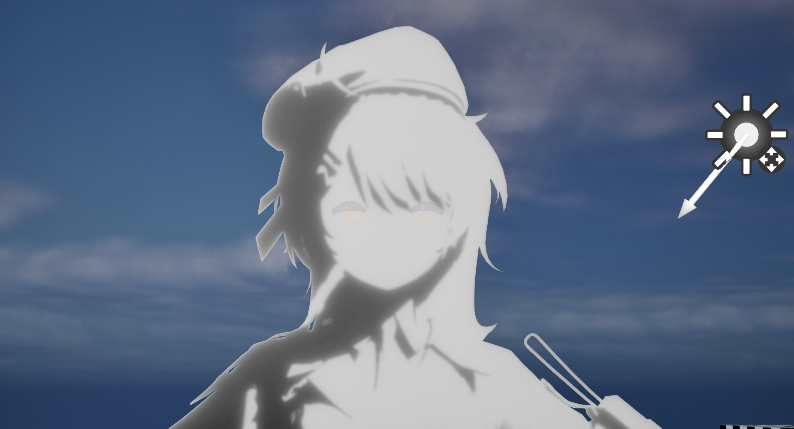

不过如果我们凑近点来看看，可以发现一堆马赛克：
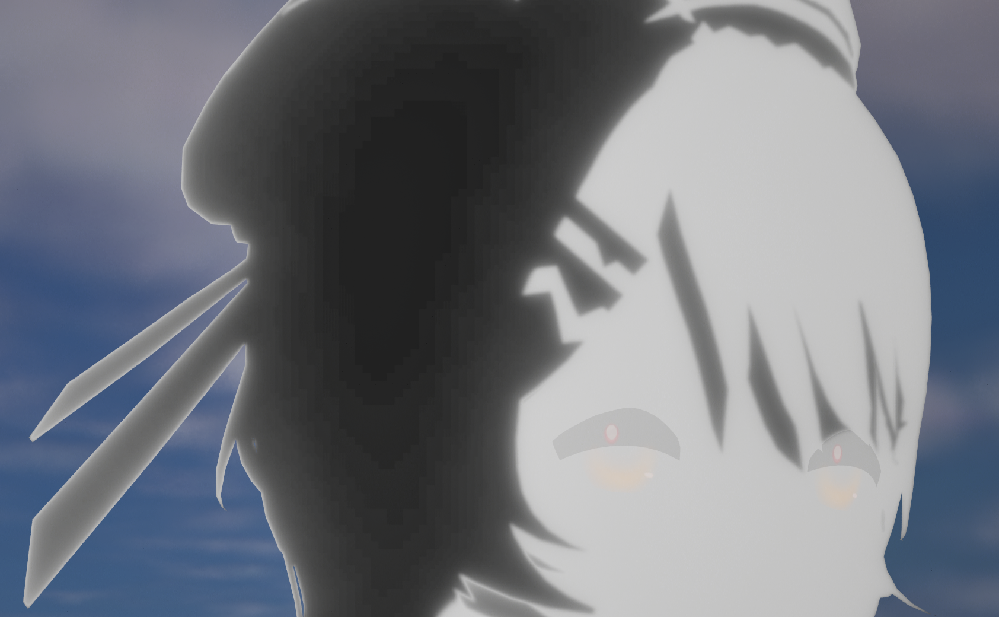

这其实也是预期以内的结果，我们的ToonShadow只有8位，是经不起降采样、卷积操作这样来回捣腾的。但如果把ToonShadow提升16位的话那太浪费了，所以我们接下来需要创建一张16位临时的Texture来做Blur。

我们在ToonShadowBlur.cpp中新加一个Setup Pass，在这个Pass里创建了一张16位单通道的临时Texture，并且把ToonShadow里存储的阴影信息Copy到临时Texture里：
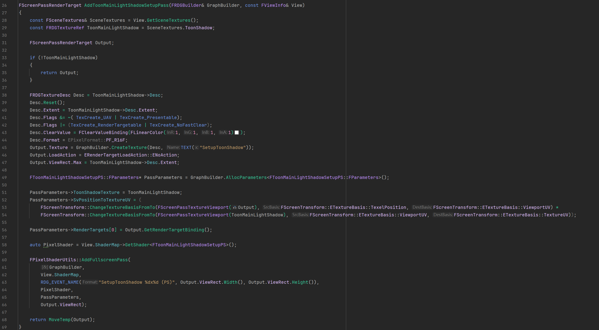
	ToonShadowBlur.cpp

然后还要在加一个Pass，用来把临时Texture里模糊过后的Shadow拷回ToonShadow的a通道：
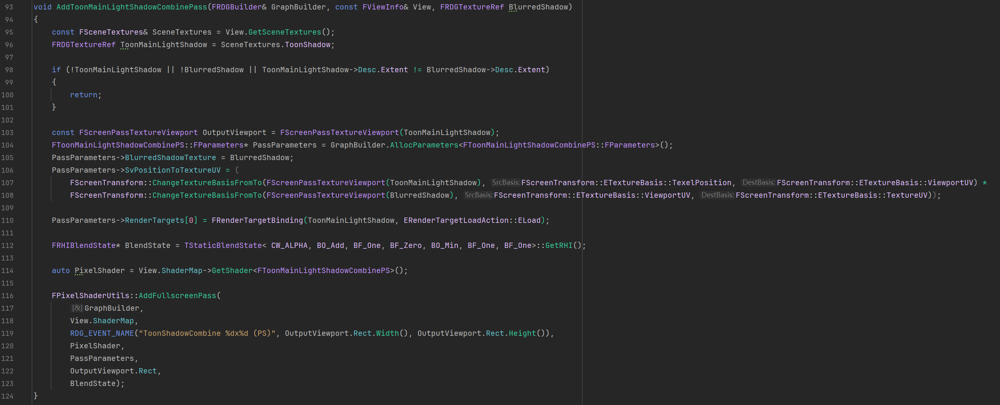
	ToonShadowBlur.cpp

AddToonMainLightShadowBlurPass这里也小改一下：
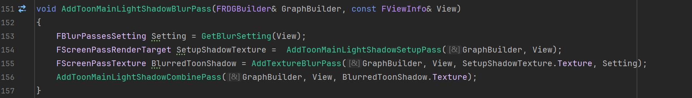
	ToonShadowBlur.cpp

看看效果：
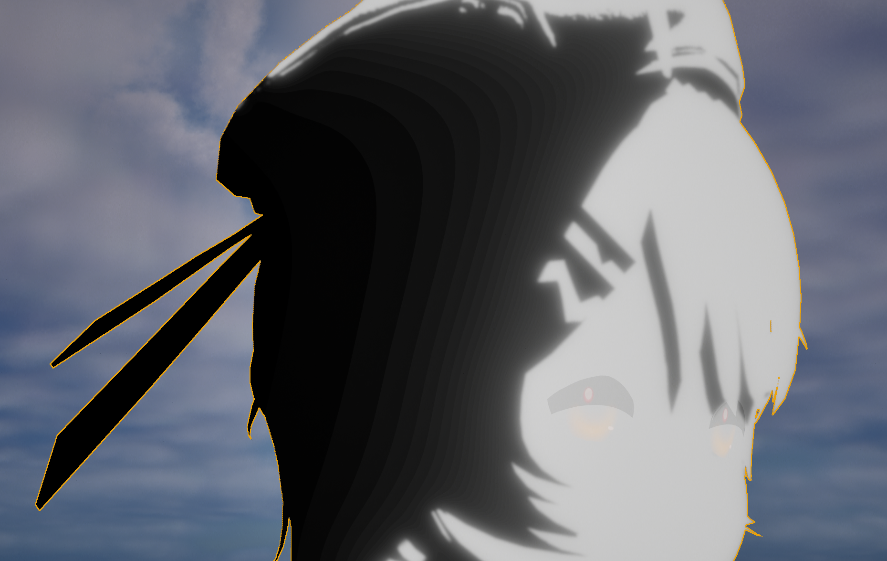

额...，虽然没有马赛克了，但是这一条一条的横纹也很难受。当然，这个也是精度导致的问题，因为我们最后把16位的BlurredShadow拷回8位的Texture里，必然带来一定的精度损失。

这里有一个技巧，我们把BlurredShadow拷回ToonShadow时先反平方一下：
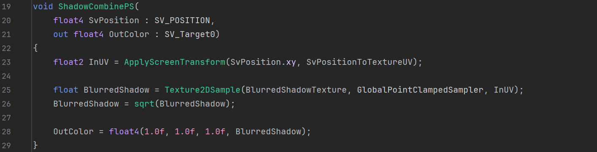
	ToonShadowBlur.usf

在使用ToonShadow时再开一下方：
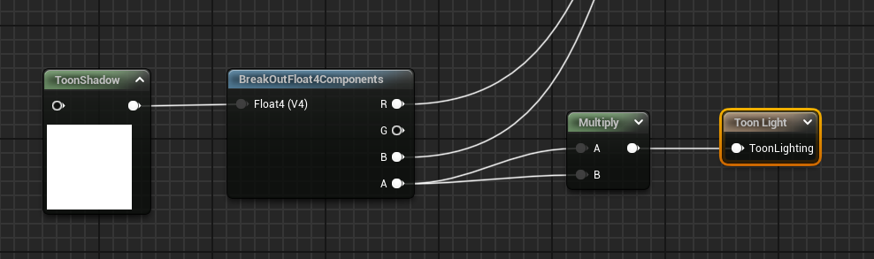

就会发现精度高了很多，已经是可以接受的程度了：
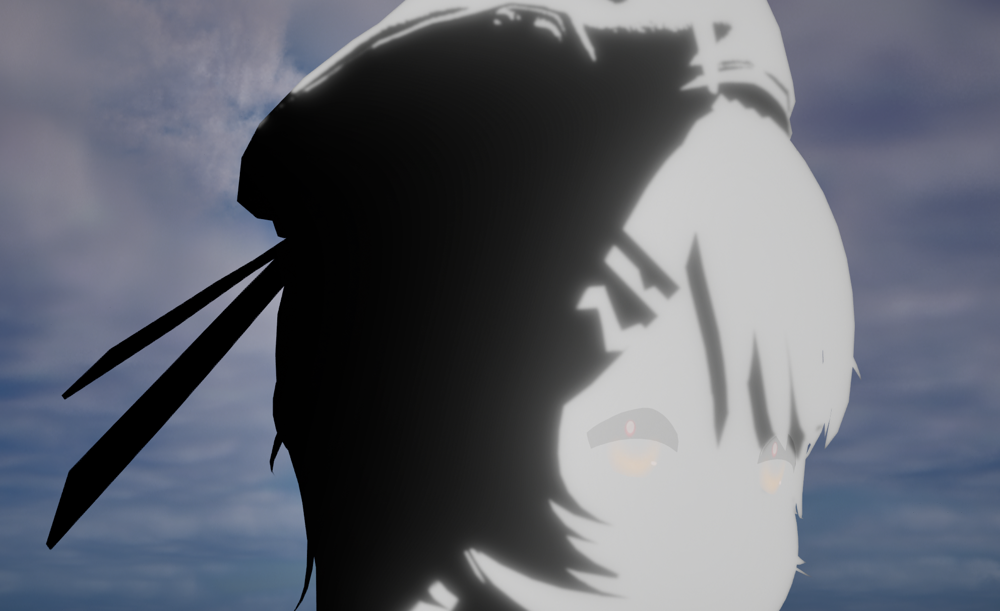

 这里解释一下为什么要反平方，这里涉及一个老生常谈的问题：人眼对亮度的感知是非线性的。大家都知道，对于人眼来说，中性灰是0.18而不是0.5，对于人眼来说，暗部其实都在0.18之下，在加上我们用8位来保存灰度，这就导致用于保存暗部的灰度值是非常少的。(255$\times$ 0.18=45.9，不到50个灰阶)
 我们把BlurredShadow反平方操作其实会让提升整体的灰度，用更多的灰阶用来保存暗部($\sqrt{0.18}=0.42$)，从而让暗部的灰阶过渡变得更加平滑。

###### 2.2 ToonBasePass写入自阴影

对比一下现在的Shading效果和BlurredShadow，就会发现BlurredShadow和角色身上的阴影根本就对不上，这是因为ToonShadow只有投影信息，并不包括角色的自阴影。
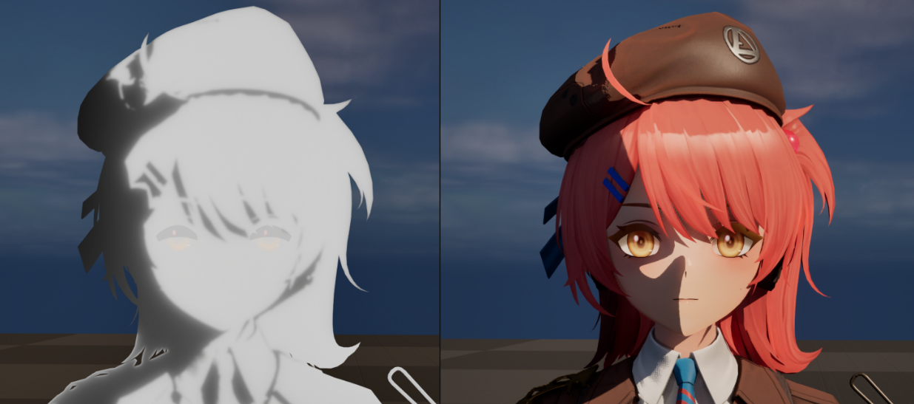

如果我们拿个NoL来卡出自阴影能行吗，不行，因为角色脸部还有SDF阴影，投影跟它肯定是对不上的。这似乎产生了一个悖论，BlurredShadow是在ToonLightPass之前计算的，而自阴影，SDF阴影这些东西是在ToonLightPass里计算的，这导致BlurredShadow永远都访问不到自阴影、SDF阴影这些东西。

其实要解决也不难，我们提前把(在ToonBasePass里)自阴影、SDF阴影等算好就行。因此我在ToonBufferOutput节点上加了个输出针脚，用来输出自阴影。
稍微改改我们的材质，在计算光照的时候顺带把自阴影传出来给ToonBasePass
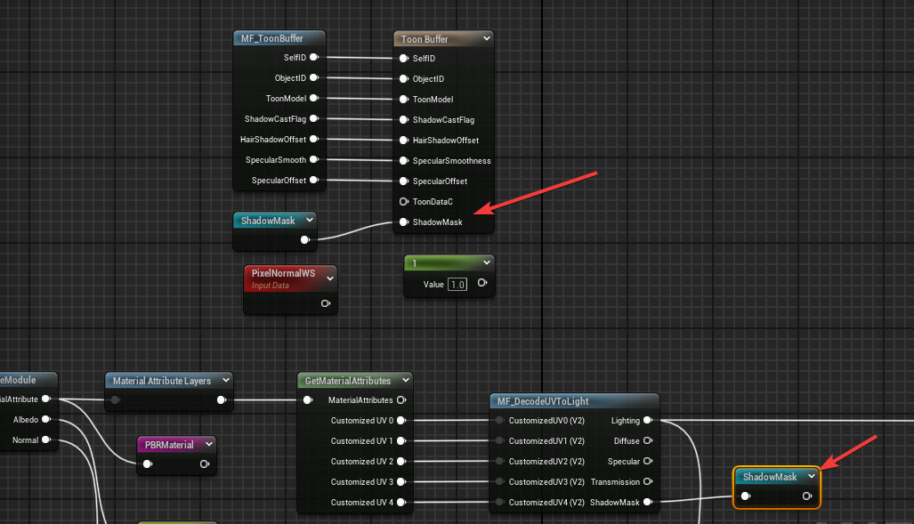

在ToonBasePass把ToonShadow作为RenderTarget，计算阴影需要一些主光的参数，也传给ToonBasePass
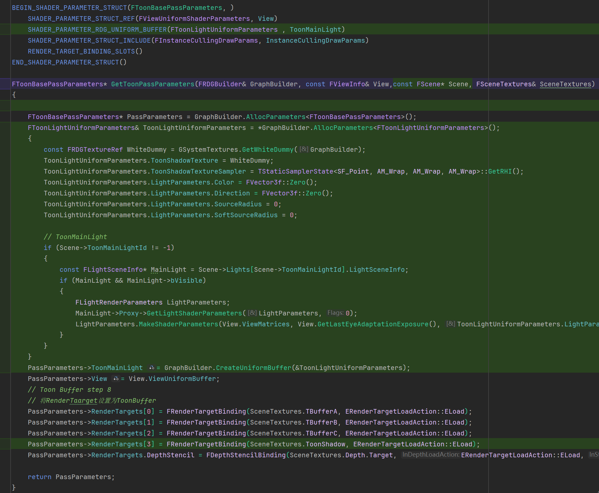
	ToonBasePassRendering.cpp

阴影我输出到ToonShadow的G通道里：
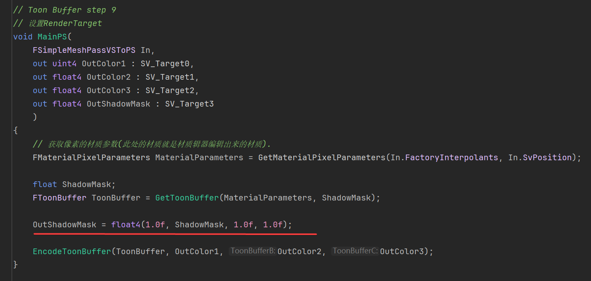
	ToonBasePassPS.usf

如果直接材质编辑器里计算的阴影连到ToonBufferOutput，我们很容易得到类似的报错，这是因为我的Custom HLSL里用了FDirectLighting这个结构体，而ToonBasePassPS.usf没有Include相关的文件。
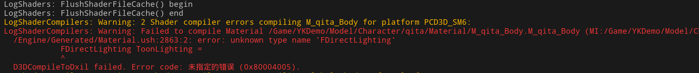

类似的一些情况我们可以通过添加一些宏的规避掉，不过我更想加一个ToonPassSwitch节点，能够方便我们区分ToonBasePass、ToonLightPass的代码。
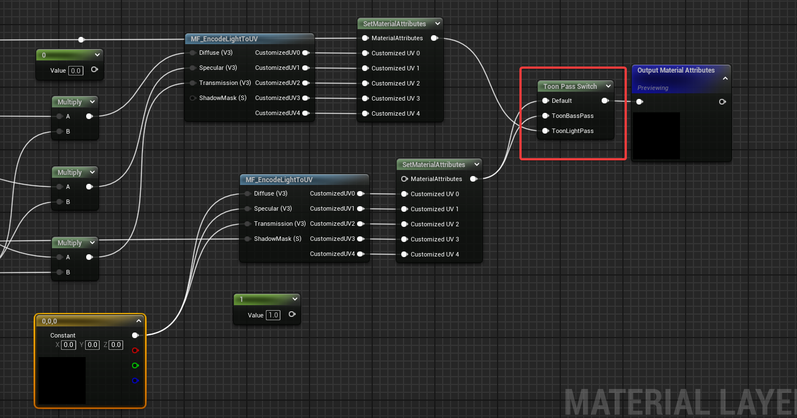

具体怎么实现的我就不展开了，具体看这个提交记录：
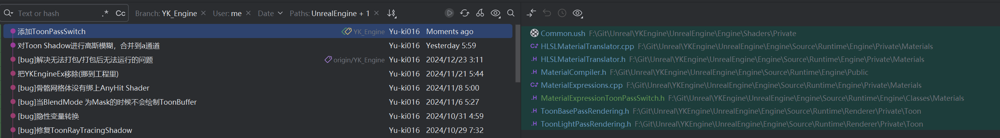

这样只要ToonBasePass里把自阴影、SDF阴影传到ShadowMask针脚上就能得到正确的BlurredShadow了：
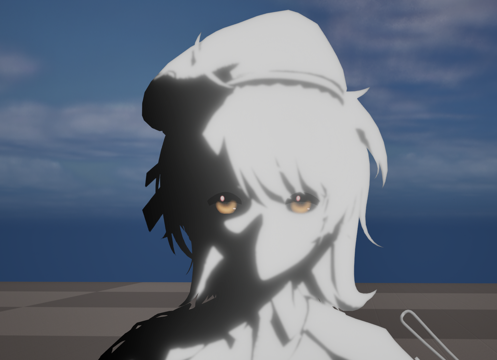

###### 2.3 暗部晕染效果

有了这张BlurredShadow，我们就能做很多有意思的效果。
比如可以在计算完光照之后，把BlurredShadow乘上主光颜色，BaseColor之后Add上去，或者用Screen来混合：
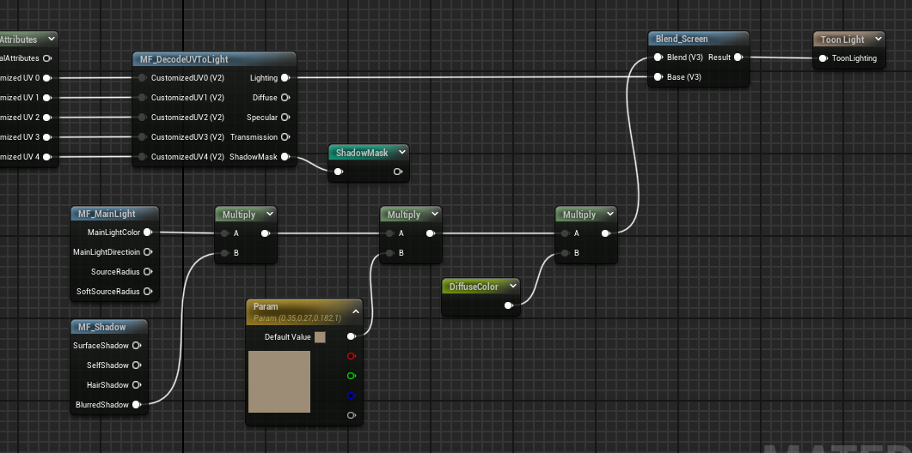

看看效果(由于我是在HDR显示器上调的效果，截图的暗部会比我自己所看到的更暗一些)：

另外我们也可以在计算光照的时候就和BlurredShadow取一个Max，这样的好处是不会让亮部变亮，而且可以和Ramp结合：
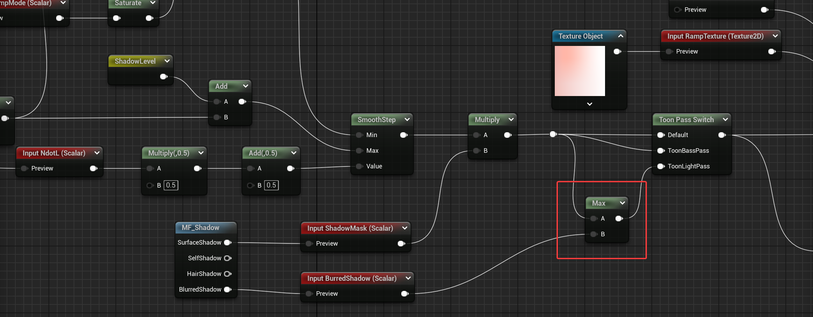

##### 三、参考与链接

###### 3.1 链接

本文的修改都上传github了，对应下图的提交记录：
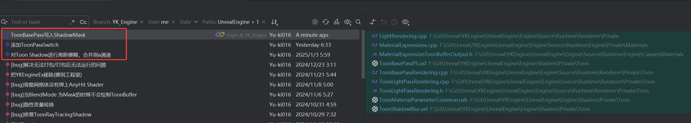
	https://github.com/Yu-ki016/UnrealEngine/tree/YK_Engine

示例工程：
https://github.com/Yu-ki016/YKEngineExampleProject

###### 3.2 参考

 [UFSH2024]用虚幻引擎5为《幻塔》定制高品质动画流程风格化渲染管线 | 晨风 Neverwind 完美世界游戏：
 https://www.bilibili.com/video/BV1rW2LYvEox

