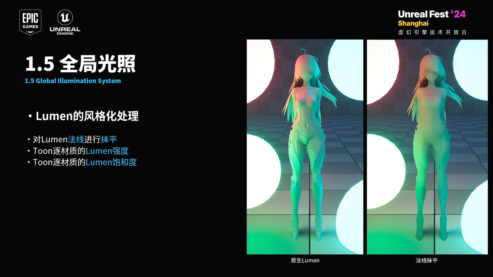

##### 一、前言

之前的文章里，我对Lumen的Diffuse进行降采样并进行一次卷积来得到低频的Lumen。完美的分享里提供了另一种思路：通过抹平法线来得到低频的Lumen信息。

	https://www.bilibili.com/video/BV1rW2LYvEox

这个思路挺不错的，我也想尝试一下。说到抹平法线，第一反应可能会想到对Toon角色的法线进行Blur，但我并不希望做卡通渲染动不动就进行Blur。于是思考了一下能不能使用别的方法来代替，这时灵光一闪“用相机方向代替法线可能性微存？”

马上试试看：

	LumenScreenProbeGather.usf

发现效果好到惊人。这个方法效率高，实现简单，同时不用进行任何的降采样和卷积，这就意外着不会出现场景像素能量到Toon角色上的这种Artifact，非常推荐大家使用。

##### 二 、实现思路

这次的实现非常简单，核心代码只有前言里贴出来的那几行。

首先，参数我做了一些调整，把这个参数传给shader即可：

	Scene.h

然后把之前降采样什么的操作都删了(这个，已经不需要了.jpg)

	IndirectLightRendering.cpp

在LumenScreenProbeGather.usf里将Toon角色的法线和相机方向进行插值：

	LumenScreenProbeGather.usf

在DiffuseIndirectComposite.usf里改成调整Lumen强度，饱和度，AO强度这些：

	DiffuseIndirectComposite.usf

最终效果：

##### 三、参考与链接

###### 3.1 链接

本文的修改都上传github了，对应下图的提交记录：

	https://github.com/Yu-ki016/UnrealEngine/tree/YK_Engine

示例工程：
https://github.com/Yu-ki016/YKEngineExampleProject

###### 3.2 参考

[UFSH2024]用虚幻引擎5为《幻塔》定制高品质动画流程风格化渲染管线 | 晨风 Neverwind 完美世界游戏：
https://www.bilibili.com/video/BV1rW2LYvEox
