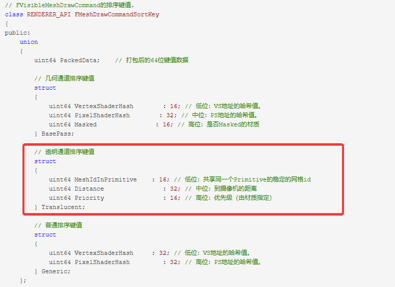
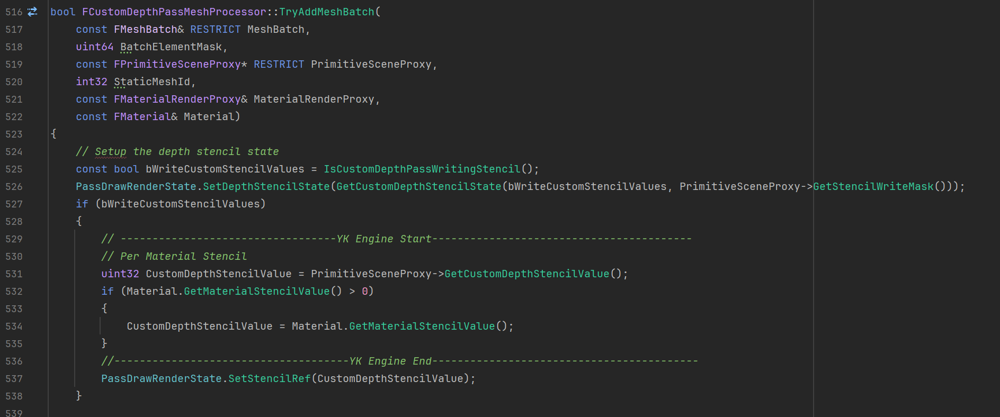
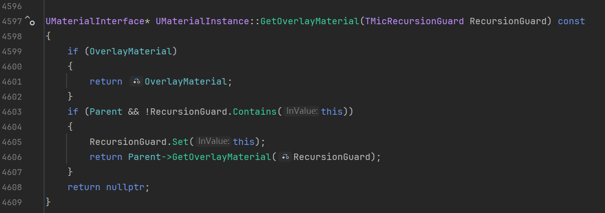

##### 一、前言

前段时间抄了养多乐大佬的绝区零渲染视频来学习一下，养多乐各种trick和参数还原的这么精准，想必是肘晕了水熊和振宇为我们把绝区零的shader偷了出来呀。
	https://www.bilibili.com/video/BV1kBBKYRE6Q

另外我也是想看看大家用公版引擎做卡通渲染会有哪些痛点，由于UE的stencil、TranslucencySortPriority和OverlayMaterial都是根据Mesh来设置的，视频里为了做描边、眼透效果将头发、身体、眼睛等部位拆成了不同的Mesh。拆分Mesh确实有些麻烦，我们可以优化一下，将Stentil、TranslucencySortPriority和OverlayMaterial都改成逐材质设置。
###### 1.1 逐材质Stentil

关于逐材质的Stentil，张氏男子已经写了一篇很好的文章，我也是直接抄他的文章来实现的：
	https://zhuanlan.zhihu.com/p/844165353

###### 1.2 逐材质半透明排序

UE的半透明是根据三个参数来排序的：MeshIdInPrimtive、Distance、Priority

	https://www.cnblogs.com/timlly/p/14588598.html

MeshIdInPrimtive：UE同一个Mesh上会有不同的材质，UE管它们叫做Section，一般情况下MeshIdInPrimtive就是按照模型Section的Id来进行设置的。
Distance：这个是根据每个Mesh到摄像机的距离计算的，从远到近排序，离相机越远Distance值越小，保证离相机近的Mesh较后渲染。
Priority：这个就是我们在Mesh上设置的TranslucencySortPriority

这三个参数的优先级为：Priority>Distance>MeshIdInPrimtive，因此，如果我们修改Priority，半透明会无视摄像机距离，直接按照Priority来排序；如果我们想只修改同一个Mesh内的排序，则可以通过自定义MeshIdInPrimtive来实现。

为了我们能够更好地调整半透明排序，我同时支持了逐材质TranslucencySortPriority和MeshIdInPrimtive的自定义。

###### 1.3 逐材质OverlayMaterial

UE的OverlayMaterial本质上是在原本网格的MeshBatch之后，把材质替换成OverlayMaterial，然后再提交一次MeshBatch。

	StaticMeshRender.cpp

在这个阶段我们是可以拿到到各个Section的Material的，这里我们只要改成使用Material上的OverlayMaterial就能实现逐材质OverlayMaterial。

甚至我们还可以做一些扩展，比如加个for循环多次绘制OverlayMaterial，这样还能实现多Pass的效果。不过目前我还没打算做多Pass，后面如果想做毛发效果再考虑实现这个。

##### 二、实现思路

###### 2.1 逐材质Stencil

逐材质Stencil照着张氏男子的文章抄就行，在CustomDepthPass里设置MaterialStencilValue：

	CustomDepthRendering.cpp

但是，如果你开启Nanite的话，可以发现我们设置的MaterialStencil并没有起作用：

如果你在FCustomDepthPassMeshProcessor::TryAddMeshBatch上打断点的话，也会发现断点并没有触发，说明nanite并没有走传统的AddMeshBatch的流程。

经过一番搜索，发现Nanite的CustomStencil应该是在5.3才支持的，我们可以找到Nanite支持CustomStencil的提交记录：https://github.com/EpicGames/UnrealEngine/commit/38657d35af200c5cb1095

接下来我们在这个提交记录上找找线索，我们可以发现Nanite的CustomStencil是直接从Primitive上拿的，这要改起来就很麻烦了，所以我决定直接开摆，暂时不支持Nanite的逐材质Stencil。

	NaniteDepthExport.usf

	PrimitiveUniformShaderParametersBuilder.h

###### 2.2 逐材质半透明排序

逐材质半透明排序的修改流程跟stencil差不多，我在材质上添加了两个参数：Material Translucency Sort Priority和Translucency Section Priority。
Material Translucency Sort Priority与Mesh组件上的Translucency Sort Priority相对应，它的优先级高于距离排序；
Translucency Section Priority对应的是前言里提到的MeshIdInPrimtive，它的优先级低于距离排序，如果我们想调整网格内的排序，使用这个更合适。

	Material.h

同样地，我们给这两个参数加上一些接口和并设置好override关系。

Material Translucency Sort Priority的功能实现起来非常简单，如果材质上设置了MaterialTranslucencySortPriority，就用它覆盖原本的SortKey.Translucent.Priority。

	BasePassRendering.cpp

Translucency Sort Priority的功能实现如果你想简单点的话可以和上面一样，直接覆盖SortKey.Translucent.MeshIdInPrimitive。
但我为了后面做OverlayMaterial的时候计算MeshIdInPrimitive的偏移值方便一点，在添加MeshBatch的时候，根据Translucency Sort Priority进行排序。这样做的好处是保证MeshIdPrimitive的最大值依旧等于Section数量-1。

先根据Section的Index和Translucency Sort Priority进行排序：

	StaticMeshRender.cpp

	StaticMeshRender.cpp

根据排序后的结果来设置MeshIdInPrimitive：

	StaticMeshRender.cpp

	PrimitiveSceneProxy.cpp

同样的，SkeletalMesh也要进行相似的修改，不过有一点需要注意，我们在GetDynamicElementsSection里设置的MeshIdInPrimtive会在Collector.AddMesh里被覆盖掉，所以我加了个bool参数来避免被引擎默认的排序覆盖：

	SkeletalMesh.cpp

	SceneManagement.cpp

###### 2.3 逐材质OverlayMaterial

接下是逐材质OverlayMaterial，它的实现我并没怎么参考Nanite Override Material，还是照着之前添加Stencil和Material Translucency Sort Priority等的流程来：

	Material.h

不过GetOverlayMaterial函数有些区别，它多了个TMicRecursionGuard，这个东西是从Nanite Override Material那边抄过来的，用来防止无限递归：

	MaterialInterface.h

	Material.cpp

	MaterialInstance.cpp

搞完OverlayMaterial的接口并设置好override关系之后，我们就可以在原本OverlayMaterial MeshBatch的地方拿到材质上的OverlayMaterial并进行替换 。
在StaticMesh和SkeletalMesh都加上：

	StaticMeshRender.cpp

	SkeletalMesh.cpp

接下来我们用一个简单的带WPO的材质来测试一下结果：

理论上我们应该获得右图的效果，结果却如左图一样，一点反应都没有：

截帧可以发现，我们的OverlayMaterial实际上是绘制了，只不过它的WPO并没有起作用：

还有两处地方需要修改。
一个是MaterialRelevance，MeshCompnent会把用到的所有材质特性收集到FMaterialRelevance里，其中就有一个bUsesWorldPositionOffset来控制是否开启WPO：

	MeshComponent.cpp

	MaterialRelevance.h

第二个是FPrimitiveSceneProxy里的bAnyMaterialHasWorldPositionOffset属性，我们也要进行设置：

	PrimitiveSceneProxy.cpp

对了，FPrimitiveSceneProxy里还有一个VerifyUsedMaterial函数，我们也要加上一些逻辑来避免报错，不然它天天刷error也挺烦的：

	PrimitiveSceneProxy.cpp

##### 三、参考和链接

###### 3.1 链接

本文的修改都上传github了，对应下图的提交记录：

	https://github.com/Yu-ki016/UnrealEngine/tree/YK_Engine

示例工程：
https://github.com/Yu-ki016/YKEngineExampleProject

###### 3.2 参考

【Unity/虚幻5/Blender】3种引擎 绝区零风格 卡通渲染 星见雅 完整流程：
https://www.bilibili.com/video/BV1kBBKYRE6Q

UE5 CustomStencil 逐材质Stencil：
https://zhuanlan.zhihu.com/p/844165353

剖析虚幻渲染体系（03）- 渲染机制：
https://www.cnblogs.com/timlly/p/14588598.html