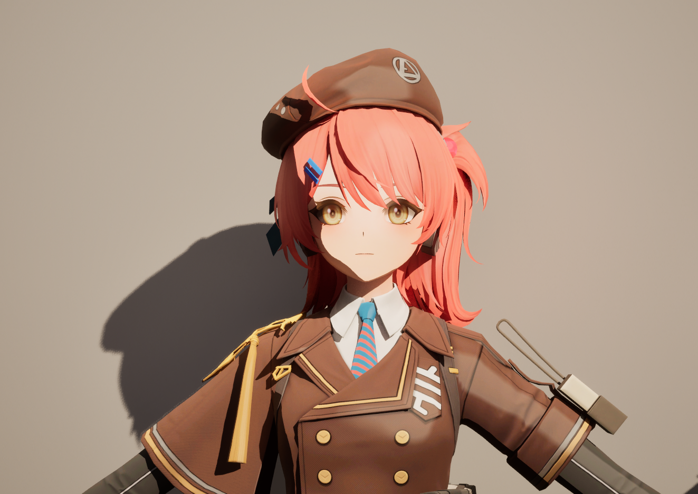
发现之前写的文章很多图片被知乎压得很糊，一些代码的图片更是根本看不清，所有我打算以后写文章时把markdown文件和所有图片都上传到github上，如果有需要还请移步以下github仓库：
https://github.com/Yu-ki016/Yu-ki016-Articles/tree/main

另外，本文的修改也都上传github了，对应下图的提交记录：

https://github.com/Yu-ki016/UnrealEngine/tree/YK_Engine

##### 一、前言
###### 1.1 背景
上一篇文章添加了几个ToonBuffer，这样就方便我们写入些自定义的数据来做卡通渲染，但是，在美美写一些渲染特性之前，还有一个问题不解决一下浑身难受，那就是角色脸上的自阴影：
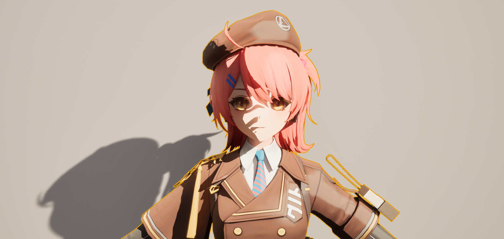
> 角色脸上的自阴影

另外，我还想对投影做一些更精密的控制，比如说我希望：
1. 角色A任意部位可以选择接受或者不接受自阴影
2. 角色A任意部位可以选择是否投影到角色A身上（比如可以开启或关闭头发对脸部的投影）
3. 角色A在第1、2点关闭了投影的时候，仍可以投影到任意角色B（头发关闭了对A的投影之后仍能对B投影）
###### 1.2 处理自阴影的方法
处理自阴影的方法有很多，最简单粗暴的话直接让脸不接受投影就好，目前市面上很多游戏脸部就没接受投影。但我个人是非常希望角色脸部可以接受头发，树叶等的投影，肯定不会采取这种方法。
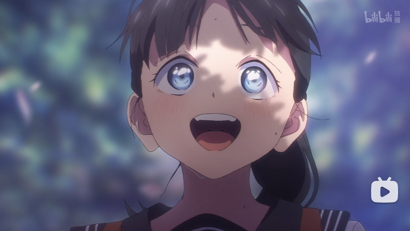
>《明日酱的水手服》

还有一个简单易实现的方法，就是在脸部比较shadow map深度的时候添加一个offset，这样也可以消除自阴影，当然像头发的投影这些离脸部较近的物体的投影也会被屏蔽掉，或多或少有些问题。不过头发的投影我们可以用一些其他的方法来做（屏幕空间的做法之类的），这个办法也不是不能用。

YivanLee大佬的分享里，使用的是ShadowProxy，虽然不知道他使用的是怎么样的代理，但以我个人粗浅的理解这种做法应该或多或少也会有些小问题。
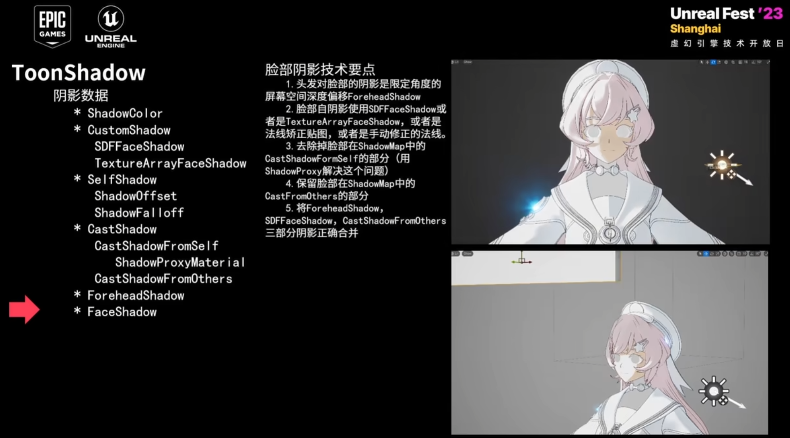
>https://www.bilibili.com/video/BV13K4y1r7Fm

除此之外，也可以渲染两张ShadowDepth或者使用PerObject Shadow，这些方法实现起来稍有繁琐，而且为了消除自阴影多渲染一张ShadowDepth，我个人会觉得不够优雅。
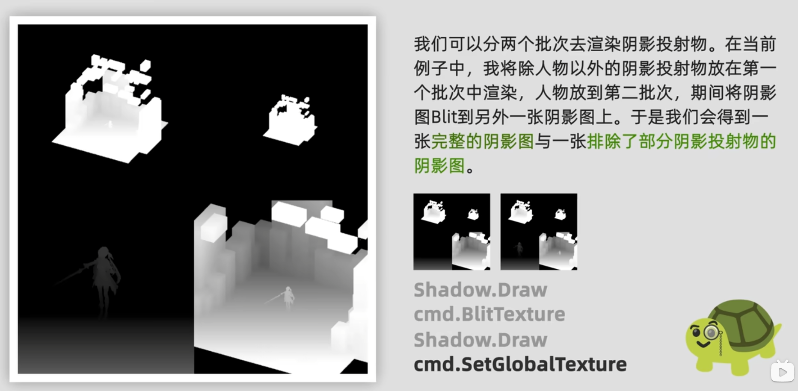
>https://www.bilibili.com/video/BV1yy421v75V

另外，越是想对投影做一些更精密的控制，比如说1.1中提到的那三点，就发现ShadowMap的局限性越明显。因此，为了实现我预想的那些效果，我打算通过修改RayTracing Shadow来实现对卡渲投影的控制。

##### 二、Realtime RayTracing基础知识

我一开始打算改的时候，看到源码里的payload，anyhit shader等东西的时候完全是云里雾里的，相信很多人也是对光栅化流程更熟悉一些，不大了解RayTracing流程，所以我们先补充点RayTracing的基础知识。
本文对光追的介绍只是浅尝则止，如果想深入了解光追，可以看看向往大佬文章，讲得非常详实：
https://www.cnblogs.com/timlly/p/16687324.html
SigGraph2018的这个课程也讲得非常不错，下文很多图片都是从他的ppt里截的：
https://intro-to-dxr.cwyman.org/
###### 2.1 RayTracing管线

首先，可以看一下这张图，这是我们最熟悉的光栅化管线：
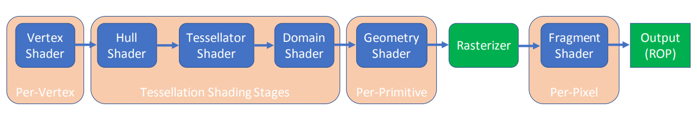
>https://intro-to-dxr.cwyman.org/presentations/IntroDXR_RaytracingShaders.pdf

跟光栅化管线相对应的，Realtime RayTracing的管线如下：

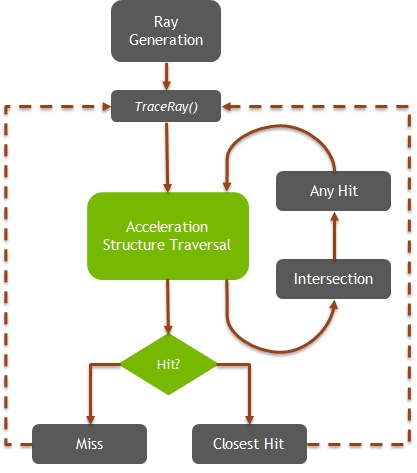
>https://intro-to-dxr.cwyman.org/presentations/IntroDXR_RaytracingShaders.pdf

上图的Acceleration Structure Traversal是加速结构：
- 它以最适合GPU遍历的格式表示全3D环境。表示为两级层次结构，该结构提供了GPU的优化光线遍历，以及应用程序对动态对象的有效修改。

不过加速结构我们不需要太关注，更需要关注的是RayTracing中可编程的这5个shader：
- **Ray Generation**：用于生成射线。在此shader中可以调用TraceRay()递归追踪光线。所有光线追踪工作的起点，从Host启动的线程的简单二维网格，追踪光线，写入最终输出。
- **Intersection**：当TraceRay()内检测到光线与物体相交时，会调用此shader，以便使用者检测此相交的物体是否特殊的图元（球体、细分表面或其它图元类型）。使用应用程序定义的图元计算光线交点，内置光线三角形交点。
- **Any Hit**：当TraceRay()内检测到光线与物体相交时，会调用此shader，以便使用者检测此相交的物体是否特殊的图元（球体、细分表面或其它图元类型）。在找到交点后调用，以任意顺序调用多个交点。
- **Closest Hit**和**Miss**：当TraceRay()遍历完整个场景后，会根据光线相交与否调用这两个Shader。Cloesit Hit可以执行像素着色处理，如材质、纹理查找、光照计算等。Cloesit Hit和Miss都可以继续递归调用TraceRay()。**Closest Hit**在光线的最近交点上调用，可以读取属性和追踪光线以修改有效载荷。**Miss**如果未找到并接受命中，则调用，可以追踪射线并修改射线有效载荷。
>上面的解释抄自向往大佬的文章：《剖析虚幻渲染体系（17）- 实时光线追踪》

看了上面的介绍大家可能还没对光追管线有清晰的了解，接下来再进行详细的介绍。

如下图，首先Ray Generation Shader会调用TraceRay()函数，屏幕的每个像素都会发射出一根射线出来，每根射线进入加速结构遍历所有交点，最终得到交点信息返回Ray Generation Shader。接下来Ray Generation Shader拿到交点信息后，计算输出结果写回屏幕。
简单点来说，Ray Generation Shader是光追的入口和出口。

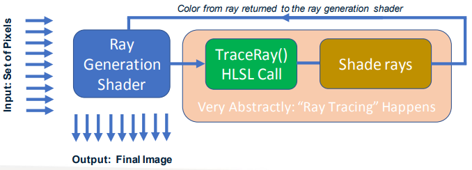
>https://intro-to-dxr.cwyman.org/presentations/IntroDXR_RaytracingShaders.pdf

接下来我们看看调用TraceRay()函数之后，光追管线是怎么计算交点并返回信息给RayGeneration Shader。
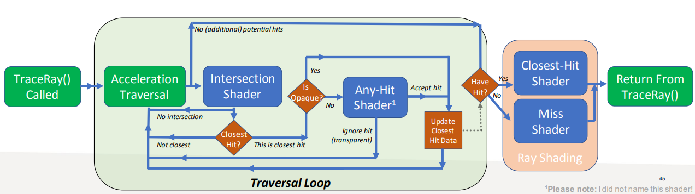
>https://intro-to-dxr.cwyman.org/presentations/IntroDXR_RaytracingShaders.pdf

首先，射线通过Intersection Shader来判断是否和物体有相交；
当射线与物体有交点时调用AnyHit Shader，由于在射线的路线下可能会有多个交点，因此AnyHit Shader也会被多次调用，这里一点需要注意的，每个交点调用的顺序是随机的，因此下图里A点先调用还是B点先调用这是不确定的。

一般AnyHit Shader的职责在于判断这个交点的`Hit`是否有效
- 如果说是B点先调用，并且AnyHit Shader认为这个Hit有效，就可以保存这个B点为Closest Hit，那么接下来Intersection Shader判断交点A的距离比B大，就可以直接舍弃交点A，不会再调用AnyHit Shader
- 如果说是B点先调用，并且B点是一个Mask材质镂空的地方或者透明材质，则AnyHit Shader可以调用IgnoreHit()函数舍弃这个Hit，这样就不会更新最近距离，接下来继续在A点调用AnyHit Shader
- 当然也可能是A点先调用...
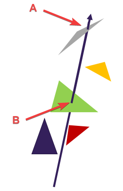
>https://rtintro.realtimerendering.com/2-GPU.pdf

当光线遍历完了场景中的所有交点之后，如果一个有效的Hit都没有，则调用Miss Shader。
当光线遍历完了场景中的所有交点之后，有一个有效的Closest Hit，则调用ClosestHit Shader，一般ClosestHit Shader会把交点距离，交点处的颜色、法线等需要的数据返回Ray Generation Shader，让Ray Generation Shader进行后续的光照计算。

###### 2.2 Payload

上面漏讲了Payload，Payload是射线的有效载荷，其实就是一个用户自定义的结构体，2.1部分里说的把颜色、法线等数据返回RayGeneration Shader就是通过Payload返回的。
下面是5种shader的定义，你可以发现AnyHit/Miss/ClosestHit Shader的输入输出就是Payload。

>https://intro-to-dxr.cwyman.org/presentations/IntroDXR_RaytracingShaders.pdf

比如下面的代码了定义了一个只有颜色的Payload，当光线没打中物体miss shader往Payload里写如蓝色，当光线打中了物体则往Payload中写入红色。

>https://rtintro.realtimerendering.com/2-GPU.pdf
###### 2.3 DXR Built-in函数
下面是Direct X RayTracing(DXR)提供的一些built in函数，大伙看一眼就行
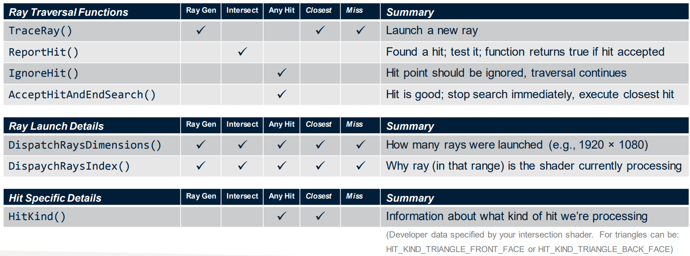
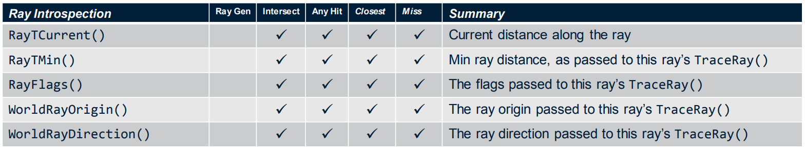
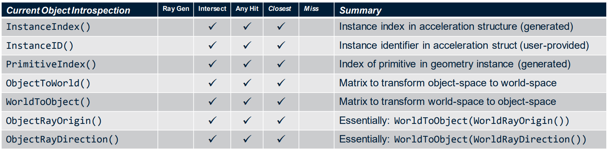
>https://intro-to-dxr.cwyman.org/presentations/IntroDXR_RaytracingShaders.pdf
###### 2.4 RayTracing Shadow

接下来看看RayTracing Shadow是怎么实现的
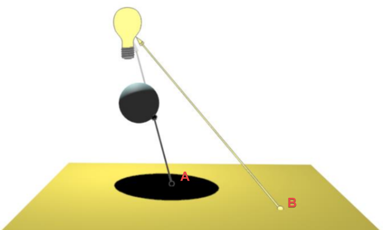
>https://www.cnblogs.com/timlly/p/16687324.html

- Generation Shader通过TraceRay()从着色点发射一条指向光源方向的射线
- 如果射线没有击中任何物体(没有任何有效的Hit)，则说明该像素被光源照亮
- 如果射线击中任何物体，则说明该像素在阴影中

根据上面信息，我们如果想去除自阴影的话，其实只需要在AnyHit Shader里判断射线击中的物体是否自身，如果是自身，则调用IgnoreHit()舍弃这个Hit。同样的，如果我们想排除自阴影之外的其他投影，也可以在AnyHit Shader中进行判断。

##### 三 使用Nsight截帧RayTracing

刚想开始修改管线的时候，发现Renderdoc不支持RayTracing，如下图，光源的RayTracing Shadow将会无法设置，也没有办法启用。
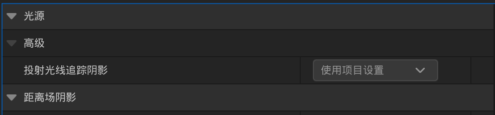

刚好也可以摆脱一下路径依赖， 学习一下别的截帧软件，这里我使用的是Nsight，下载链接如下：
https://developer.nvidia.com/nsight-graphics

打开Nsight，它的界面是这样的，你可以点击左上角的Connect按钮来连接Unreal：
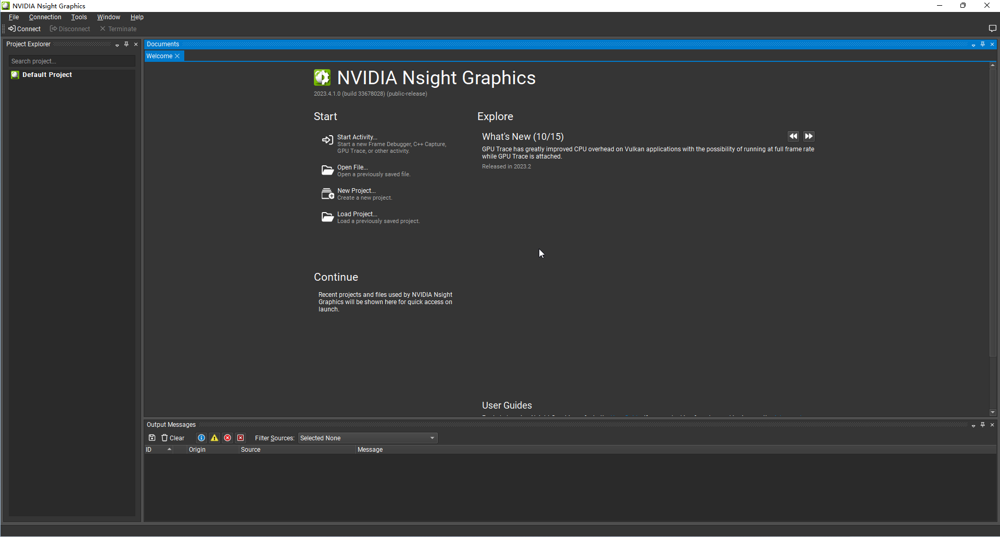
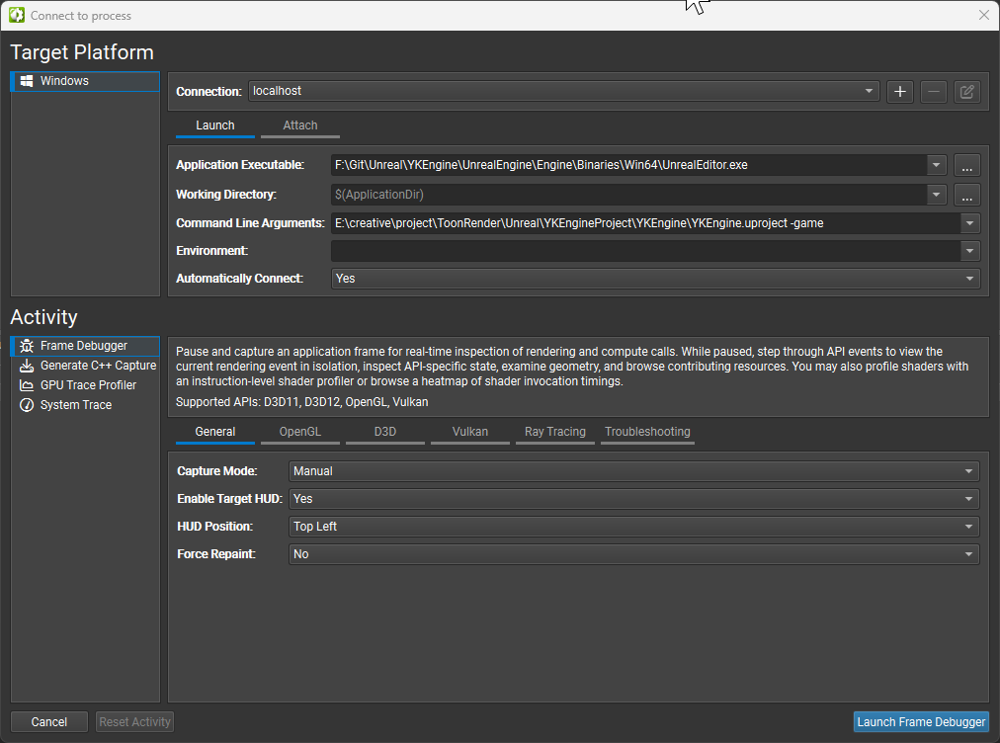
Activity中选择Frame Debugger
在Application Executable中填入引擎的路径：
```c
F:\Git\Unreal\YKEngine\UnrealEngine\Engine\Binaries\Win64\UnrealEditor.exe
```
在Commmand Line Arguments中填入项目的路径，后面加上-game
```c
E:\creative\project\ToonRender\Unreal\YKEngineProject\YKEngine\YKEngine.uproject -game
```
我使用Nsight截帧的时候，用Eitor模式启动会卡住，所以添加-game让项目以独立进程启动，就是下面这个模式，
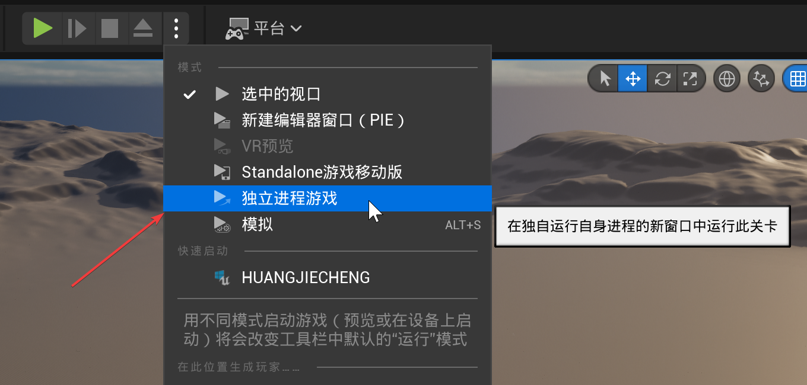

接下来我们截帧找一下UE的RayTracing Shadow：
在项目设置里打开光追和光追阴影
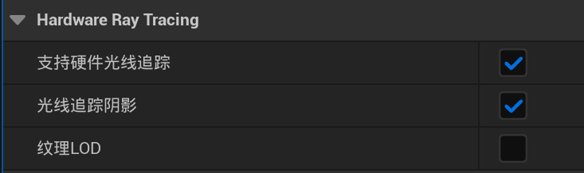

如果光源的光追阴影还没开启的话，在光源设置里手动打开
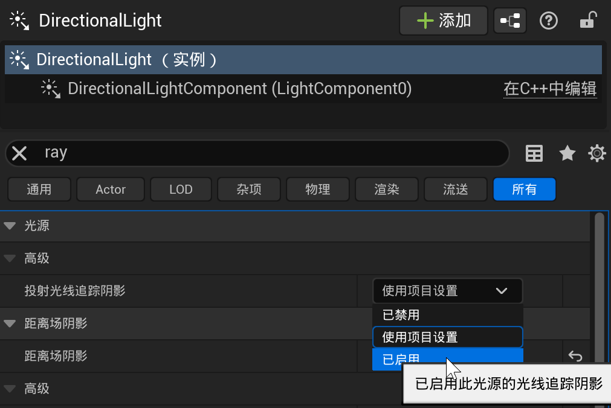

接下来用Nsight启动项目，然后按F11截帧
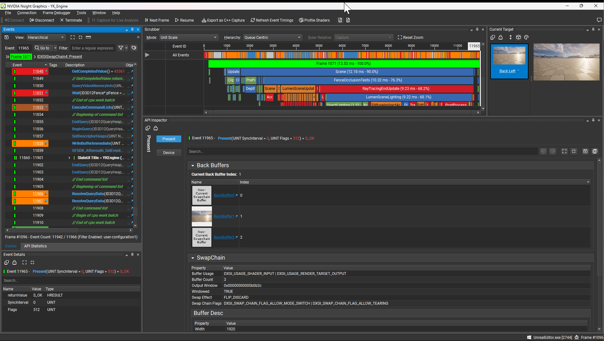
Nsight左边截到的Event非常多，可以使用筛选功能过滤掉一些Event，找起来会更简单点
这样我们很快就能找到RayTracing Shadow的pass


##### 四、RayTracing Shadow修改

###### 4.1 给Toon材质绑定AnyHit Shader

根据2.4节，我们只要改改AnyHit Shader就能够消除自阴影，但是在开改之前需要注意一点，一般opaque的物体是不会绑定AnyHit Shader的。
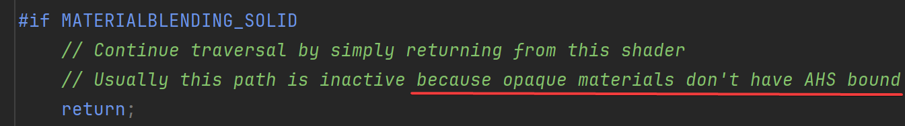
>RayTracingMaterialHitShaders.usf

这是因为光线和opaque的物体相交时，根本不需要判断Hit的有效性，是否要舍弃这个Hit，opaque材质的Hit一定是有效的，所以不需要使用AnyHit Shader。

比如我们可以做一个测试，UE RayTracing Shadow使用的AnyHit Shader是RayTracingMaterialHitShaders.usf里的MaterialAHS，我们在Shader的最前面添加下面的代码让Toon相关材质的物体都不投影
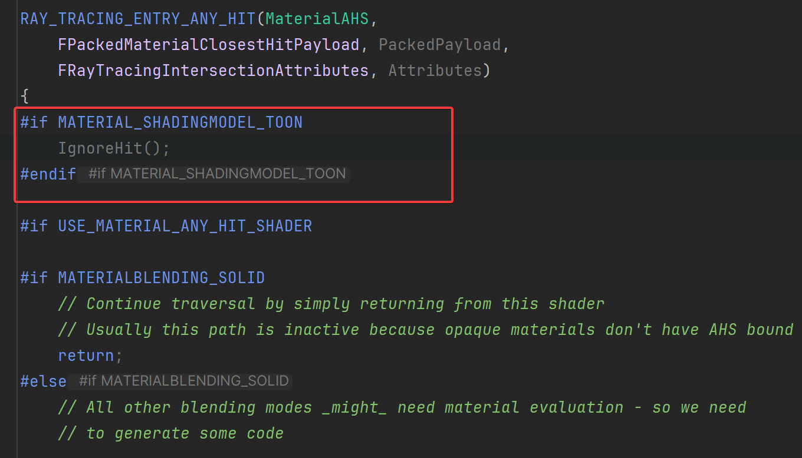
可以发现Toon的投影没有任何变化


UE把Intersection、AnyHit、ClosestHit Shader合在一起作为一个组，叫做HitGroup。
一般opaque的物体使用的HitGroup是这个FOpaqueShadowHitGroup，可以发现它只设置了ClosestHit Shader：
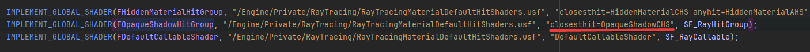
>RayTracingMaterialHitShaders.cpp

它的ClosestHit Shader非常简单，只是往Payload里写入了射线Hit点的距离。

>RayTracingMaterialDefaultHitShaders.usf

这样的话，就不用为每个材质都绑定AnyHit Shader，统一只使用一个简单的ClosestHit Shader就行。

如果场景中会有Mask材质或者有透明材质等特殊的材质，则使用TMaterialCHS，会按照条件为它们绑定ClosestHit Shader、AnyHit Shader或Intersection Shader

>RayTracingMaterialHitShaders.cpp

UE是具体是怎么为物体绑定FOpaqueShadowHitGroup或者TMaterialCHS，可以看看FDeferredShadingSceneRenderer::CreateRayTracingMaterialPipeline()，可以发现Unreal是使用MeshCommand的bOpaque属性来判断的
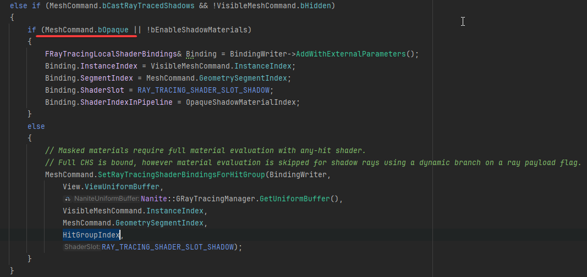
>RayTracingMaterialHitShaders.cpp

所以我们在SetupRayTracingMeshCommandMaskAndStatus()中将使用了Toon Shading Model的MeshCommand我们将它的bOpaque设置为false
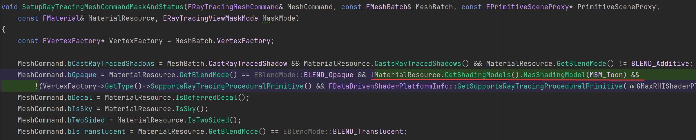
>RayTracingInstanceMask.cpp

除此之外，当使用Toon ShadingModel时GetMaterialHitShader函数里的UseAnyHitShader和TMaterialCHS里的bWantAnyHitShader都应该设置为true
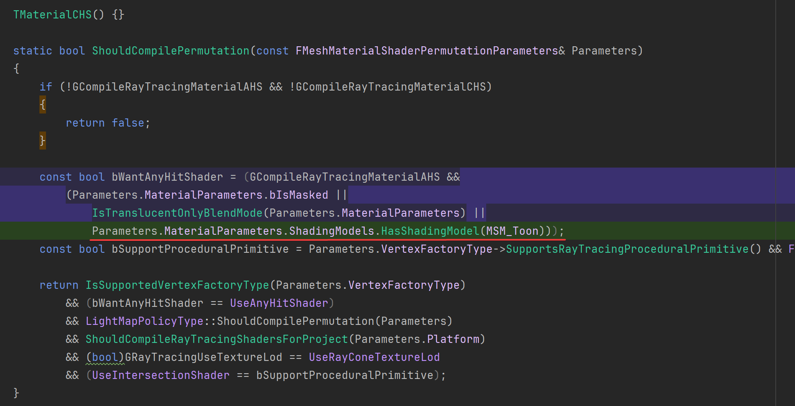
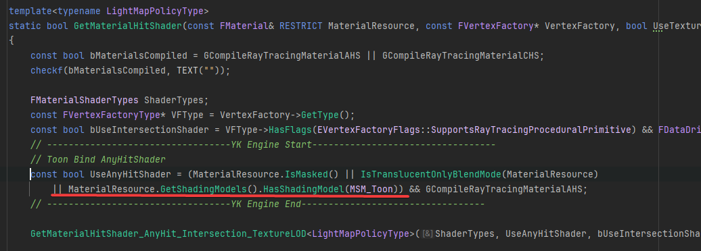
>RayTracingMaterialHitShaders.cpp

这样就可以发现AnyHit Shader成功绑定到Toon材质上了：

###### 4.2 修改ToonBuffer

接下来我们需要往ToonBuffer里写一些额外的数据为我们改造RayTracing Shadow做准备。

下面是我为RayTracing Shadow准备的数据：

| 名称             | 类型   | RenderTarget  | Bit |
| -------------- | ---- | ------------- | --- |
| SelfID         | uint | ToonBufferA.r | 8   |
| ObjectID       | uint | ToonBufferA.g | 8   |
| ToonModel      | uint | ToonBufferA.b | 3   |
| ShadowCastFlag | uint | ToonBufferA.b | 5   |
这里介绍一下这些都是东西了意义。

SelfID是其实就是3D流程中非常常见的ID Map，用来区分同一个模型的不同部分。
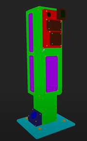
ObjectID则是我用来区分不同的Actor,我为每个角色随机写入一个0-1的float来作为ObjectID。
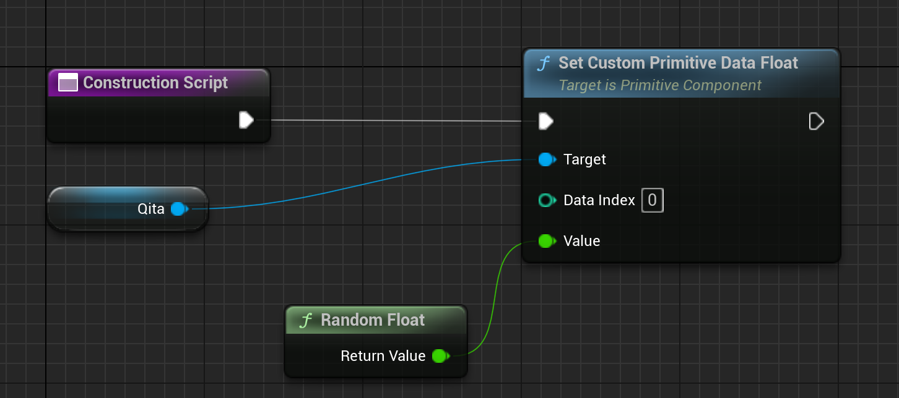

ToonModel则是我用来区分不同的Toon ShadingModel，一开始我定义了两个ShadingModel，一个Toon一个ToonFace，后面感觉之后Toon相关的ShadingModel会越来越多，不如只使用一个ShadingModel，然后用这个3Bit的ToonModel来区分。
ShadowCastFlag则是用来定义不同的投影情况。

打开Engine/Shaders/Private/Toon/ToonShadingCommon.ush，添加一个struct FToonBuffer，顺便定义一下EncodeUintToFloat()等几个函数

```c
#define TOONMODEL_DEFAULT           0  
#define TOONMODEL_FACE              1  
#define TOONMODEL_HAIR              2  
#define TOONMODEL_EYE               3  
#define TOONMODEL_SKIN              4  
// SCF表示ShadowCastFlag  
#define SCF_DEFAULT                  0x00  
#define SCF_DISABLEONSELF            0x01  
#define SCF_DISABLEONFACE            0x02  
#define SCF_DISABLEONEYE             0x04  
#define SCF_DISABLEONTOON            0x08  
#define SCF_DISABLEALLTOON           0x10  
  
struct FToonBuffer  
{  
    // -----------------------------------ToonBufferA-------------------------------  
    uint SelfID; // ToonBufferA.r (8)  
    uint ObjectID; // ToonBufferA.g (8)  
    uint ToonModel; // ToonBufferA.b (3)  
    uint ShadowCastFlag; // ToonBufferA.b (5)  
};

uint GetBitsMaxValue(int Bits = 8) {return (1L << Bits) - 1;}  
  
float EncodeUintToFloat(uint Src, int BitSrc = 8)  
{  
    return float(Src) / float(GetBitsMaxValue(BitSrc));  
}  
  
uint EncodeFloatToUint(float Src1, int BitsSrc1 = 8)  
{  
    return saturate(Src1) * GetBitsMaxValue(BitsSrc1);  
}  
  
uint4 EncodeFloatToUint(float4 Src1, int BitsSrc1 = 8)  
{  
    return saturate(Src1) * GetBitsMaxValue(BitsSrc1);  
}

```

接下来修改一下材质，把我们需要的数据写入ToonBuffer
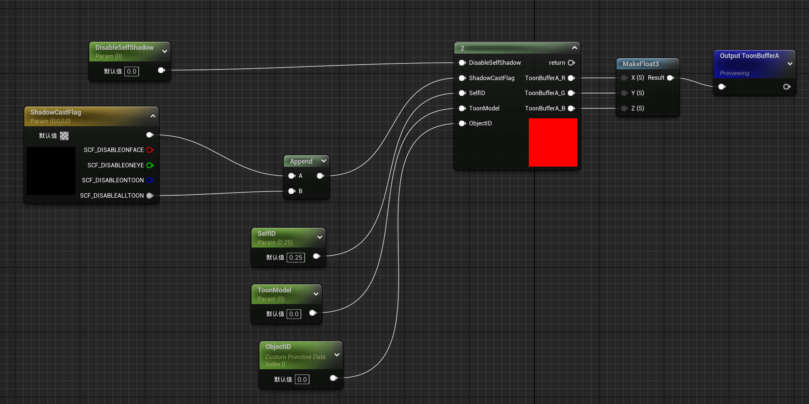
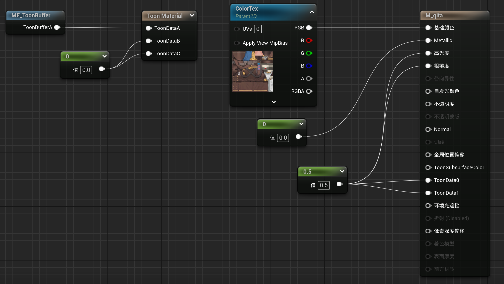

Custom Node里面的代码：
```c
    uint Out1 = 0;

    Out1 |= DisableSelfShadow   > 0.5f ? SCF_DISABLEONSELF  : 0;
    Out1 |= ShadowCastFlag.r    > 0.5f ? SCF_DISABLEONFACE  : 0;
    Out1 |= ShadowCastFlag.g    > 0.5f ? SCF_DISABLEONEYE   : 0;
    Out1 |= ShadowCastFlag.b    > 0.5f ? SCF_DISABLEONTOON  : 0;
    Out1 |= ShadowCastFlag.a    > 0.5f ? SCF_DISABLEALLTOON : 0;
    Out1 |= EncodeFloatToUint(ToonModel/7, 3) << 5;

    ToonBufferA_R = SelfID;
    ToonBufferA_G = ObjectID;
    ToonBufferA_B = EncodeUintToFloat(Out1);

    return 1;
```
记得要在DeferredShadingCommon.ush中把ToonShadingCommon.ush包含进去，这样Custom Node就能使用我们上面定义的函数
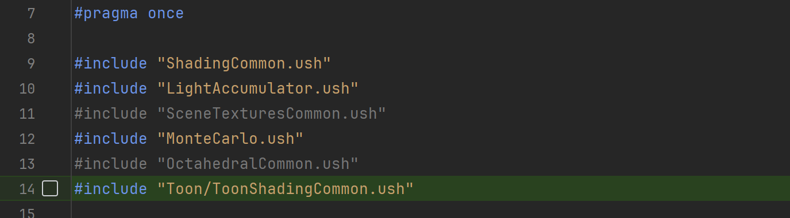

还有一点要注意的，我把ToonBuffer的格式从float改成了uint，这是为了防止浮点数精度问题导致我们编码ToonBuffer的时候数据出现误差。
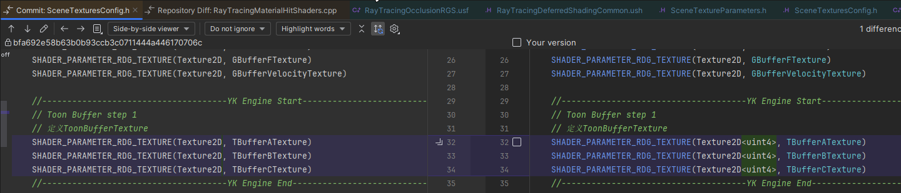
>SceneTexturesConfig.h

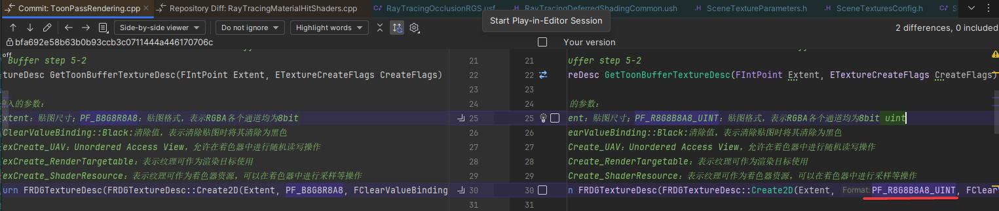
>ToonPassRendering.cpp

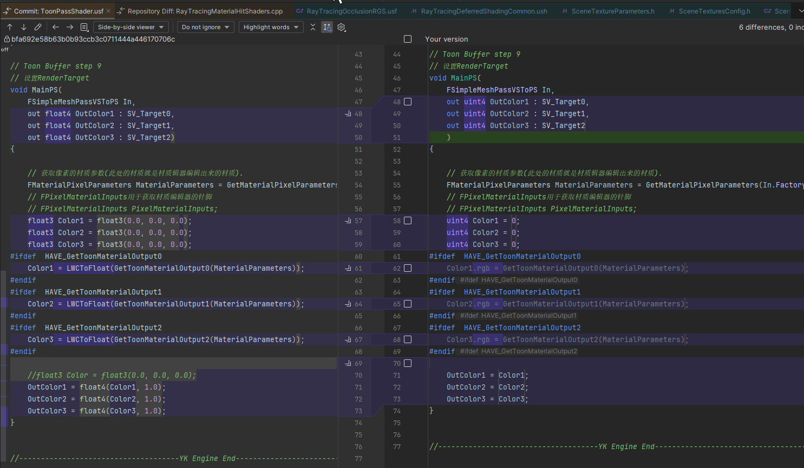
>ToonPassShader.usf

这样就可以把数据写入ToonBuffer了，下面我只给脸设置了不同的SelfID
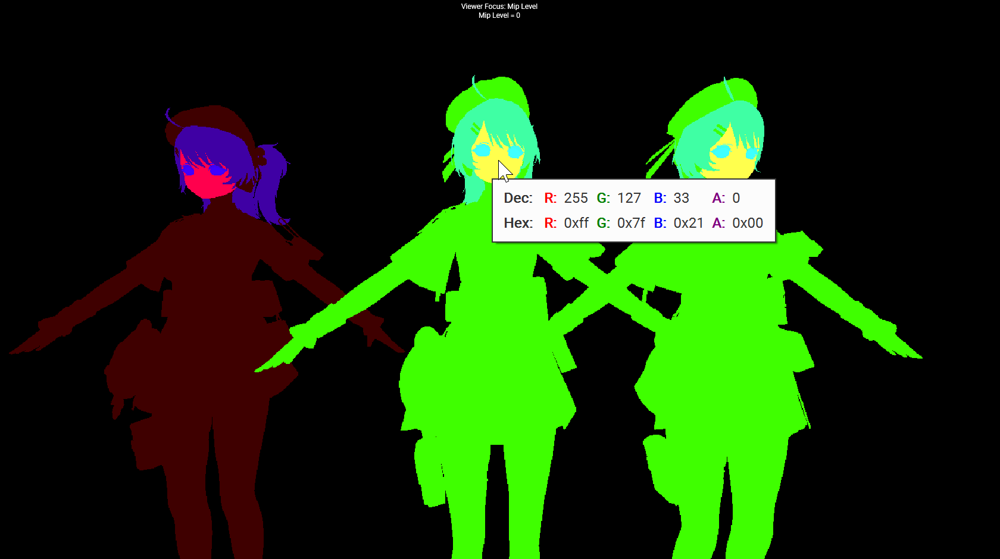

关于ToonBuffer的创建还请看我上篇文章：
https://zhuanlan.zhihu.com/p/677772284


###### 4.3 读取ToonBuffer中的数据

接下来我们需要在RayTracing Shadow的Generation Shader里读取ToonBuffer里的数据
想在shader里读取Texture一般就4步：

1.在对应shader的parameter里加入ToonBuffer的定义
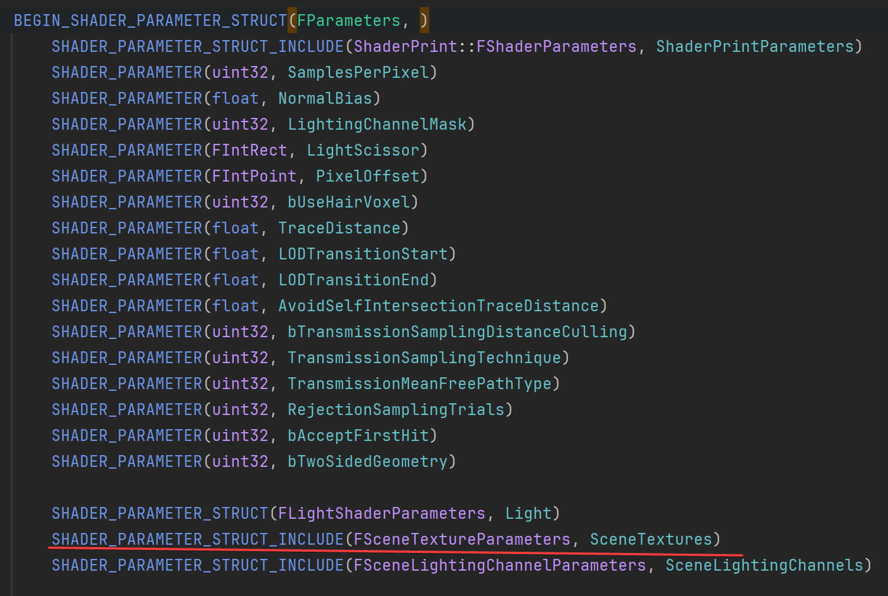
>RayTracingShadows.cpp

FOcclusionRGS的Parameter里有一个FSceneTextureParameters，这里面放的都是GBuffer的Texture，我们把TBuffer加到这里面，让访问GBuffer的shader都能访问TBuffer
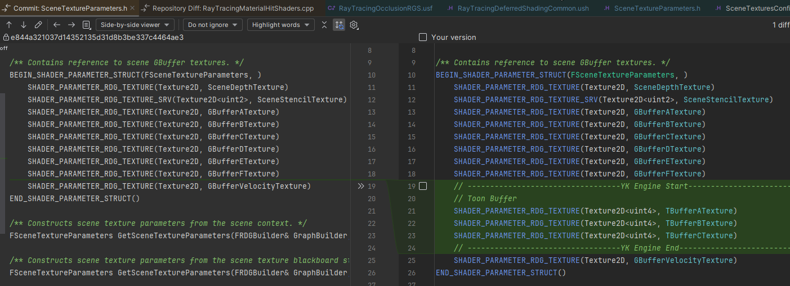
>SceneTextureParameters.h

2.找个地方把TBuffer传入Parameter中
SceneTextureParameters.cpp中两个GetSceneTextureParameters都修改了
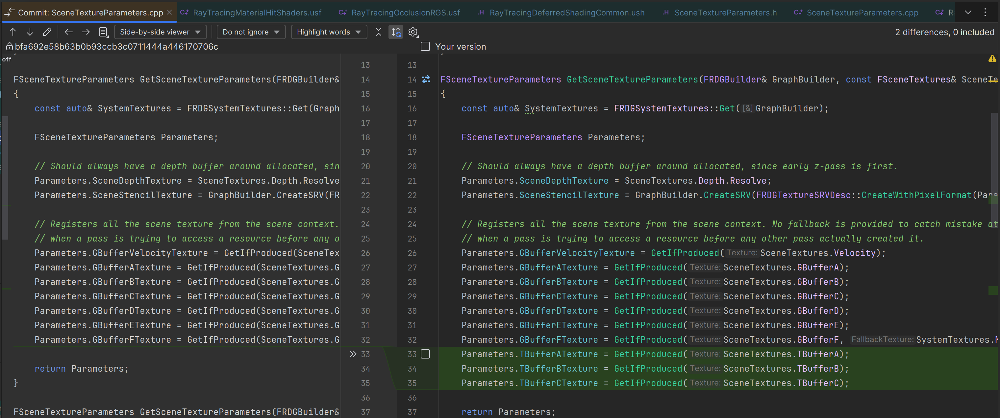
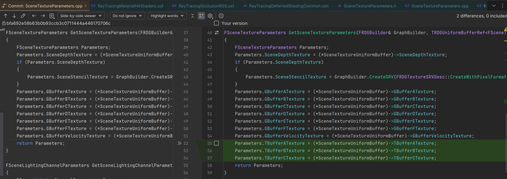

3.在Shader中把对应的Texture声明一下
FSceneTextureParameters的定义都放在DeferredShadingCommon.ush里
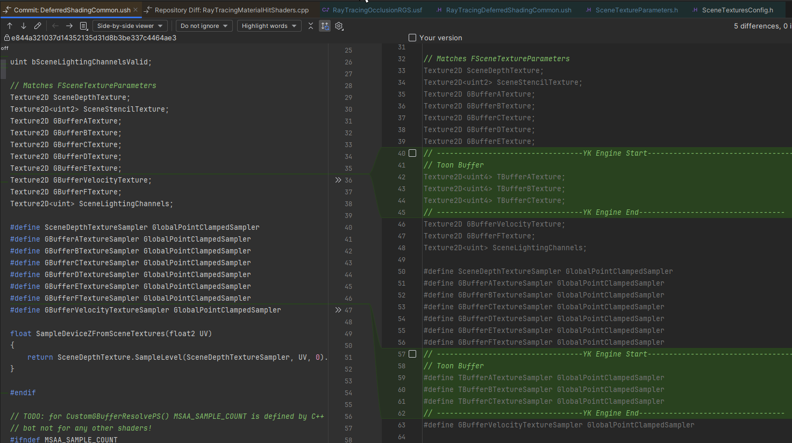

4.在Shader里采样贴图
RayTracing Shadow的shader通过RayTracingDeferredShadingCommon.ush里的GetGBufferDataFromSceneTexturesLoad采样GBuffer
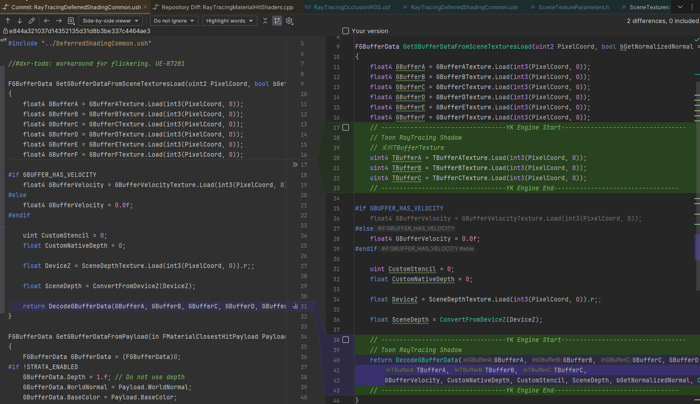
>RayTracingDeferredShadingCommon.ush

为了方便访问ToonBuffer的数据，把FToonBuffer添加进struct FGBufferData里：
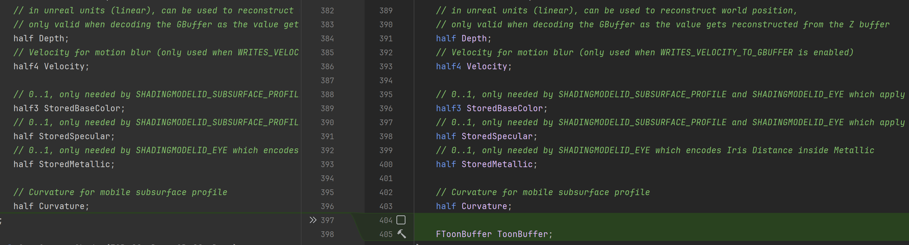
>DeferredShadingCommon.ush

并且重载了一下DecodeGBufferData函数：
```c
FGBufferData DecodeGBufferData(  
    float4 InGBufferA,  
    float4 InGBufferB,  
    float4 InGBufferC,  
    float4 InGBufferD,  
    float4 InGBufferE,  
    float4 InGBufferF,  
    uint4 InTBufferA,  
    uint4 InTBufferB,  
    uint4 InTBufferC,  
    float4 InGBufferVelocity,  
    float CustomNativeDepth,  
    uint CustomStencil,  
    float SceneDepth,  
    bool bGetNormalizedNormal,  
    bool bChecker)  
{  
    FGBufferData GBuffer = DecodeGBufferData(InGBufferA, InGBufferB, InGBufferC, InGBufferD, InGBufferE, InGBufferF,  
                                   InGBufferVelocity,                                   CustomNativeDepth, CustomStencil, SceneDepth, bGetNormalizedNormal,                                   bChecker);  
    if (GBuffer.ShadingModelID == SHADINGMODELID_TOON)  
    {       GBuffer.ToonBuffer = DecodeToonDataFromBuffer(InTBufferA, InTBufferB, InTBufferC, InGBufferD);  
    }  
    return GBuffer;  
}
```
还有DecodeToonDataFromBuffer函数放在ToonShadingCommon.ush：
```c
// 解码ToonBuffer  
FToonBuffer DecodeToonDataFromBuffer(uint4 ToonBufferA, uint4 ToonBufferB, uint4 ToonBufferC, float4 CustomData)  
{  
    FToonBuffer ToonBuffer;  
    //uint4 ToonBufferABit = EncodeFloatToUint(ToonBufferA);  
    uint4 ToonBufferABit = ToonBufferA;  
    ToonBuffer.SelfID = ToonBufferABit.r;  
    ToonBuffer.ObjectID = ToonBufferABit.g;  
    ToonBuffer.ShadowCastFlag = (ToonBufferABit.b >> 0) & GetBitsMaxValue(5);  
    ToonBuffer.ToonModel = (ToonBufferABit.b >> 5) & GetBitsMaxValue(3);  
    return ToonBuffer;  
}
```

###### 4.4 修改RayTracing Shadow

修改FOcclusionShadingParameters，把ToonBuffer的数据保存起来
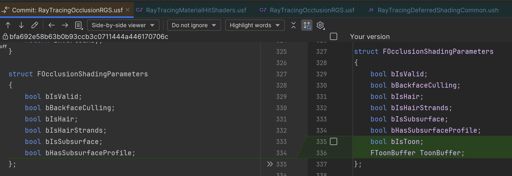
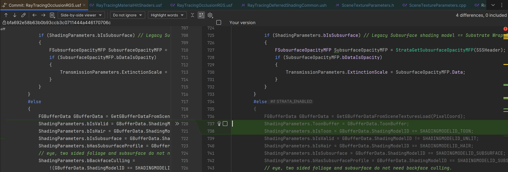
>RayTracingOcclusionRGS.usf

在ToonShadingCommon.ush里定义一下我们的Payload
```c
struct FToonPayloadData  
{  
    uint ToonData;               
    // 按位编码ToonPayload  
    uint GetSelfID()                     {return (ToonData >> 0) & GetBitsMaxValue(8);}  
    void SetSelfID(uint ID)                   {ToonData |= ((ID & GetBitsMaxValue(8)) << 0);}  
  
    uint GetObjectID()                   {return (ToonData >> 8) & GetBitsMaxValue(8);}  
    void SetObjectID(uint ID)              {ToonData |= ((ID & GetBitsMaxValue(8)) << 8);}  
    uint GetShadowCastFlag()               {return (ToonData >> 16) & GetBitsMaxValue(5);}  
    void SetShadowCastFlag(uint Flag)        {ToonData |= ((Flag & GetBitsMaxValue(5)) << 16);}  
    uint GetToonModel()                      {return (ToonData >> 21) & GetBitsMaxValue(3);}  
    void SetToonModel(uint ToonModel)        {ToonData |= ((ToonModel & GetBitsMaxValue(3)) << 21);}  
};
```

RayGeneration Shader当使用Toon的时候，使用我们自定义的TraceVisibilityRay函数
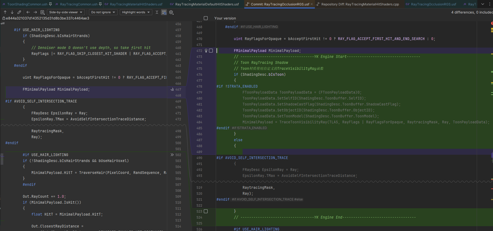
>RayTracingOcclusionRGS.usf

接下来实现一下TraceToonVisibilityRay：
- 先把ToonShadingCommon.ush包含进去
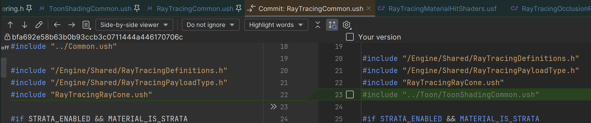
>RayTracingCommon.ush
- 在struct FPackedMaterialClosestHitPayload : FMinimalPayload里添加一个SetShadingModelID函数(注意不是STRATA_ENABLED里的那个)
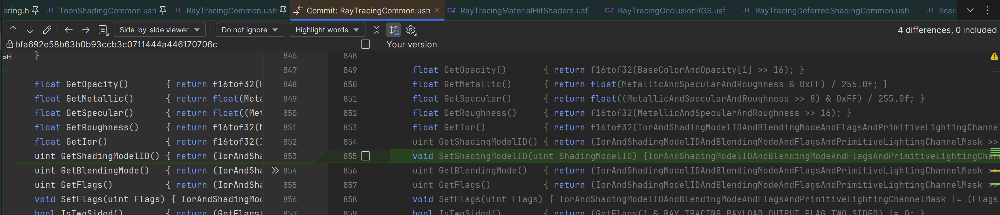
>RayTracingCommon.ush
```
void SetShadingModelID(uint ShadingModelID) {IorAndShadingModelIDAndBlendingModeAndFlagsAndPrimitiveLightingChannelMask |= (ShadingModelID & 0xF) << 16; }
```
- 接下来随便找个地方添加TraceToonVisibilityRay，FPackedMaterialClosestHitPayload里有一个PackedCustomData我直接把ToonPayloadData写进去，就不用往FPackedMaterialClosestHitPayload里增加额外的数据了(由于每个像素都需要保存一份Payload，里面的数据越多，内存消耗也越高)
```c
#if !STRATA_ENABLED  
FMinimalPayload TraceToonVisibilityRay(  
    in RaytracingAccelerationStructure TLAS,  
    in uint RayFlags,  
    in uint InstanceInclusionMask,  
    in FRayDesc Ray,  
    in FToonPayloadData ToonPayloadData)  
{  
    FPackedMaterialClosestHitPayload PackedPayload = (FPackedMaterialClosestHitPayload)0;
    PackedPayload.SetFlags(RAY_TRACING_PAYLOAD_INPUT_FLAG_SHADOW_RAY);
    PackedPayload.PackedCustomData = ToonPayloadData.ToonData;  
    PackedPayload.SetShadingModelID(SHADINGMODELID_TOON);
    TraceVisibilityRayPacked(PackedPayload, TLAS, RayFlags, InstanceInclusionMask, Ray);  
    FMinimalPayload MinimalPayload = (FMinimalPayload)0;    
    MinimalPayload.HitT = PackedPayload.HitT;    
    return MinimalPayload;  
}  
#endif
```

接下来找到RayTracingMaterialHitShaders.usf修改AnyHit Shader，记得把开头这三行测试代码删了


修改一下这两个分支的判断：
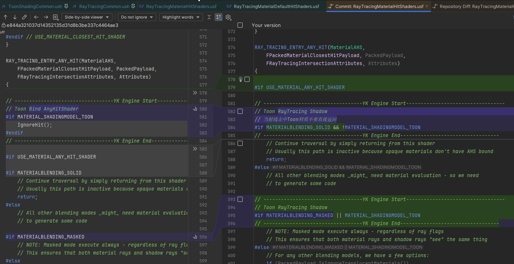
>RayTracingMaterialHitShaders.usf

在最后面加上对Toon的处理：
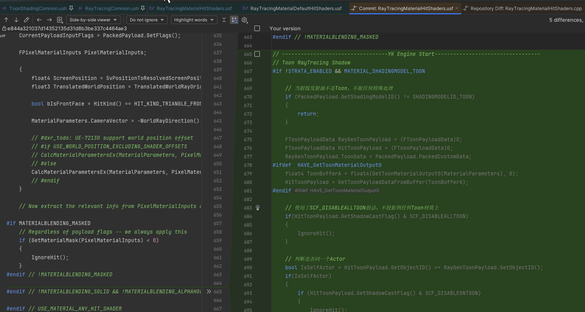
>RayTracingMaterialHitShaders.usf

完整代码：
```c
#if !STRATA_ENABLED && MATERIAL_SHADINGMODEL_TOON  
  
    // 当射线发射源不是Toon，不做任何特殊处理  
    if (PackedPayload.GetShadingModelID() != SHADINGMODELID_TOON)  
    {       
	    return;  
    }  
    
    FToonPayloadData RayGenToonPayload = (FToonPayloadData)0;    
    FToonPayloadData HitToonPayload = (FToonPayloadData)0;   
    RayGenToonPayload.ToonData = PackedPayload.PackedCustomData;
    
    #ifdef  HAVE_GetToonMaterialOutput0  
    float4 ToonBufferA = float4(GetToonMaterialOutput0(MaterialParameters), 0);  
    HitToonPayload = GetToonPayloadDataFromBuffer(ToonBufferA);
    #endif  
    
    // 使用了SCF_DISABLEALLTOON的话，不投影到任何Toon材质上  
    if(HitToonPayload.GetShadowCastFlag() & SCF_DISABLEALLTOON)  
    {       IgnoreHit();    }    
    // 判断是否同一个Actor  
    bool IsSelfActor = HitToonPayload.GetObjectID() == RayGenToonPayload.GetObjectID();  
    if(IsSelfActor)  
    {       
	    if (HitToonPayload.GetShadowCastFlag() & SCF_DISABLEONTOON)  
       {          
	       IgnoreHit();       
	   }       
	   // 消除自阴影  
       if (HitToonPayload.GetShadowCastFlag() & SCF_DISABLEONSELF && RayGenToonPayload.GetSelfID() == HitToonPayload.GetSelfID())  
       {          
	       IgnoreHit();       
	   }       
	   if (HitToonPayload.GetShadowCastFlag() & SCF_DISABLEONFACE && RayGenToonPayload.GetToonModel() == TOONMODEL_FACE)  
       {          
	       IgnoreHit();       
	   }       
	   if (HitToonPayload.GetShadowCastFlag() & SCF_DISABLEONEYE && RayGenToonPayload.GetToonModel() == TOONMODEL_EYE)  
       {          
	       IgnoreHit();       
	   }    
   }  
#endif
```

GetToonPayloadDataFromBuffer函数的定义如下，放在ToonShadingCommon.ush里：
```c
FToonPayloadData GetToonPayloadDataFromBuffer(float4 ToonBufferA)  
{  
    FToonPayloadData Out = (FToonPayloadData)0;  
    uint4 ToonBufferABit = ToonBufferA;  
    Out.SetSelfID(ToonBufferABit.r);  
    Out.SetObjectID(ToonBufferABit.g);  
    Out.SetShadowCastFlag((ToonBufferABit.b >> 0) & GetBitsMaxValue(5));  
    Out.SetToonModel((ToonBufferABit.b >> 5) & GetBitsMaxValue(3));  
    return Out;  
}
```

下面我关闭了脸部的自阴影，头发对脸部，眼睛的投影
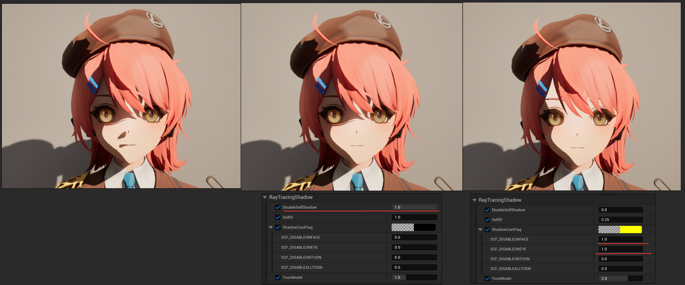
保留其他物体对Toon的投影，Toon对Toon的投影可以选择开启或关闭
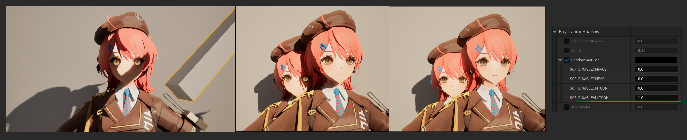
（像眼睛、眉毛等部分的材质我还没去调，shading效果有点奇怪，不要在意）
##### 五 参考

我的RayTracing Shadow相关代码大量参考自Jason Ma大佬的这个项目，他的代码也是完全公开的，非常推荐大家去看看：
https://github.com/JasonMa0012/MooaToon?tab=readme-ov-file

剖析虚幻渲染体系（17）- 实时光线追踪
https://www.cnblogs.com/timlly/p/16687324.html

Introduction to DirectX RayTracing
https://intro-to-dxr.cwyman.org/


