##### 一、前言

喜欢看动画的各位想必对动画摄影流程并不陌生，摄影环节在赛璐璐动画的画面表现中起到了至关重要作用。2D动画需要通过通过摄影来打光，3D动画虽然可以在3D场景中完成打光，不需要这么复杂的摄影，但也依然可以使用动画摄影的技巧提升画面质感。

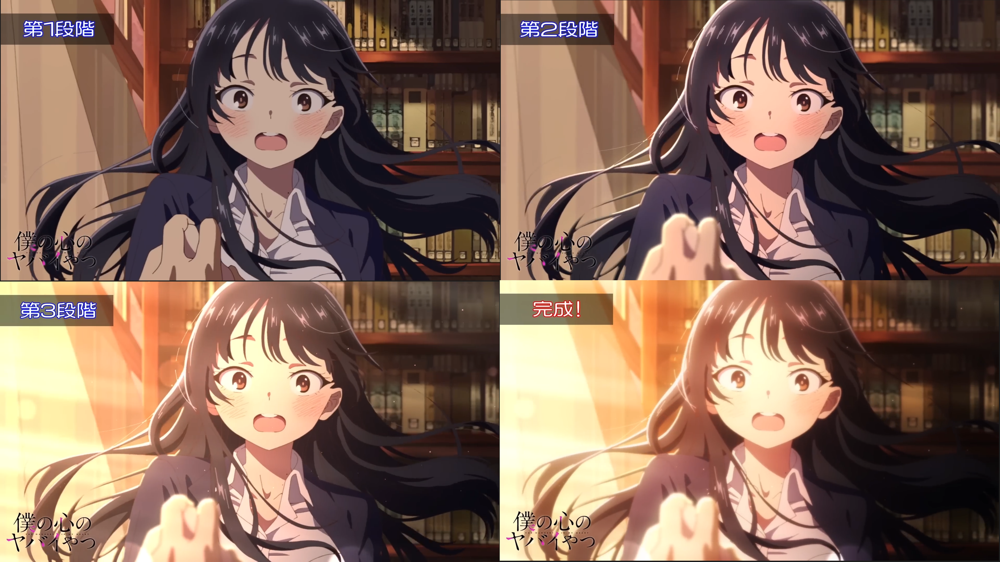
> https://www.youtube.com/watch?v=f0gSCJM0Xus

在动画摄影过程中，“摄影师”会使用各种蒙版对画面进行局部调整，调整颜色倾向、对比，添加blur等等，比如光学核心的教程：
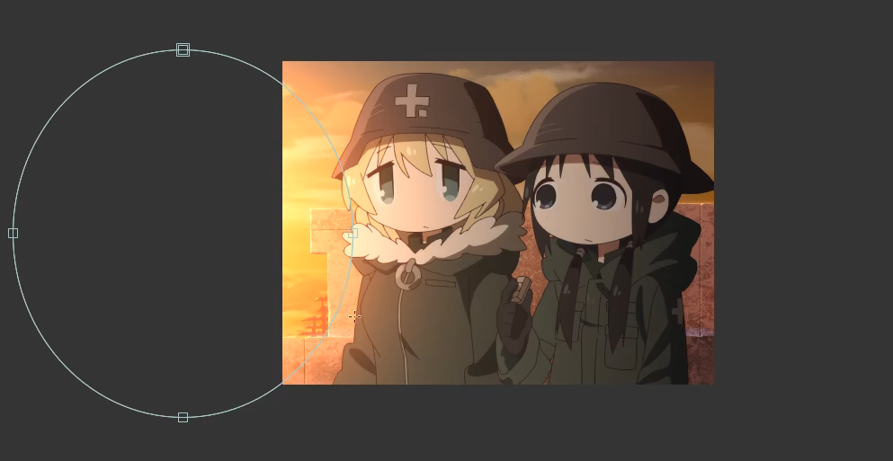
> https://www.bilibili.com/video/BV1Rx411L7nx

这些动画摄影的技巧可以很大程度提升画面的质感，因此我一直希望能够将动画摄影融入到卡通渲染的流程之中。相信不只是我，也有很多人有着相同的想法，比如早在21年，流朔大佬就做出了一些不错的尝试。
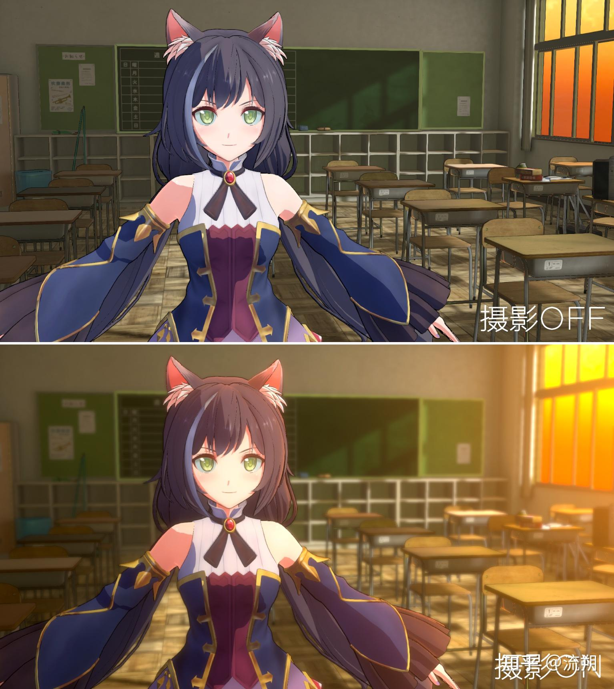
> https://zhuanlan.zhihu.com/p/363790714

但是摄影这种东西有着非常明显的缺点，大多数摄影效果，它必然是逐镜头进行调整的，因此要使用它的话，要么是做离线动画，要么就是在过场动画这种固定镜头的场合。
如果是做离线动画，AE、Nuke、达芬奇等后期软件都有着非常完整的工具链，并不需要我们费力在引擎里制作这些效果。
对于实时渲染领域，我们只能在过场动画里进行摄影，总不能在游戏里跑图的时候，屏幕某块位置一直有块光斑，想想都很违和，摄影的使用范围被大幅限制，性价比显得不是很高。

之前我一直犹豫有没有必要在引擎内实现摄影，所以没有动手进行实践。直到几个月前，截帧学马仕的时候发现他们在Bloom上绘制了一个椭圆的光斑。
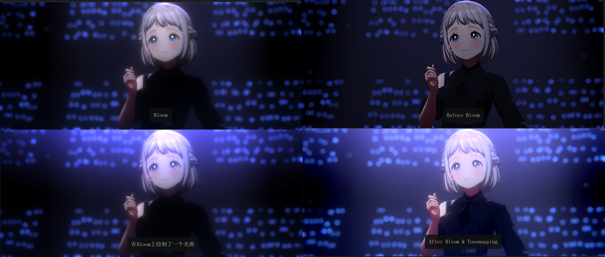
虽然只是一个很简单的效果，但给了我不少信心，既然市面上的游戏有类似的效果，说明市场对它是有需求的，那么将动画摄影融入到卡通渲染之中这件事情并非毫无意义。最近我花了一些时间，完成了一个模仿动画摄影流程的工具。

像学马仕中出现的椭圆光斑，想要实现是非常简单的，UE里使用后处理材质就能实现，然后可以通过调节参数来调整椭圆的位置、尺寸和颜色。

但如果只靠参数来调整的话，非常不直观，使用体验很差。要做的话，我希望能够尽可能让体验接近后期软件，所以我给工具写了一套UI，这样调整起来就非常直观。
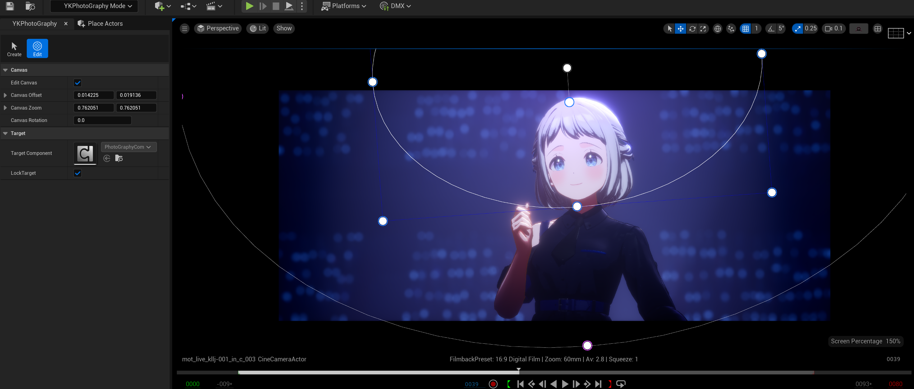

YKPhotoGraphy工具其实很简单，它主要就是编辑器UI+后处理材质的组合。

##### 二、工具使用

###### 1.创建PhotoGraphyActor

在UE编辑器左上角将编辑器模式切换为YKPhotoGraphy：
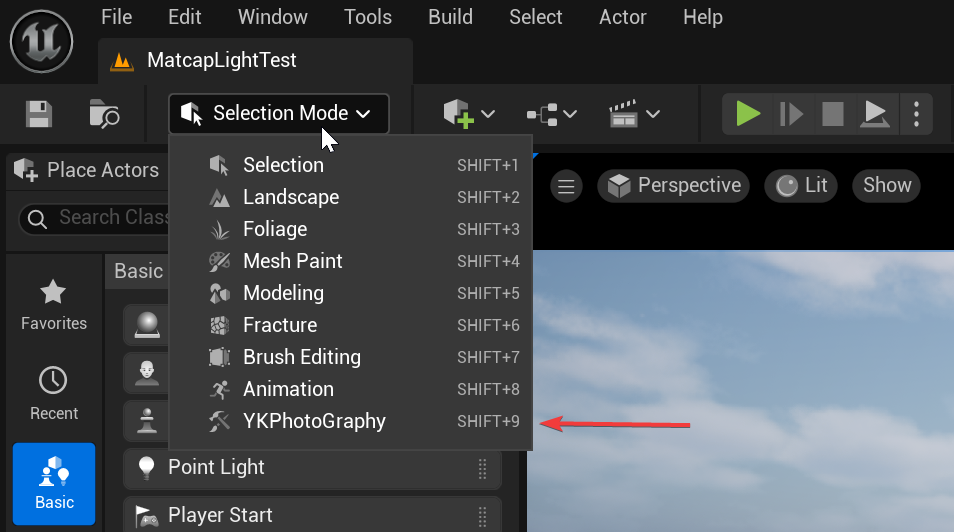

进入编辑器模式之后，默认进入的是Create面板，在这个界面你可以快速的创建一个PhotoGraphy Actor。
1.在Actor Class这里，选中你要创建的蓝图类型，目前只有一个，后面可能会派生各种不同功能的蓝图；
2.在PostProcess Actor这里选中场景中可以绑定后处理材质的Actor，PhotoGraphy工具是基于后处理材质实现的，他会在目标Actor下绑定一个后处理材质，可以作为目标Actor为后处理体积或者摄像机。
3.点击Create按钮。
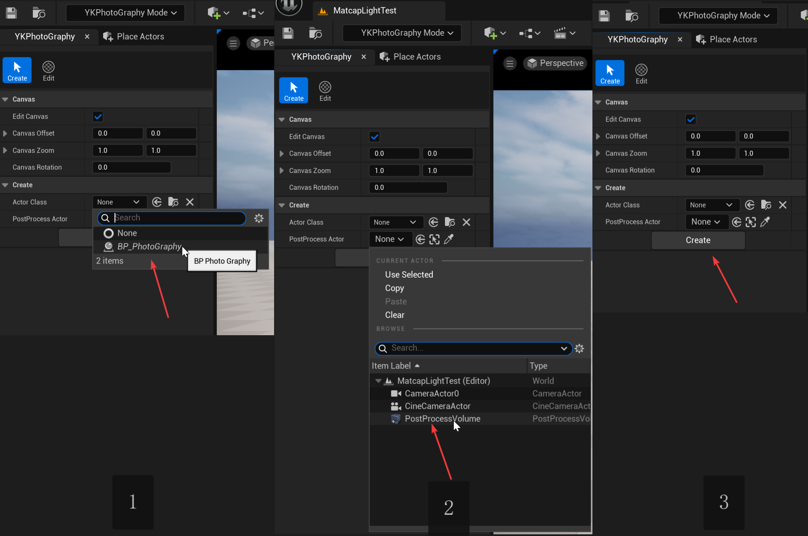

点击了Create按钮之后，场景中应该会多了一个叫BP_PhotoGraphy的Actor，并且屏幕中间多了个白色的圆圈。
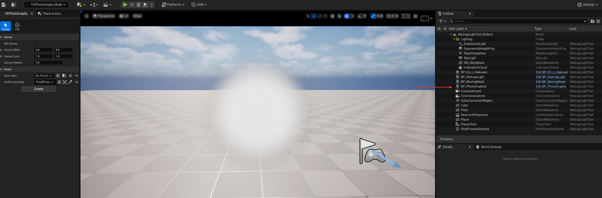

当然，你也可以自己手动把蓝图拖到创建里，然后在细节面板里指定要绑定的后处理Actor，也是一样的结果：
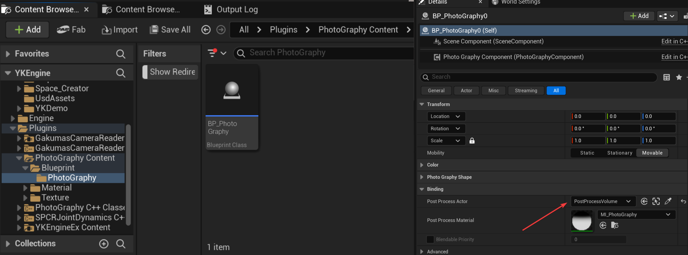

###### 2.编辑蒙版形状

进入Edit面板，选中刚刚创建的PhotoGraphy Actor，你可以看到屏幕上方绘制了一些控制点。
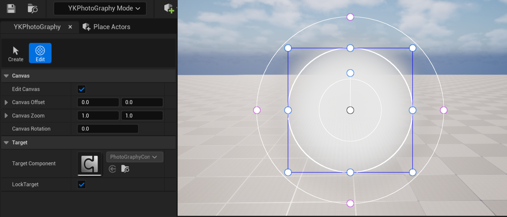

你可以通过拖动控制点来移动、旋转蒙版，也可以调整蒙版大小，羽化范围；操作逻辑和UI的造型都是参考的达芬奇：
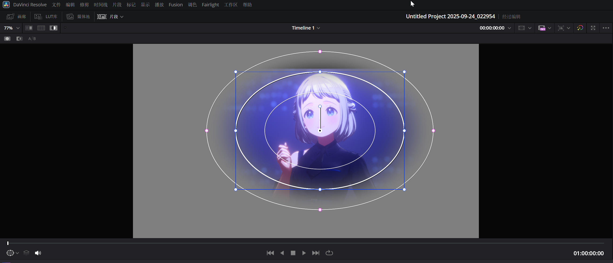

当然，你还可以在PhotoGraphyActor的细节面板中切换蒙版的类型，目前支持三种：
- Ellipse：椭圆蒙版
- Gradient：渐变蒙版
- Linear：四边形蒙版(别问我为什么四边形是Linear，达芬奇就是这么命名的)
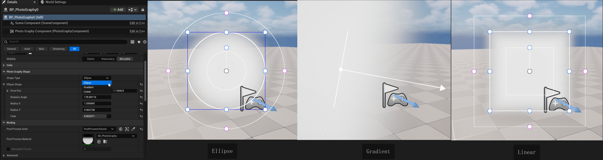

###### 3.调整画布

很多时候，我们需要把蒙版放在屏幕的边缘，这个时候，你会发现有些控制点在屏幕之外，这样的话让我们很难编辑。

所以，我还添加了一个调整“画布”的功能，当你鼠标在3D视图里时，按下空格键，你会发现鼠标变成了一个位移的图标，此时在3D视图中对着空白区域拖拽，你就能够移动屏幕。
同样的，按下空格键+Ctrl键，会进入缩放模式，上下拖拽鼠标可以缩放画布；
按下空格键+Shift键，会进入旋转模式，拖拽鼠标可以旋转画布。

这个画布的操控逻辑抄的是krita，为什么不抄用得更多的PS呢，只能说我更喜欢开源软件一点。
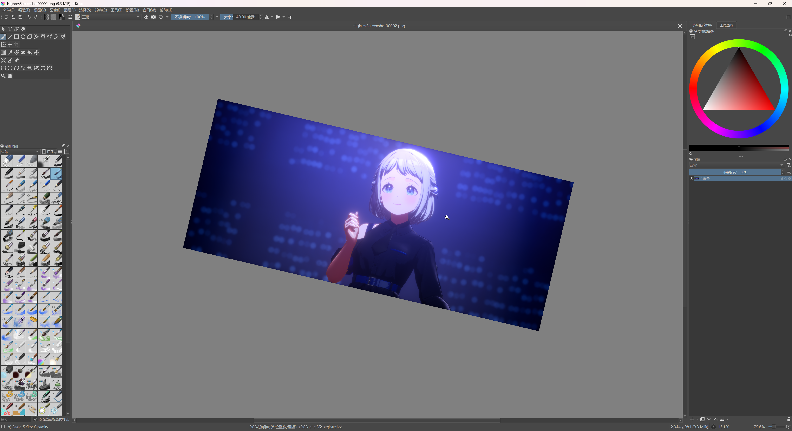

###### 4.调整颜色

PhotoGraphyActor上的颜色参数并不多，调一调就懂了，参数里的Inside Color、Inside Intensity、OutSide Color 、Outside Intensity分别是蒙版内部和外部的颜色、强度；内部和外部的区分见下图：
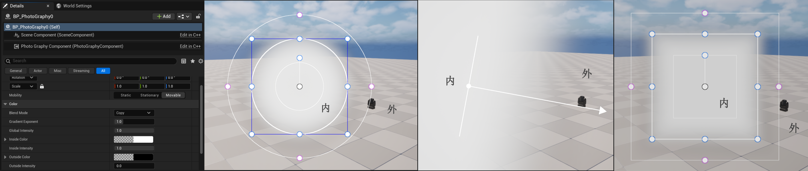

Blend Mode是混合模式，平时跟绘画软件或者后期软件打交道的大家肯定依旧很熟悉了，目前提供了5种常用的模式：
- Copy：即Alpha混合
- Add：加法，一些软件会叫做线性减淡
- Multiply：乘法，一些软件会叫正片叠底
- Overlay：叠加，当前景颜色大于0.5时会让画面变亮，小于0.5时让画面变暗
数学公式是：
$$
f(a,b)=
\begin{cases}
  2ab & {a \lt0.5} \\
  1-2(1-a)(1-b) & {a \ge 0.5}
\end{cases}
$$
背景颜色为a，前景颜色为b
- Screen：滤色，会让颜色变亮
数学公式是：

$$
f(a,b)=1-(1-a)(1-b)
$$

Gradient Exponent：控制蒙版的衰减过渡，默认值1在数值上是绝对的线性过渡，但是由于色彩空间、Tonemapping等的影响，可能在视觉上并不是很线性，此时你可以通过调整这个参数让过渡在视觉上更符合你想要的效果
Global Intensity：控制后处理效果的强度，为0时后处理效果将完全不可见。

###### 5.逐Actor蒙版

在动画摄影中，只对角色或者只对背景添加效果也是非常常见的操作。
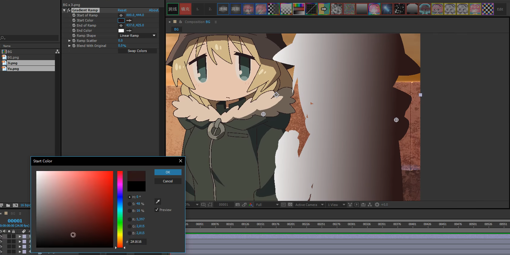
> https://www.bilibili.com/video/BV1Rx411L7nx

PhotoGraphyActor的Per Actor Picker模块通过stencil实现了类似的功能，为了功能正常执行，你需要确保在项目设置中开启了Custom Depth和Stencil。
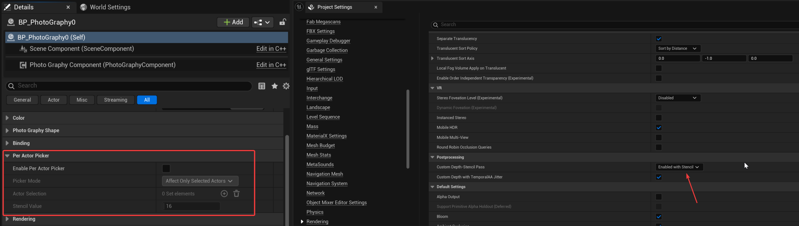

打开Enable Per Actor Picker开关，在Actor Selection中选中你想要添加蒙版的Actor：
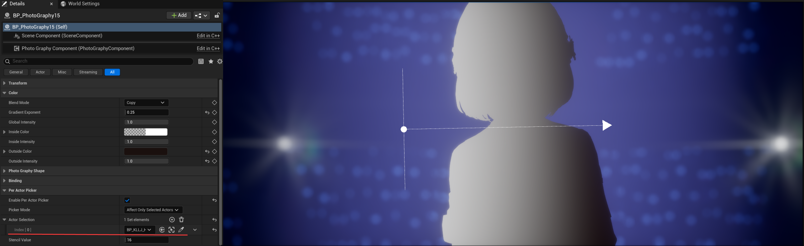

如果你想反向操作，将Picker Mode更改为Exclude Selected Actors即可，这样Actor Selection外的所有地方都会添加上蒙版。
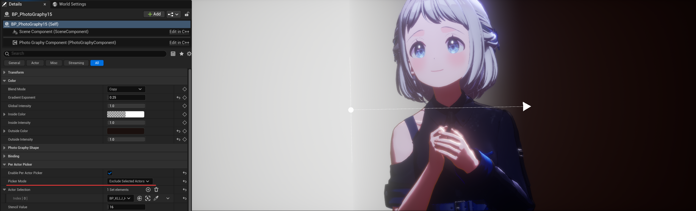

Stencil Value：工具会自动在Actor Selection里面的Actor上打开Custom Depth并添加对应Stencil。
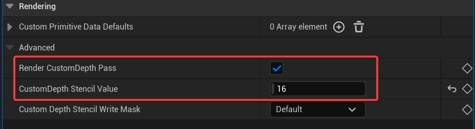

###### 6.后处理材质设置

当前场景有一个矩形的PhotoGraphyActor，当我再创建一个新的PhotoGraphyActor时，你会发现，矩形消失了，出现了一个新的圆形。
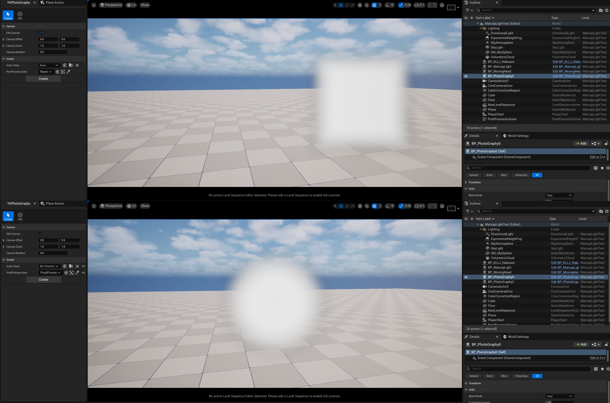

这个现象是正常的，它和Unreal后处理材质的混合机制相关。

在后处理体积的细节面板里，我们可以发现两个后处理材质都添加上了，并且它们的权重都是1
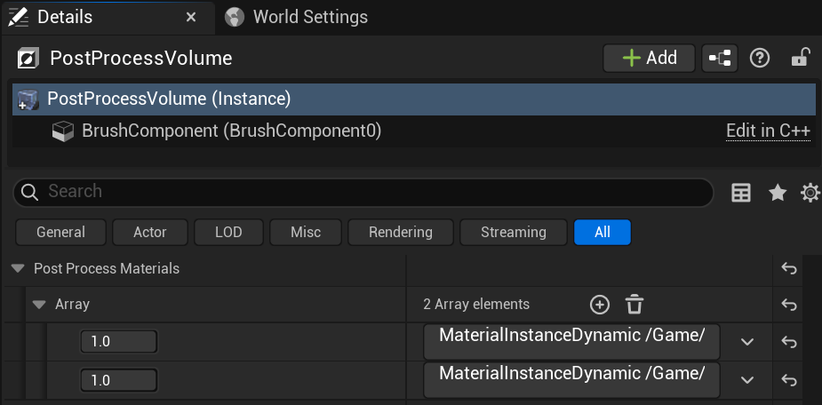

我们减少第二个后处理材质的权重试试，可以发现第二个后处理材质会以一个很奇怪的方式"过渡"为第一个后处理材质。

这个表现和后处理材质的Blendable Priority有关，当两个后处理材质的Blendable Priority相同时，UE采取的策略是尽可能地去混合这两个后处理材质，当我们减少第二个后处理材质的权重时，UE会插值圆形和矩形的参数，来让圆形过渡为矩形。

为了避免UE的插值，我们需要为两个后处理材质设置不同的Blendable Priority，在第二个PhotoGraphyActor的细节面板中，我们将它的Blendable Priority设置为1，这样两个后处理材质就都出现了，UE不会对它们进行插值。
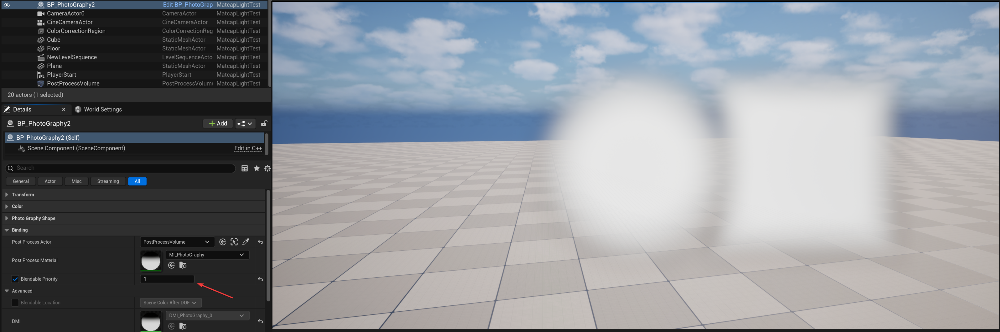

有时候，我们需要更新后处理材质在渲染管线中的执行位置，这个也可以在PhotoGraphyActor中的Blendable Location中进行设置：
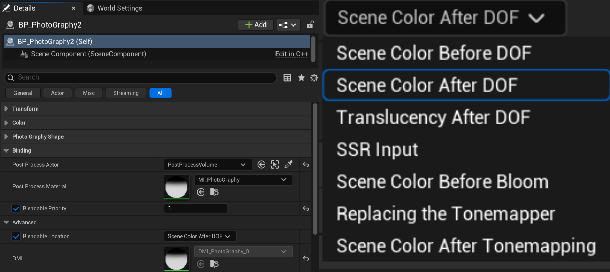

###### 7.添加序列帧

PhotoGraphy工具本身就是为了制作动画设计的，Actor上所有形状和颜色属性都是支持在Sequence中添加序列帧的。

##### 四、结尾

###### 4.1 参考

【Unity URP】一次对卡通渲染仿动画摄影的探索：
https://zhuanlan.zhihu.com/p/363790714

动画后期(动画摄影) 业内向:
https://www.bilibili.com/video/BV1Rx411L7nx
###### 4.2 工程

工具已经以UE插件的形式发布到Github上，下载工具并放入Plugins文件夹即可使用：
https://github.com/Yu-ki016/YKPhotoGraphy
