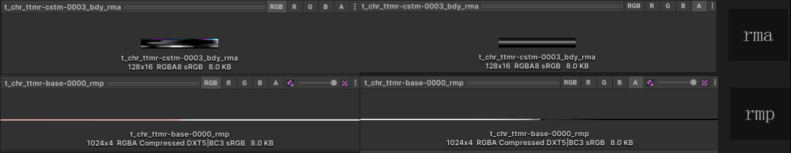
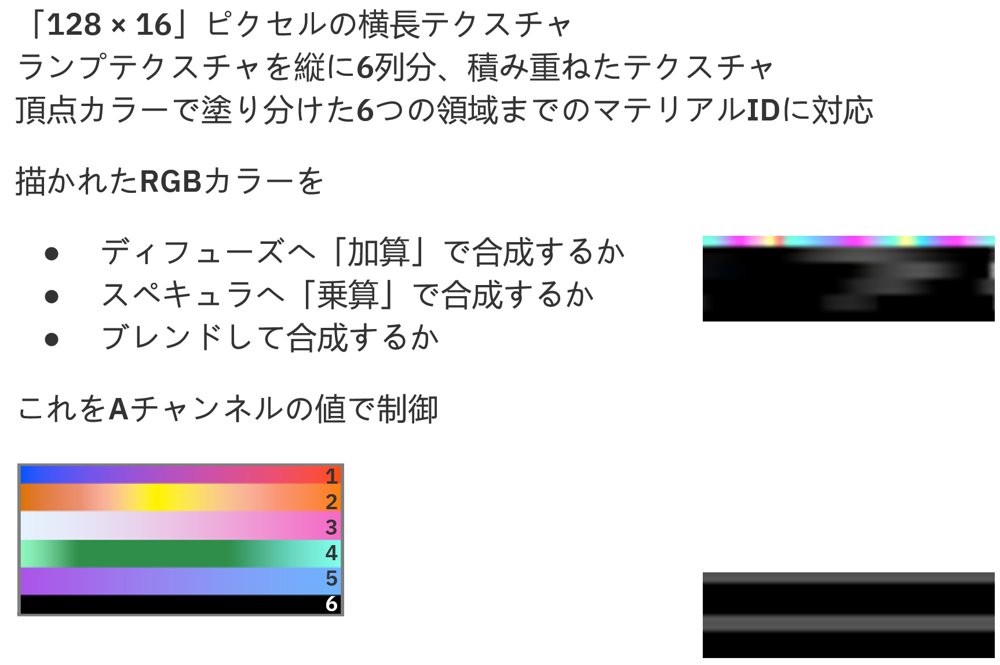
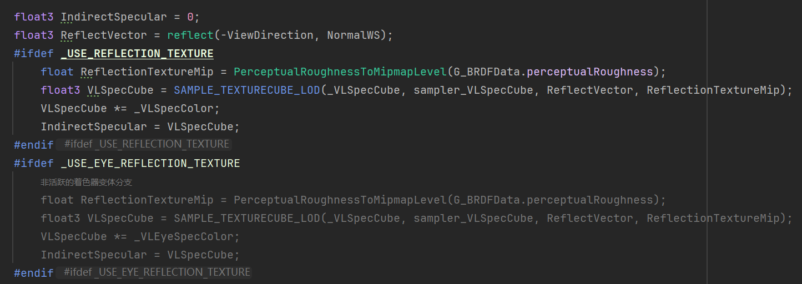
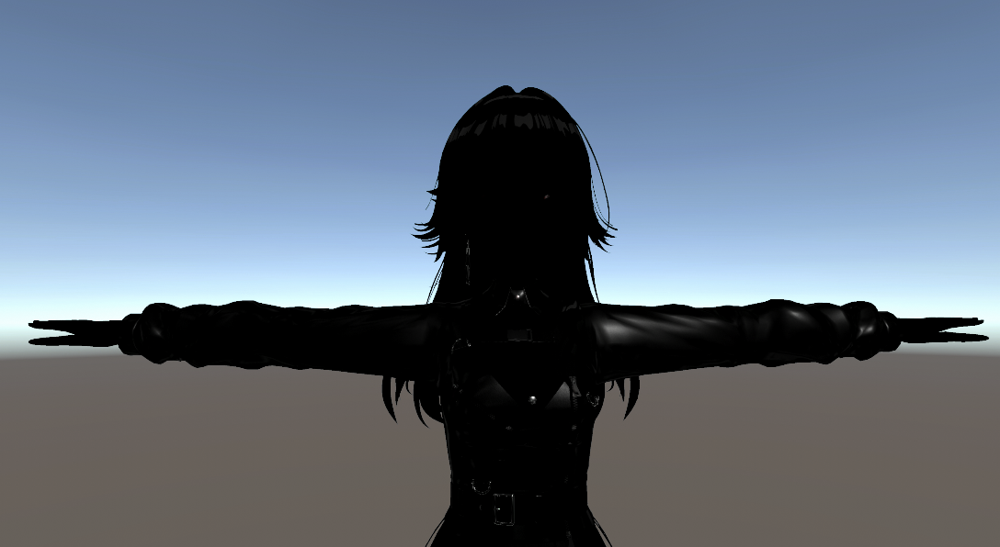
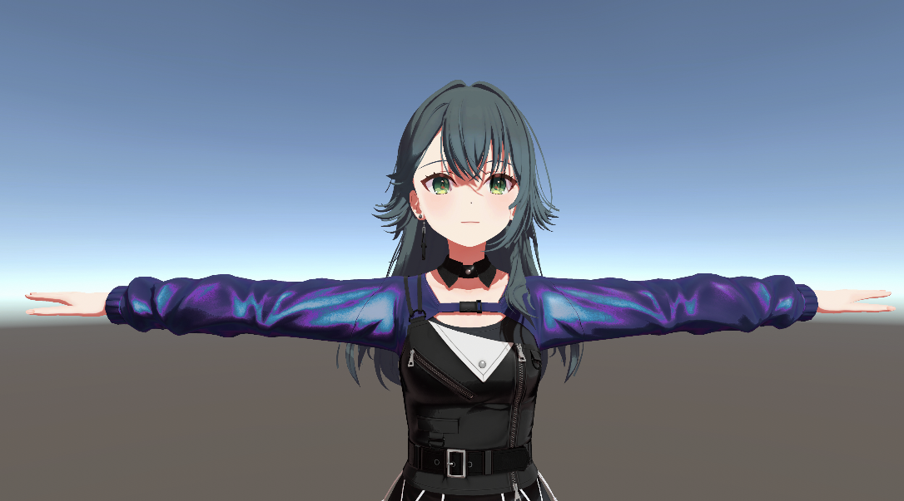
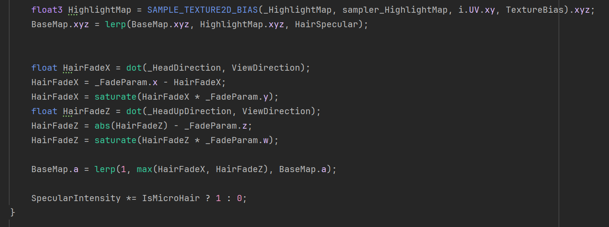

##### 一、前言

上篇文章我们逆向了角色身体部分的shader代码，代码并不完整，这篇文章我们不涉及任何逆向相关的东西，完整看看学马仕的角色是怎么渲染的。

##### 二、贴图与模型

###### 2.1贴图

学马仕用到了8种贴图：


1和2是两张颜色贴图，左边的col是基础色，a通道是alpha，右边的sdw是阴影的颜色，它的a通道是皮肤区域的Mask：

采样结果：


头发的a通道不大一样，专门用来控制前发的透明度：


3是def也就是质感贴图，def贴图的四个通道分别是：
R：用来控制阴影的Offset，也会作用边缘光的Mask来使用
G：Smoothness
B：Metallic
A：Specular


def图的b通道在脸部用来处理三角区的光照：


4和5是两张ramp图，rmp是阴影ramp，rma全称是RampAdd(ppt种叫做质感ramp)，这张是学马仕特有的。


阴影ramp的rgb通道是用来给皮肤做sss效果的：

阴影ramp的a通道是给皮肤以外的区域使用的，用来插值col贴图和sdw贴图的颜色：

质感ramp一共有6列，使用哪一列由顶点色来控制，对于diffuse，他会add上去，对于specular则是multiply。

质感ramp用来做镭射效果也用来控制高光强度：


6是头发特有的高光图hhl，用来给头发高光处染色：


7是眼睛的高光图，没啥好说的：


8是layer图，用来制作流汗和头发凌乱的效果，layer图左边与基础色插值，layer图右边与def图插值：


其他的还有天空球的纹理：


###### 2.2 模型

顶点色里存了以下信息：


脸部的法线有做扁平化处理：


##### 三、效果实现

###### 3.1 shader框架：

首先是shader框架：
```c
Shader "Unlit/GakumasActor_Sample"
{
	Properties
	{
		_BaseMap ("Base (RGB)", 2D) = "white" { }
		[HDR] _BaseColor ("Base Color", Color) = (1,1,1,1)
		_ShadeMap ("Shade (RGB)", 2D) = "white" { }
		_RampMap ("Ramp (RGB) Ramp (A)", 2D) = "white" { }
		_HighlightMap ("Highlight (RGB)", 2D) = "black" { }
		[Toggle(_DEFMAP_OFF)]_DisableDefMap ("Disable DefMap", Float) = 0
		_DefMap ("Def", 2D) = "white" { }
		_DefValue ("DefValue", Vector) = (0.5,0,1,0)
		[Toggle(_LAYERMAP_ON)]_EnableLayerMap ("Use LayerMap", Float) = 0
		_LayerMap ("Layer (RGB)", 2D) = "white" { }
		_RenderMode ("Optional Rendering Mode", Float) = 0
		_BumpScale ("Scale", Float) = 1
		_BumpMap ("Normal", 2D) = "bump" { }
		_AnisotropicMap ("Anisotropic Tangent(RG) AnisoMask(B)", 2D) = "black" { }
		_AnisotropicScale ("Anisotropic Scale", Range(-0.95, 0.95)) = 1
		[Toggle(_RAMPADD_ON)]_EnableRampAddMap ("Use RampAddMap", Float) = 0
		_RampAddMap ("RampAdd (RGB)", 2D) = "white" { }
		[HDR] _RampAddColor ("RampAdd Color", Color) = (1,1,1,1)
		[HDR] _RimColor ("Rim Color", Color) = (0,0,0,0)
		[Toggle] _VertexColor ("Use VertexColor", Float) = 0
		_OutlineColor ("Outline Color", Color) = (0,0,0,0)
		[Toggle(_EMISSION)] _EnableEmission ("Enable Emission", Float) = 0
		_EmissionMap ("EmissionMap", 2D) = "black" { }
		[HDR] _EmissionColor ("Emission Color", Color) = (0,0,0,0)
		_RefractThickness ("Refract Thickness", Float) = 0
		_DefDebugMask ("Def Debug", Float) = 15
		_SpecularThreshold ("Specular Threshold", Vector) = (0.6,0.05,0,0)
		[KeywordEnum(REFLECTION_TEXTURE, EYE_REFLECTION_TEXTURE, REFLECTION_SPHERE)]_USE("ReflectionSwitch", Float) = 0
		_ReflectionSphereMap ("Reflection Sphere", 2D) = "black" { }
		_FadeParam ("Fade x=XOffset y=XScale z=YOffset w=YScale", Vector) = (0.75,2,0.4,4)
		_ShaderType ("Shader Type", Float) = 0
		_Cull ("__cull", Float) = 2
		[Enum(UnityEngine.Rendering.BlendMode)]_SrcBlend ("__src", Float) = 1
		[Enum(UnityEngine.Rendering.BlendMode)]_DstBlend ("__dst", Float) = 0
		[Enum(UnityEngine.Rendering.BlendMode)]_SrcAlphaBlend ("__srcAlpha", Float) = 1
		[Enum(UnityEngine.Rendering.BlendMode)]_DstAlphaBlend ("__dstAlpha", Float) = 0
		_ColorMask ("__colormask", Float) = 15
		_ColorMask1 ("__colormask1", Float) = 15
		_ZWrite ("__zw", Float) = 1
		_StencilRef ("__stencilRef", Float) = 64
		_StencilReadMask ("__stencilRead", Float) = 108
		_StencilWriteMask ("__stencilWrite", Float) = 108
		[Enum(UnityEngine.Rendering.CompareFunction)]_StencilComp ("__stencilComp", Float) = 8
		[Enum(UnityEngine.Rendering.StencilOp)]_StencilPass ("__stencilPass", Float) = 2
		[PerRendererData] _ActorIndex ("Actor Index", Float) = 15
		// [PerRendererData] _LayerWeight ("Layer Weight", Float) = 0
		_LayerWeight ("Layer Weight", Float) = 0
		[PerRendererData]_HeadDirection ("Direction", Vector) = (0,0,1,1)
		[PerRendererData]_HeadUpDirection ("Up Direction", Vector) = (0,1,0,1)
		[PerRendererData] _MultiplyColor ("Multiply Color", Color) = (1,1,1,1)
		[PerRendererData] _MultiplyOutlineColor ("Outline Multiply Color", Color) = (1,1,1,1)
		[PerRendererData] _UseLastFramePositions ("Use Last Frame Positions", Float) = 0
	}
	SubShader
	{
		Tags
		{
			"RenderType"="Opaque"
		}
		LOD 100

		Pass
		{
			HLSLPROGRAM
			#pragma vertex vert
			#pragma fragment frag
			// make fog work
			#pragma multi_compile_fog

			#pragma shader_feature _ _LAYERMAP_ON
			#pragma shader_feature _ _RAMPADD_ON
			#pragma shader_feature _ _DEFMAP_OFF
			#pragma shader_feature _ _ALPHAPREMULTIPLY_ON
			#pragma shader_feature  _ _USE_REFLECTION_TEXTURE _USE_EYE_REFLECTION_TEXTURE _USE_REFLECTION_SPHERE

			#include "Library/PackageCache/com.unity.render-pipelines.core@14.0.11/ShaderLibrary/Common.hlsl"
			#include "Library/PackageCache/com.unity.render-pipelines.core@14.0.11/ShaderLibrary/API/D3D11.hlsl"
			#include "Library/PackageCache/com.unity.render-pipelines.universal@14.0.11/ShaderLibrary/BRDF.hlsl"
			#include "Library/PackageCache/com.unity.render-pipelines.universal@14.0.11/ShaderLibrary/GlobalIllumination.hlsl"
			#include "Library/PackageCache/com.unity.render-pipelines.universal@14.0.11/ShaderLibrary/Input.hlsl"
			#include "Library/PackageCache/com.unity.render-pipelines.core@14.0.11/ShaderLibrary/SpaceTransforms.hlsl"
			#include "Library/PackageCache/com.unity.render-pipelines.core@14.0.11/ShaderLibrary/Texture.hlsl"
			#include "GakumasCommon.hlsl"

			cbuffer ShaderParameters : register(b0)
			{
				float4 _BaseColor;
				float4 _DefValue;
				float _EnableLayerMap;
				float _RenderMode;
				float _BumpScale;
				float _AnisotropicScale;
				float4 _RampAddColor;
				float4 _RimColor;
				float _VertexColor;
				float4 _OutlineColor;
				float _EnableEmission;
				float _RefractThickness;
				float _DefDebugMask;
				float4 _SpecularThreshold;
				float4 _FadeParam;
				float _ShaderType;
				float _Cull;
				float _SrcBlend;
				float _DstBlend;
				float _SrcAlphaBlend;
				float _DstAlphaBlend;
				float _ColorMask;
				float _ColorMask1;
				float _ZWrite;
				float _StencilRef;
				float _StencilReadMask;
				float _StencilWriteMask;
				float _StencilComp;
				float _StencilPass;
				float _ActorIndex;
				float _LayerWeight;
				float _SkinSaturation;
				float4 _HeadDirection;
				float4 _HeadUpDirection;
				float4 _MultiplyColor;
				float4 _MultiplyOutlineColor;
				float _UseLastFramePositions;
				float4x4 _HeadXAxisReflectionMatrix;
				float4 _BaseMap_ST;
				float4 _MatCapParam;
				float4 _MatCapMainLight;
				float4 _MatCapLightColor;
				float4 _ShadeMultiplyColor;
				float4 _ShadeAdditiveColor;
				float4 _EyeHighlightColor;
				float4 _VLSpecColor;
				float4 _VLEyeSpecColor;
				float4 _MatCapRimColor;
				float4 _MatCapRimLight;
				float4 _GlobalLightParameter;
				float4 _ReflectionSphereMap_HDR;
			};

			Texture2D _BaseMap;
			SAMPLER(sampler_BaseMap);
			Texture2D _ShadeMap;
			SAMPLER(sampler_ShadeMap);
			Texture2D _RampMap;
			SAMPLER(sampler_RampMap);
			Texture2D _HighlightMap;
			SAMPLER(sampler_HighlightMap);
			Texture2D _DefMap;
			SAMPLER(sampler_DefMap);
			Texture2D _LayerMap;
			SAMPLER(sampler_LayerMap);
			Texture2D _BumpMap;
			SAMPLER(sampler_BumpMap);
			Texture2D _AnisotropicMap;
			SAMPLER(sampler_AnisotropicMap);
			Texture2D _RampAddMap;
			SAMPLER(sampler_RampAddMap);
			Texture2D _EmissionMap;
			SAMPLER(sampler_EmissionMap);
			Texture2D _ReflectionSphereMap;
			SAMPLER(sampler_ReflectionSphereMap);
			TextureCube _VLSpecCube;
			SAMPLER(sampler_VLSpecCube);

			struct appdata
			{
                float4 Position             : POSITION; 
                float3 Normal               : NORMAL;     
                float4 Tangent              : TANGENT;   
                float2 UV0                  : TEXCOORD0;     
                float2 UV1                  : TEXCOORD1;     
                float4 Color                : COLOR;       
                float3 PrePosition          : TEXCOORD4;     
			};

			struct v2f
			{
                float4 UV                   : TEXCOORD0;     
                float3 PositionWS           : TEXCOORD1;     
                float4 Color1               : COLOR;      
                float4 Color2               : TEXCOORD2;     
                float3 NormalWS             : TEXCOORD3;     
                float3 NormalHeadReflect    : TEXCOORD4;     
                float4 ShadowCoord          : TEXCOORD6;
                float4 PositionCSNoJitter   : TEXCOORD7;    
                float4 PrePosionCS          : TEXCOORD8;     
                float4 PositionCS           : SV_POSITION;
			};


			v2f vert( appdata v )
			{
				v2f o;

				o.UV.xy = v.UV0 * _BaseMap_ST.xy + _BaseMap_ST.zw;
				o.UV.zw = v.UV1.xy;
				
				o.PositionWS = TransformObjectToWorld(v.Position);
				o.NormalWS = TransformObjectToWorldNormal(v.Normal);
				
				float4 PositionWS = float4(o.PositionWS, 1.0f);
				o.PositionCSNoJitter = mul(_NonJitteredViewProjMatrix, PositionWS);

				bool UseLastFramePositions = _UseLastFramePositions + unity_MotionVectorsParams.x > 1.0f;
				float3 LastFramePositionOS = UseLastFramePositions ? v.PrePosition : v.Position;
				float4 LastFramePositionWS = mul(unity_MatrixPreviousM, LastFramePositionOS);
				o.PrePosionCS = mul(_PrevViewProjMatrix, LastFramePositionWS);

				o.PositionCS = TransformWorldToHClip(PositionWS);
				return o;
			}

			float4 frag( v2f i , bool IsFront : SV_IsFrontFace) : SV_Target
			{
				float TextureBias = _GlobalMipBias.x - 1;
				float4 BaseMap = SAMPLE_TEXTURE2D_BIAS(_BaseMap, sampler_BaseMap, i.UV.xy, TextureBias);
				
				return float4(BaseMap.xyz, 1.0f);
			}
			ENDHLSL
		}
	}
}
```
v2f结构体里的东西并不是全都用上了的，像PositionCSNoJitter、PrePositionCS这些是跟MotionVector相关的，大家直接忽略就行。

目前你应该可以看到如下的效果：


###### 3.2 读取顶点色

2.2中提到了学马仕的顶点色保存了描边颜色、描边宽度、offset、ID等数据，我们新建一个GakumasCommon.hlsl先写一下把4Bit编码进8Bit、从8Bit解码出来的函数：


接下来封装一个函数，用来读取顶点色：


然后在Vertex和Pixel shader里读取顶点色：


可以输出来看看：


###### 3.3 基础光照

相信大家都有发现旋转视角的时候，角色身上的光照会随着视角移动。如下方的视频，无论视角朝哪个方向，光源永远从角色的右上方打过来：


这个效果的学马仕是用类似Matcap的方法来实现的，关于Matcap的原理我就不做解释了，不清楚的话可以看下面这篇文章，解释得非常全面：
https://zhuanlan.zhihu.com/p/420473327

我们先把法线变换到Matcap空间：


这时候我们随便把法线和一个向量dot一下的话，就有类似学马仕的效果了：
```c
float3 NormalMatS = mul(WorldToMatcap, float4(NormalWS, 0.0f));  
float3 TestVector = float3(0.34, 0.57, 0.74);  
Test = dot(NormalMatS, TestVector);
```


上面的TestVector其实就相当于ViewSpace的光源方向，我们把它改成一个全局参数_MatCapMainLight，当_MatCapMainLight的w分量为0时启用MatCap光照效果，为1时则是正常的世界空间NoL：


记得用脚本Set一下_MatCapMainLight


###### 3.4 投影

接下来我们把投影给加上，先把Keyword加上：

VertexShader里计算一下ShadowCoord：

PixelShader里采样一下ShadowDepth：

当然，还不要忘记加上一个ShadowCaster的Pass：

看看效果，哇，Unity这默认的投影质量低得有点虾头了：

之前截帧的那篇文章已经讨论过学马仕的投影方案：

我们也稍微提升一下ShadowDepth的分辨率，把Max Distance拉到很低，把软阴影开起来：

把头的投影关掉：

这样投影的精度就跟学马仕差不多了：


这里强调一下，上面投影的处理只是为了在URP的框架下能够简单快速得到较高精度的投影，千万不要当真。

再把Shadow的距离衰减，强度调整等给补上：

最后一行是学马仕的shader里添加的小trick，加上之后投影的边缘更"实"了一点：
```c
Shadow = saturate(Shadow * ((4.0f * Shadow - 6) * Shadow + 3.0f));
```


###### 3.5 应用Ramp

先把贴图BaseMap、ShadeMap和DefMap采样了，然后把DefDiffuse和Shadow应用到之前计算出来的NoL光照上：


用上面的BaseLighting采样Ramp：


再把BaseMap和ShadeMap也加上：


还有一个全局变量_SkinSaturation调整皮肤的饱和度，材质参数_BaseColor调整整体颜色：


###### 3.6 加上RampAdd

把RampAdd的计算补充到BaseLighting之前：

采样到的RampAddMap：

应用了RampAddMap之后的结果：


###### 3.7 脸部三角区

学马仕脸部三角区的处理不是传统的SDF，而是把通过将脸部法线左右翻转。
我们需要拿到脸部的骨骼，通过脸部的朝向来构造一个矩阵_HeadXAxisReflectionMatrix，用于将脸部的朝右方向要反过来：


VertexShader里用刚才构造的矩阵变换法线：

这样我们就能得到一个左右翻转的法线：


在脸部三角区我们使用左右翻转的法线来计算光照：


###### 3.8 Specular

先初始化一些等会用得到的PBR参数：


采样天空球：


接下来就是计算直接和间接的反射了，EnvironmentBRDFSpecular和DirectBRDFSpecular都是URP里本身自带的：


计算出来的Specular：


再和Diffuse加到一起：


###### 3.9 眼睛和半透明

先把BlendMode的设置加上：

输出一下Alpha：


然后在材质上设置好BlendMode，如果有排序问题的话再修改一下渲染队列，这个时候应该就能够得到这样的效果：


接下来是眉毛上的一个高光，这个东西要在闭眼的时候才会出现，在睁眼时藏在模型里面：

用UV来作为眉毛高光的Mask，然后把眉毛高光给提亮了(其实不做不做做这一步效果影响不大，本身亮度就大于1了)：


###### 3.10 头发

我们先算出头发的高光范围，是高光的地方采样HighlightMap并和基础色插值：


头发还有一个调整前发透明度的效果：

不过这个透明度只在做眉毛/眼睛透过头发的时候才会用上，如果现在把头发的Alpha混合开起来的话效果是错误的：


###### 3.11 流汗/头发凌乱

采样LayerMap：


颜色和DefMap和刚才采样出来的结果进行插值：


结果：


###### 3.12 眉眼透过

先把Stencil的设置加上：


渲染队列头发>眼睛/眉毛，眼睛、眼睛高光>眼白，模板值如图：

目前是全透的效果：


为了能够半透，我们需要把所有shader代码全拷到GakumasCommon里：


然后新建一个Pass再渲染一次头发：


但是这样所有部位都会渲染两次，这个时候按道理我们应该把除了头发之外的材质，disabledShaderPasses加上第二个Pass来防止重复渲染。


但是我们每个材质都要设置一遍，挺麻烦的，那干脆加一个KeyWord，用剔除来防止渲染两遍。（当然这样Vertex Shader还是计算了两次，也产生了额外的DrawCall，做项目的话建议写个脚本批量设置一下disabledShaderPasses）


现在眉毛和眼睛就是半透的：


###### 3.13 描边

学马仕的平滑法线存在切线里：

使用平滑法线可以一定程度上避免硬边的断裂（注意鞋子边缘）：


新增一个Outline的Pass


VertexShader和PixelShader非常简单，基本都是那三板斧：

上面_OutlineParam的那部分相当于下面的函数，靠近相机时会一定程度上减少描边粗细：


眼睛记得在DisabledShaderPasses里描边去掉：


注：上面的描边和学马仕的描边有一些小区别，学马仕眉毛的描边是可以透过头发的而上面的不行，如果想完全还原需要描边在HairCover前绘制，并且开启模板。

###### 3.14 天光

学马仕的天光就是采的球谐，没做任何特殊处理：


###### 3.15 边缘光

边缘光是一个ViewSpace的法线和边缘光方向点乘，（不过我们已经有NormalMatS了，跟NormalVS应该也差不多的）：


###### 3.16 多光源

学马仕的多个源参数都是自己传的，不过我们直接用Unity本身的多光源就行。
先加上多光源的Keyword：


整体思想是将多光源的光源与之前的直接光照结果(diffuse和specular)相乘再相加，这个想法还是挺有意思的：

不过红框里的代码我觉得写得有点烂了，它的值大多情况下都会等于1，比较意义不明：


仅多光源：

完整光照结果：


###### 3.17 其他

Matcap反射：
学马仕的代码里其实还有Matcap的部分，就是传统的大家都很熟悉的那种Matcap，用来作为反射使用。但是我在游戏里截了很多帧都没发现哪里真正用上了Matcap。


像星星眼，眼睛高光抖动、眼睛高光转一圈等效果都是通过序列帧来实现的，这个实现起来不难，需要的话自己实现就行：


鼻子上的这个黑头转到侧面的时候会消失，这个是通过blendshape控制的：


设置全局参数的脚本：
```c#
using System;
using System.Collections;
using System.Collections.Generic;
using UnityEngine;
using UnityEngine.Rendering;

[ExecuteInEditMode]
public class SetGlobalAttributes : MonoBehaviour
{
    MaterialPropertyBlock PropertyBlock;
    SkinnedMeshRenderer[] Renderers;
    [Tooltip("x:天光强度;Y:多光源强度;Z:多光源Specular强度")]
    public Vector4 GlobalLightParameter = new Vector4(1.0f, 1.0f, 1.0f, 1.0f);
    public GameObject LightDirectionWS;
    [Tooltip("主光方向，当A通道为0时为Matcap空间;当A通道为1时为世界空间(此时使用上面的LightDirectionWS物体的朝向)")]
    public Vector4 MainLightDirection = new Vector4(0.34f, 0.57f, 0.74f, 0.0f);
    [ColorUsage(true, true)]
    public Color MainLightColor = Color.white;
    [Tooltip("x:明暗交界线的Offset;z:阴影的强度")]
    public Vector4 MatCapParam = new Vector4(0.3f, 1.0f, 1.0f, 0.0f);
    public Vector4 SpecularThreshold = new Vector4(0.1f, 0.5f, 1.0f, 1.0f);
    [Tooltip("xyz:边缘光方向(ViewSpace);w:边缘光范围，值越大范围越小")]
    public Vector4 MatCapRimLight = new Vector4(-0.4f, -0.26f, 0.87f, 10.0f);
    [Tooltip("xyz:边缘光颜色;w:一遍为1，为0时边缘光不会乘上基础颜色")]
    [ColorUsage(true, true)]
    public Color MatCapRimColor = Color.white;
    [Tooltip("整体乘以这个颜色")]
    [ColorUsage(true, true)]
    public Color MultiplyColor = Color.white;
    public Color ShadeMultiplyColor = Color.white;
    public Color ShadeAdditiveColor = Color.black;
    [Tooltip("皮肤颜色饱和度")]
    public float SkinSaturation = 1;
    [ColorUsage(true, true)]
    public Color EyeHightlightColor = Color.white;
    public Cubemap VLSpecCube;
    [ColorUsage(true, true)]
    public Color VLSpecColor = Color.white;
    [ColorUsage(true, true)]
    public Color VLEyeSpecColor = Color.white;
    public Vector4 ReflectionSphereMapHDR = Vector4.one;
    [Tooltip("x:Outline最小宽度;Y:Outline受距离影响的程度;Z和W作用一致都是控制宽度")]
    public Vector4 OutlineParams = new Vector4(0.05f, 5.0f, 0.011f, 0.45f);
    public Transform Head;
    
    void UpdateProperties()
    {
        Vector3 NormalizedLight = Vector3.Normalize(MainLightDirection);
        if (LightDirectionWS && MainLightDirection.w > 0.5f)
        {
            NormalizedLight = LightDirectionWS.transform.up;
        }
        
        Shader.SetGlobalVector("_GlobalLightParameter", GlobalLightParameter);
        Shader.SetGlobalVector("_MatCapMainLight", new Vector4(NormalizedLight.x, NormalizedLight.y, NormalizedLight.z, MainLightDirection.w));
        Shader.SetGlobalVector("_MatCapLightColor", MainLightColor);
        Shader.SetGlobalVector("_MatCapParam", MatCapParam);
        Shader.SetGlobalVector("_MatCapRimLight", MatCapRimLight);
        Shader.SetGlobalVector("_MatCapRimColor", MatCapRimColor);
        Shader.SetGlobalVector("_MultiplyColor", MultiplyColor);
        Shader.SetGlobalVector("_ShadeMultiplyColor", ShadeMultiplyColor);
        Shader.SetGlobalVector("_ShadeAdditiveColor", ShadeAdditiveColor);
        Shader.SetGlobalFloat("_SkinSaturation", SkinSaturation);
        Shader.SetGlobalVector("_EyeHighlightColor", EyeHightlightColor);
        Shader.SetGlobalTexture("_VLSpecCube", VLSpecCube);
        Shader.SetGlobalVector("_VLSpecColor", VLSpecColor);
        Shader.SetGlobalVector("_VLEyeSpecColor", VLEyeSpecColor);
        Shader.SetGlobalVector("_ReflectionSphereMapHDR", ReflectionSphereMapHDR);
        Shader.SetGlobalVector("_OutlineParams", OutlineParams);
        
        Vector4 HeadDirection = new Vector4(0, 0, 1, 0);
        Vector4 HeadUp = new Vector4(0, 1, 0, 0);
        Vector4 HeadRight = new Vector4(1, 0, 0, 0);
        Matrix4x4 HeadXAxisReflectionMatrix = Matrix4x4.identity;
        if (Head)
        {
            HeadDirection = Head.forward;
            HeadUp = Head.up;
            HeadRight = Head.right;
            HeadXAxisReflectionMatrix.SetColumn(0, -HeadRight);
            HeadXAxisReflectionMatrix.SetColumn(1, HeadUp);
            HeadXAxisReflectionMatrix.SetColumn(2, HeadDirection);
            HeadXAxisReflectionMatrix.SetColumn(3, new Vector4(0, 0, 0, 1));
        }
        
        PropertyBlock = new MaterialPropertyBlock();
        PropertyBlock.SetVector("_HeadDirection", HeadDirection);
        PropertyBlock.SetVector("_HeadUpDirection", HeadUp);
        PropertyBlock.SetMatrix("_HeadXAxisReflectionMatrix", HeadXAxisReflectionMatrix);

        if (Renderers != null)
        {
            foreach (SkinnedMeshRenderer SkinnedRenderer in Renderers)
            {
                SkinnedRenderer.SetPropertyBlock(PropertyBlock);
            }
        }
    }
    
    void Start()
    {
        Renderers = GetComponentsInChildren<SkinnedMeshRenderer>();
        UpdateProperties();
    }

    private void OnValidate()
    {
        UpdateProperties();
    }
    
    private void Update()
    {
        UpdateProperties();
    }

}
```

##### 四、结尾

###### 4.1 参考

学院偶像大师资源提取记录：
https://croakfang.fun/2024/05/27/%E5%AD%A6%E9%99%A2%E5%81%B6%E5%83%8F%E5%A4%A7%E5%B8%88%E8%B5%84%E6%BA%90%E6%8F%90%E5%8F%96%E8%AE%B0%E5%BD%95/

MatCap原理介绍及应用：
https://zhuanlan.zhihu.com/p/420473327
###### 4.2 工程

文章上传到以往的Git仓库了，仓库里也附赠了一个简单的示例工程，截图中不清晰的部分还请到工程中查看：


工程链接：
https://github.com/Yu-ki016/Yu-ki016-Articles/tree/main/%E5%8D%A1%E9%80%9A%E6%B8%B2%E6%9F%93/%E5%AD%A6%E5%9B%AD%E5%81%B6%E5%83%8F%E5%A4%A7%E5%B8%88/%E8%A7%92%E8%89%B2%E6%B8%B2%E6%9F%93/UnityProject/GakumasSample